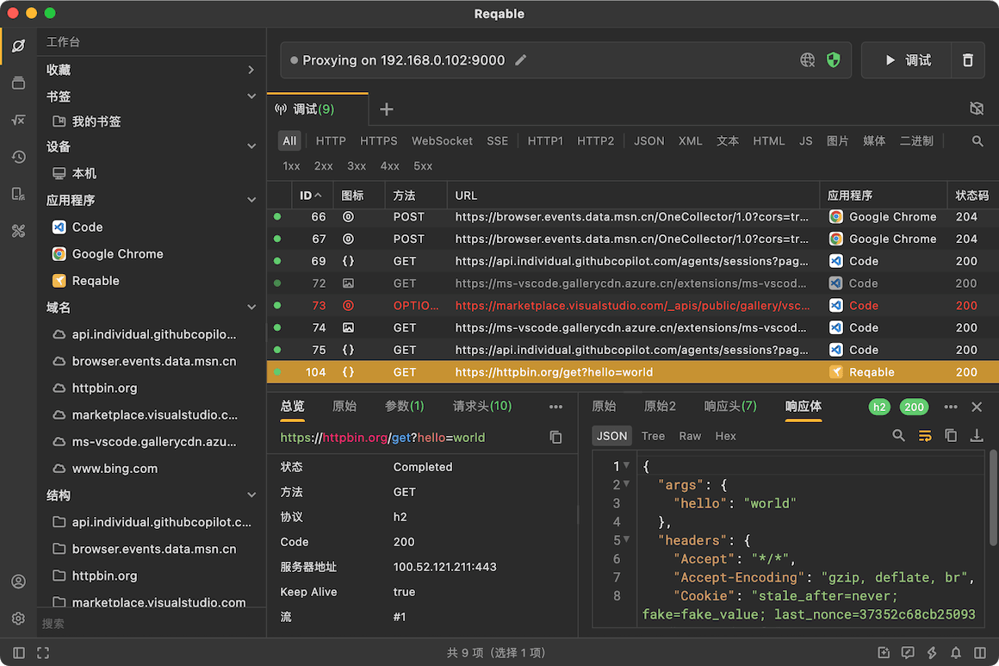

# 调试

API调试是Reqable的两大基本功能之一，Reqable提供了非常便捷和强大的调试功能，帮助工程团队快速定位网络问题。

### 视图

- [调试列表](./list)
- [列表项](./column)
- [快捷操作栏](./quickbar)
- [工作台](./explorer)
- [标签页](./tabs)
- [搜索](./search)
- [高亮](./highlight)

### 指南
- [代理](./proxy)
- [SSL](./ssl)
- [本地流量](./localhost)
- [回话](./sessions)
- [编辑](./compose)
- [历史](./history)

### 进阶指南
- [访问控制](./access-control)
- [网关](./gateway)
- [镜像](./mirror)
- [脚本](./script)
- [断点](./breakpoint)
- [重写](./rewrite)
- [反向代理](./reverse-proxy)
- [对比](./diff)
- [网络模拟](./network-condition)
- [上报服务器](./report-server)
- [重发](./repeat)
- [HAR](./har)
- [极速模式](./turbo)
- [代理终端](./proxy-terminal)
- [Charse文件支持](./chls)