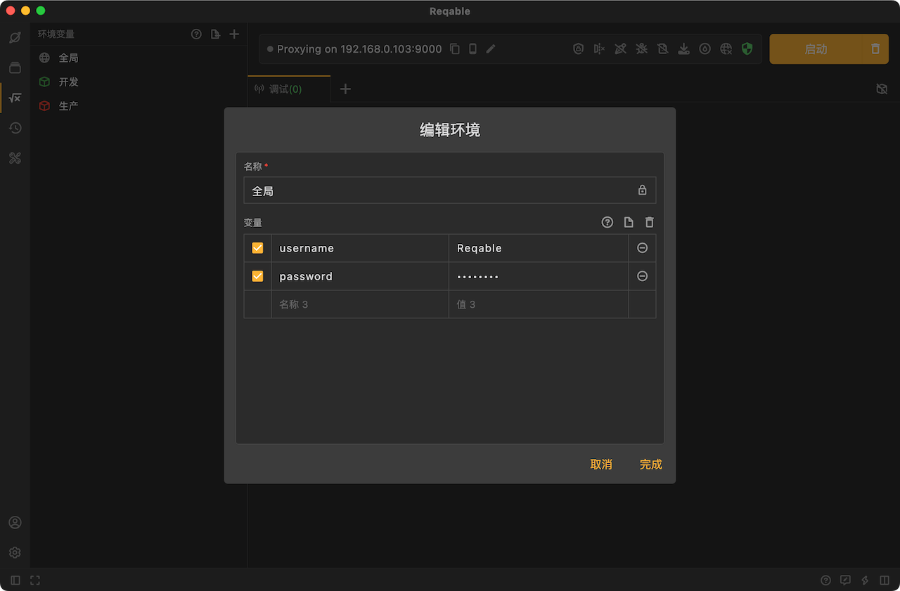

# 全局环境

在Reqable中，全局变量是一种特殊类型的环境变量，其数值在整个Reqable应用程序中都是可用的。全局变量通常用于存储那些在多个请求或环境中都需要共享的数据值。

使用全局变量可以帮助用户在不同的请求、集合或环境中共享数据，而不必重复定义相同的数值。这样可以提高工作效率，并确保数据的一致性和准确性。

要在Reqable中使用全局变量，首先需要定义这些变量。默认情况下，Reqable已经为创建了全局环境，你可以在`环境变量`面板点击`全局`环境，进行全局环境变量的定义和编辑。一旦定义了全局变量，则可以在任何请求、脚本或其他地方中使用这些变量，而无需重复输入数值。

在请求中使用全局变量时，只需在需要引用全局变量的地方使用双尖括号（例如 `<<variable_name>>`）来引用即可。Reqable会在发送请求时自动替换这些引用为实际的全局变量数值。

:::caution
全局变量的优先级低于其他环境变量，如果其他环境中存在同名变量将会优先使用其他环境中定一个的变量。
:::

全局变量分为两种类型，一种是[自定义全局变量](#custom)，另一种是[内置全局变量](#dynamic)。

## 自定义全局变量 {#custom}

全局自定义变量是用户自行定义的变量，你可以在`环境变量`面板点击`全局`环境，进行变量的添加、修改、删除和激活。

:::info
如果变量值不便于明文展示，可以点击眼睛图标（鼠标悬浮于输入框尾部自动出现）进行隐藏。
:::

## 内置全局变量 {#dynamic}

在Reqable中，除了用户自定义的全局变量外，还有一些内置的全局环境变量，它们以美元符号（$）开头。目前一共有下面这些内置全局变量。

- `$date` 当前日期（yyyy-MM-dd）。
- `$datetime` 当前日期和时间（yyyy-MM-dd HH:mm:ss）。
- `$guid` v4 风格的 guid 值。
- `$randomBoolean` 随机布尔值(true/false)。
- `$randomColor` 随机颜色名称。
- `$randomCurrencyCode` 随机3个字母的货币代码 (ISO-4217)。
- `$randomCurrencyName` 随机货币名称。
- `$randomEmail` 随机电子邮箱地址。
- `$randomHttpUrl` 随机 HTTP 链接。
- `$randomHttpsUrl` 随机 HTTPS 链接。
- `$randomImageUrl` 随机图片链接。
- `$randomInt1` 随机0-10之间的整数。
- `$randomInt2` 随机0-100之间的整数。
- `$randomInt3` 随机0-1000之间的整数。
- `$randomInt4` 随机0-10000之间的整数。
- `$randomIPv4` 随机 IPv4 地址。
- `$randomIPv6` 随机 IPv6 地址。
- `$randomJustTime` 随机时刻（HH:mm）。
- `$randomLetterLower` 随机小写字母。
- `$randomLetterUpper` 随机大写字母。
- `$randomLatitude` 随机地理纬度坐标。
- `$randomLongitude` 随机地理经度坐标。
- `$randomMACAddress` 随机 MAC 地址。
- `$randomMonth` 随机月份。
- `$randomPassword` 随机12个字符的密码。
- `$randomPhoneNumberCN` 随机11位的中国大陆号码。
- `$randomPhoneNumberUS` 随机10位的美国号码。
- `$randomUsername` 随机用户名。
- `$randomWeekday` 随机星期。
- `$timestamp` 当前毫秒时间戳。
- `$timestampInSeconds` 当前秒时间戳。
- `$timestampISO` 当前ISO时间戳（零时区）。

这些内置全局环境变量可以在请求中动态地生成数据，用户可以在Reqable中直接引用这些内置变量，无需事先定义或设置。