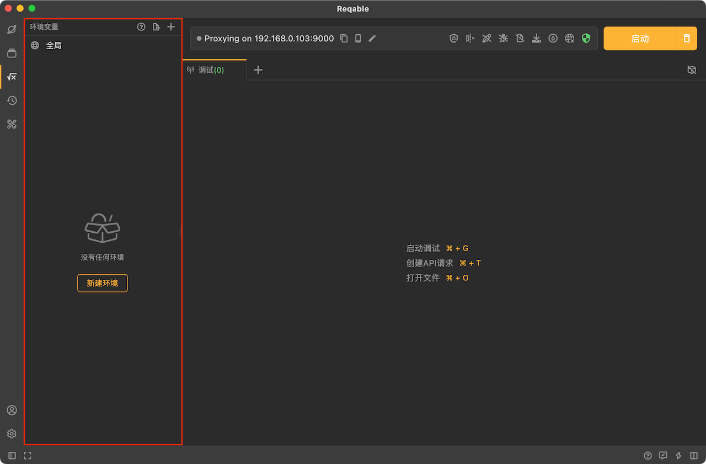

# 环境变量

环境变量是一种用于存储和管理数据值的特殊变量，这些变量可以在Reqable的API请求和Python脚本中使用，以便在不同的环境中灵活地管理数据。

Reqable中的环境变量分为两种类型：全局变量和环境特定变量。全局变量是在整个Reqable应用程序中可用的变量，而环境特定变量则是针对特定环境（如开发、测试、生产等）设置的变量。

通过使用环境变量，你可以轻松地在不同环境之间切换，并且不必手动更改每个请求中的数值。你可以在Reqable的`环境变量`面板中创建和管理环境，为每个环境设置不同的变量值。然后，在请求中使用这些环境变量，以便根据当前活动的环境动态地引用这些值。

你可以在侧边栏点击环境变量图标来打开环境变量面板，如上图所示。

关于环境变量更多的内容，请阅读下面的文档。

import DocCardList from '@theme/DocCardList';

<DocCardList />