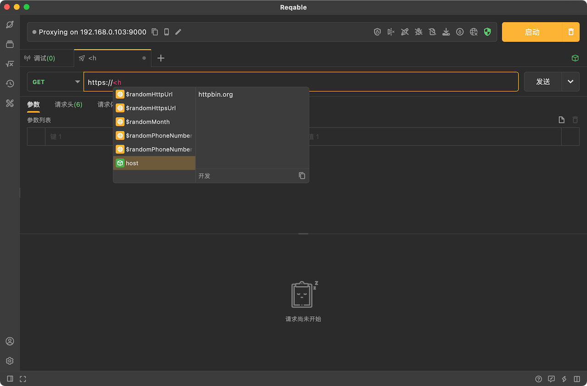

# 使用环境变量

Reqable目前支持在API测试请求以及Python脚本中使用环境变量，下面我们将分这两个部分来分别进行讲解和演示。

## API测试

在请求中可以使用尖双括号（例如 `<<variable_name>>`）来引用相应的环境变量，支持在请求URL、请求参数、请求头部、请求体以及请求授权中使用环境变量。

在输入框中输入尖括号`<`后会自动进行变量引用提示，用户可以查看当前匹配的环境变量。当鼠标指针悬浮在变量上时，会自动提示变量的信息。



Reqable会在发送请求时自动替换这些引用为实际的变量数值。


## Python脚本

在Python脚本中，环境变量存在于`context`属性的`env`变量中，可以使用下面的代码来获取环境变量。

```python
print(context.env['username'])
```