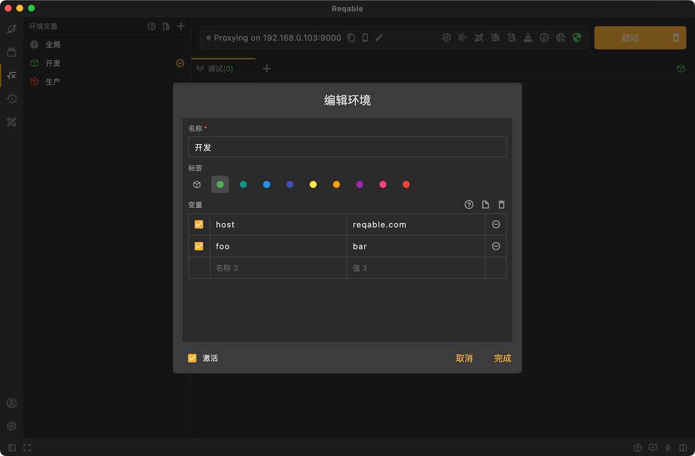
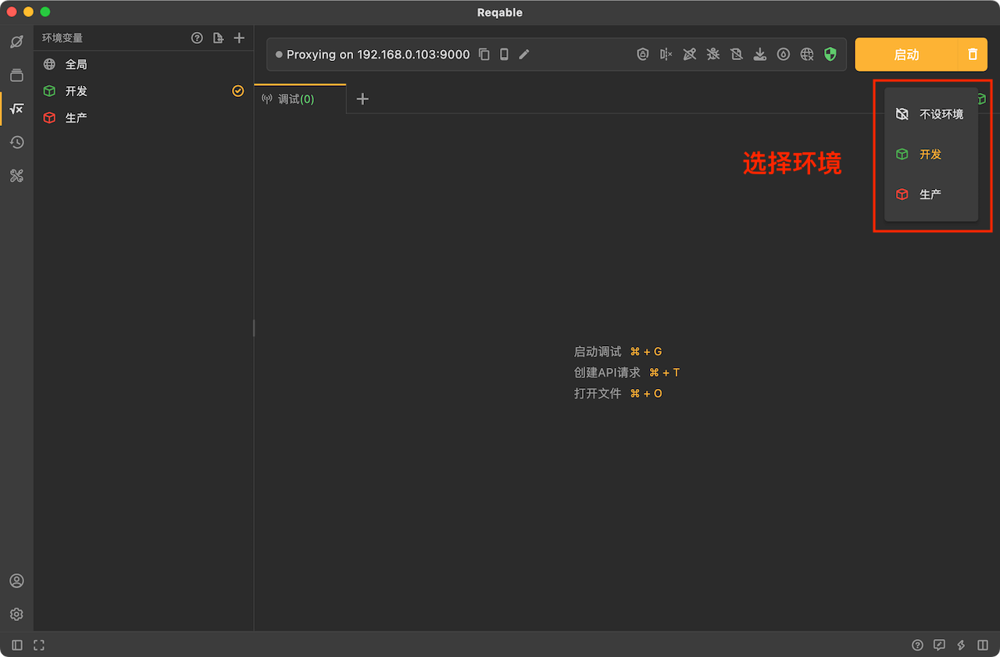

# 用户环境

在Reqable中，除了全局变量外，还有一种非全局环境变量，又称为用户变量。与全局变量不同，用户变量的作用范围仅限于特定的环境。这意味着用户变量只能在其所属的环境中使用，而不能在其他环境或全局范围内共享。

使用用户变量可以帮助用户在特定环境中管理和使用特定的数据值，而不会影响到其他环境或全局变量的数值。这样可以更灵活地组织和管理数据，使得每个环境都可以有自己独立的配置。

要在Reqable中使用用户变量，需要先创建并命名一个环境，然后再创建变量。用户可以创建多个不同的环境，并在每个环境下创建变量。为了方便区分，还可以选择不同颜色标签。

在请求中使用用户变量时，同样可以使用尖双括号（例如 `<<variable_name>>`）来引用相应的环境变量。Reqable会在发送请求时自动替换这些引用为实际的变量数值。

:::caution
用户变量的优先级高于全局变量，当前激活环境中存在同名变量将会优先使用。
:::

## 激活环境

用户变量要生效，必须先进行激活环境，同时最多只能激活一个用户环境。

可以通过环境右键菜单进行激活（取消激活）操作，或者通过点击右上角的环境图标选择环境。

