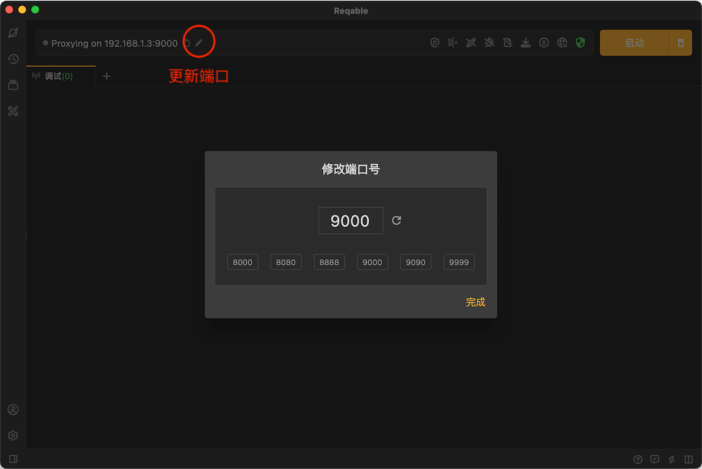
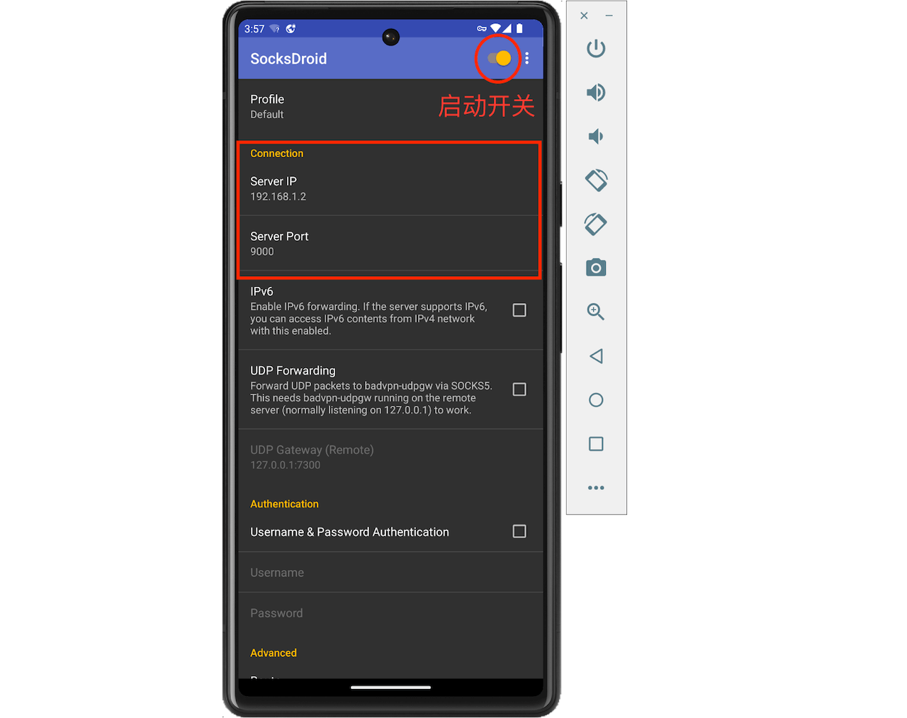

# 常见问题

### 1. Reqable日志文件目录{#log}

- Windows
```
C:\Users\xxx\AppData\Roaming\Reqable\log
```
- MacOS
```
~/Library/Caches/Reqable/log
```
- Linux
```
~/.local/share/reqable
```

### 2. 电脑端浏览器或应用程序请求无响应 {#troubleshot-pc}

可能端口冲突导致，更换Reqable的代理端口即可。



### 3. 手机端观测不到流量 {#troubleshot-mobile}

电脑端正常使用，但是手机端无法获取到任何流量。遇到这种情况请检查下面的CheckList。

- [x] 手机与电脑都连接到同一个局域网。
- [x] 手机Wifi代理已设置Reqable的IP地址和端口号（见Reqable窗口顶部），或者使用SocksDroid进行转发。
- [x] 手机上已正确安装CA证书（针对只有`CONNECT`请求的情况）。
- [x] 电脑网络防火墙已开放Reqable的端口地址。

### 4. 无法访问境外受限网站 {#restrict}

Reqable本身不具备访问受限网站的能力，需要借助其他代理软件并在Reqable中配置[二级代理](../capture/proxy#secondary)。

### 5. Android代理无效问题 {#socksdroid}

部分网络框架不支持使用系统代理配置，我们可以通过VPN转发流量到Reqable的方式进行调试。

在安装`socksdroid`（开源工具，也可自行编译），打开下面的地址下载apk文件。

```
https://github.com/bndeff/socksdroid/releases/download/1.0.3/socksdroid-1.0.3.apk
```

安装下载好的`socksdroid`，也可以使用`adb`进行安装。
```bash
adb install socksdroid-1.0.3.apk
```
安装完成后打开`socksdroid`，配置电脑的IP地址和Reqable代理端口，并启动右上角的开关。

