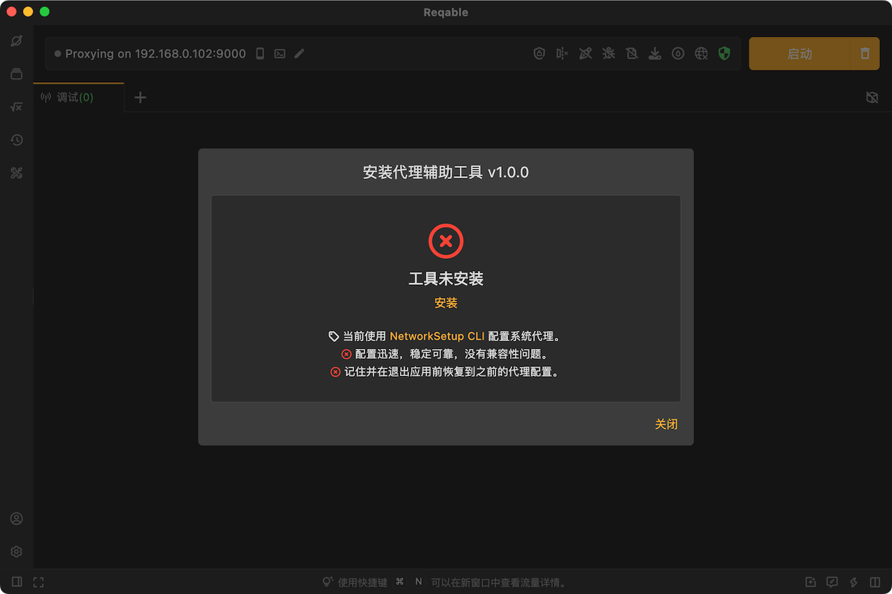
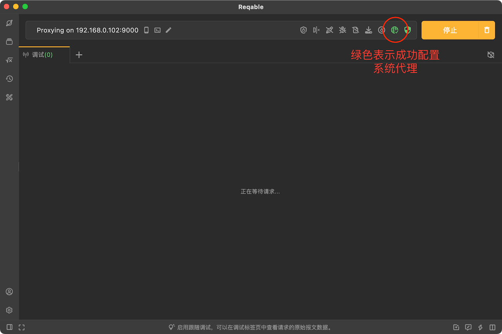
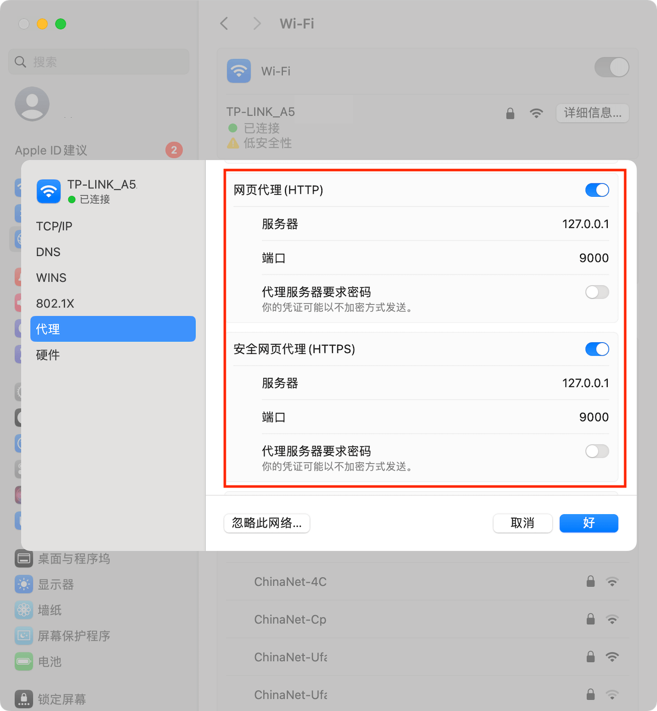
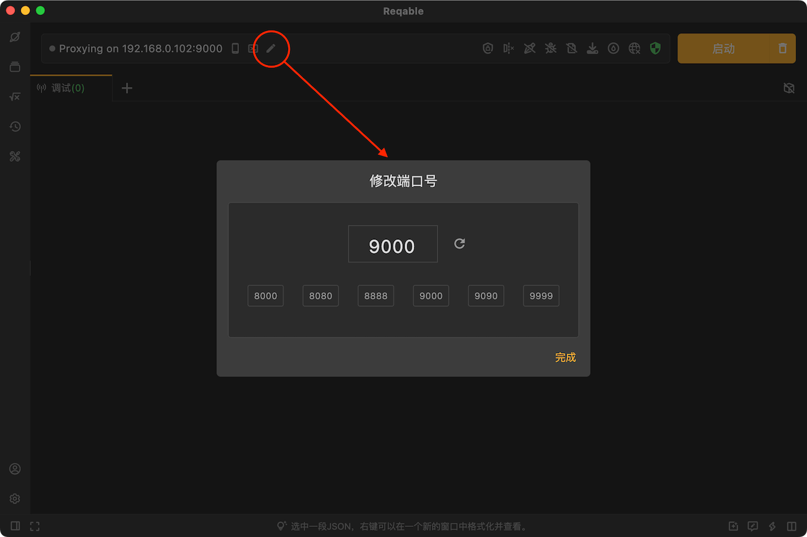
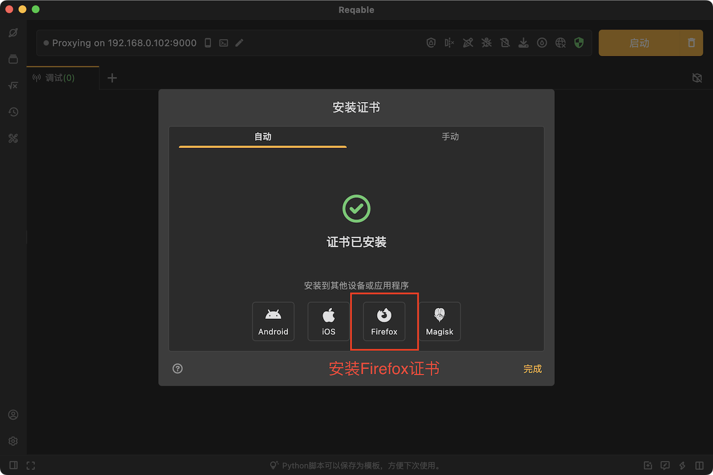

# Mac常见问题

:::info
请更新Reqable到最新版本，然后再进行问题排错。
:::

### 1. Reqable缓存目录

```
~/Library/Application Support/com.reqable.macosx
```

### 2. Reqable日志文件

```
~/Library/Application Support/com.reqable.macosx/log
```

:::note
点击Reqable底部栏5下可以打开日志控制台查看当前日志。
:::

### 3. 无法自动配置系统代理

现象表现为网络代理图标点击后无法变绿或者变绿后又跳成其他颜色。这是由于当前账户没有权限修改系统代理，需要手动安装代理辅助工具。`代理`菜单中打开`代理辅助工具`进行安装，安装时需要输入当前账户密码进行授权，安装完成后即可正常自动配置系统代理。



### 4. 捕获不到电脑端应用程序的流量

请先确保下面的操作已经处理。

- 已经开启了调试开关。
- 已关闭全部筛选和搜索条件。
- 已关闭[二级代理](../capture/proxy#secondary)功能。

然后可以按照下面的步骤进行排查。

#### 4.1 检查是否成功配置系统代理

Reqable需要给系统配置网络代理，其他应用程序需要通过系统的网络代理配置来访问Reqable的代理服务器。如果系统网络代理配置成功，下图的网络图标会显示成绿色。



手动检查系统设置中网络代理是否配置成功，系统设置 -> 网络 -> Wi-Fi -> 详细信息 -> 代理，检查`网页代理(HTTP)`、`网页代理(HTTPS)`和`网页代理(SOCKS)`开关是否打开，地址是否是`127.0.0.1`，端口是否是Reqable主界面顶部显示的端口号。



如果网络图标显示是绿色，但是手动检查系统设置中网络代理未成功，可以在[Github](https://github.com/reqable/reqable-app/issues)或者微信反馈给我们。

如果系统代理配置没有问题，请进入下一步。

#### 4.2 检查是否可以捕获浏览器的请求

Reqable启动调试开关后，打开浏览器（建议Chrome或者Safari），访问百度首页。

情况一：百度首页无法访问，并且Reqable调试列表中看不到任何流量（包括CONNECT请求）。

可能是Reqable代理服务器端口异常（例如被其他程序进程占用），可以尝试更换下端口重试。



如果更换端口后浏览器仍然无法访问百度首页，请在[Github](https://github.com/reqable/reqable-app/issues)或者微信反馈给我们。

情况二：百度首页可以访问，但是Reqable调试列表中看不到任何流量（包括CONNECT请求）。

再次检查上面4.1系统网络代理是否配置正确，或者尝试更换浏览器，或者尝试重启电脑。如果依然是这种情况，请在[Github](https://github.com/reqable/reqable-app/issues)或者微信反馈给我们。

情况三：百度首页可以访问，Reqable调试列表中也能看到浏览器的访问流量（包括CONNECT请求）。

说明Reqable工作一切正常，但是应用程序未主动使用系统网络代理来访问Reqable的代理服务器，您可以按照下面的方式进行处理。

- 应用程序是Python、NodeJS或者Ruby等脚本进程，可以尝试使用[代理终端](../capture/proxy-terminal)功能。
- 检查应用程序是否支持手动配置网络代理。
- 尝试使用Proxifier等第三方软件进行强制代理。
- 联系应用程序开发商获取解决方案。

### 5. Firefox访问提示不安全的网站

Firefox浏览器使用内置的CA Store，系统安装的CA证书无法生效，需要按照Reqable中的Firefox证书安装指引进行安装操作。



### 6. Chrome和Safari访问提示不安全的网站

在部分设备上，可能存在安装了Reqable CA证书后，Chrome和Safari浏览器访问仍然无法信任的问题。

需要打开钥匙串(Keychain Access)应用并手动删除已安装的Reqable CA证书，然后在Reqable里面点击重新安装证书。重新安装证书后，重启Reqable和浏览器再尝试。

如果上述方法尝试后仍然有问题，请在[Github](https://github.com/reqable/reqable-app/issues)或者微信反馈给我们。

### 7. 无法捕获localhost流量

localhost请求流量默认不会走系统网络代理，需要使用镜像功能特殊处理，请参考[localhost流量](../capture/localhost)。

### 8. 无法访问境外受限网站

Reqable本身不具备访问受限网站的能力，需要借助其他代理软件并在Reqable中配置[二级代理](../capture/proxy#secondary)。

### 9. 手机无法连接电脑

- 检查手机和电脑是否在同一个局域网下。
- 检查手机和电脑是否在同一个局域网段，有些局域网组网时会禁止跨段通信。
- 尝试电脑连接手机热点，然后手机再扫码连接电脑。
- 检查系统防火墙是否禁用了Reqable代理端口号流量出入。