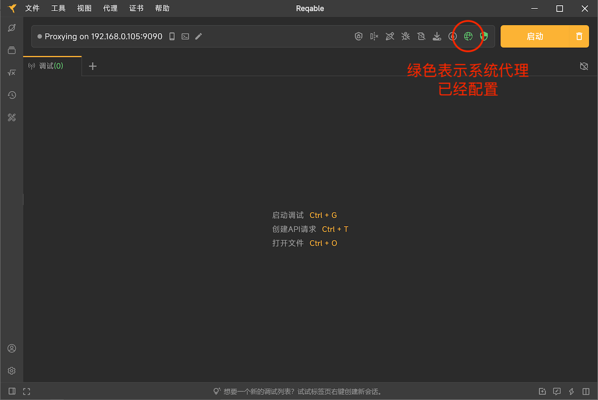
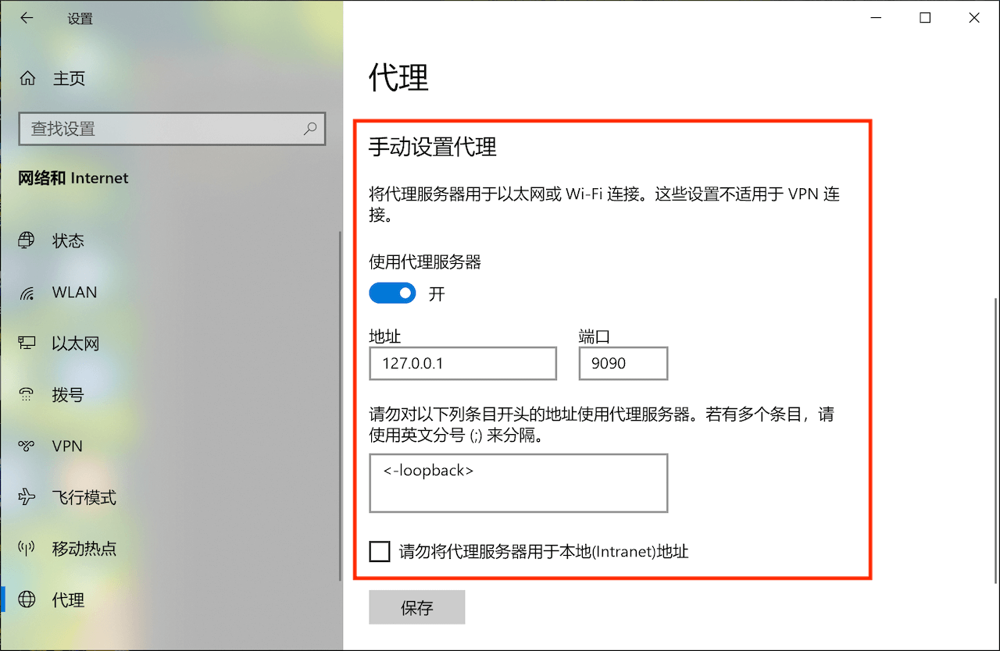
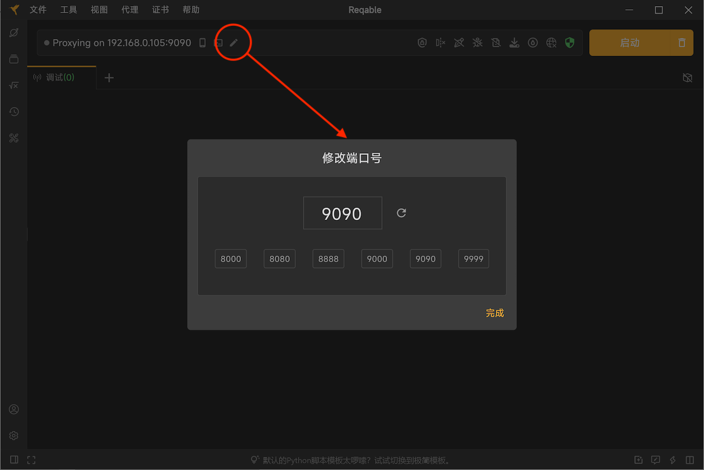
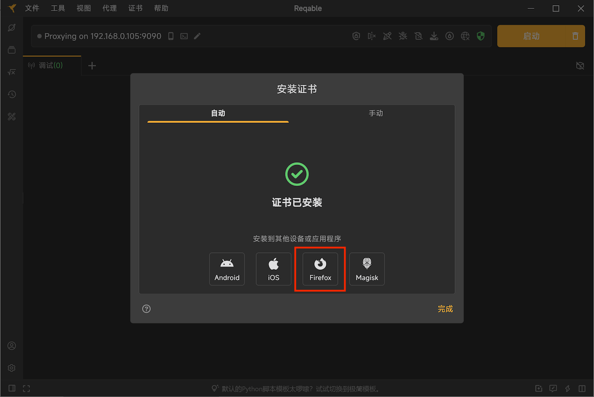

# Windows常见问题

:::info
请更新Reqable到最新版本，然后再进行问题排错。
:::

### 1. Reqable缓存目录

```!
C:\Users\xxx\AppData\Roaming\Reqable
```

### 2. Reqable日志文件

```
C:\Users\xxx\AppData\Roaming\Reqable\log
```

:::note
点击Reqable底部栏5下可以打开日志控制台查看当前日志。
:::

### 3. 捕获不到电脑端应用程序的流量

请先确保下面的操作已经处理。

- 已经开启了调试开关。
- 已关闭全部筛选和搜索条件。
- 已关闭[二级代理](../capture/proxy#secondary)功能。

然后可以按照下面的步骤进行排查。

#### 3.1 检查是否成功配置系统代理

Reqable需要给系统配置网络代理，其他应用程序需要通过系统的网络代理配置来访问Reqable的代理服务器。如果系统网络代理配置成功，下图的网络图标会显示成绿色。



手动检查系统设置中网络代理是否配置成功，Windows菜单 -> 设置 -> 网络和Internet -> 代理 -> 手动设置代理，检查`使用代理服务`开关是否打开，地址是否是`127.0.0.1`，端口是否是Reqable主界面顶部显示的端口号。



如果网络图标显示是绿色，但是手动检查系统设置中网络代理未成功，可以在[Github](https://github.com/reqable/reqable-app/issues)或者微信反馈给我们。

如果系统代理配置没有问题，请进入下一步。

#### 3.2 检查是否可以捕获浏览器的请求

Reqable启动调试开关后，打开浏览器（建议Chrome或者Edge），访问百度首页。

情况一：百度首页无法访问，并且Reqable调试列表中看不到任何流量（包括CONNECT请求）。

可能是Reqable代理服务器端口异常（例如被其他程序进程占用），可以尝试更换下端口重试。



如果更换端口后浏览器仍然无法访问百度首页，请在[Github](https://github.com/reqable/reqable-app/issues)或者微信反馈给我们。

情况二：百度首页可以访问，但是Reqable调试列表中看不到任何流量（包括CONNECT请求）。

再次检查上面3.1系统网络代理是否配置正确，或者尝试更换浏览器，或者尝试重启电脑。如果依然是这种情况，请在[Github](https://github.com/reqable/reqable-app/issues)或者微信反馈给我们。

情况三：百度首页可以访问，Reqable调试列表中也能看到浏览器的访问流量（包括CONNECT请求）。

说明Reqable工作一切正常，但是应用程序未主动使用系统网络代理来访问Reqable的代理服务器，您可以按照下面的方式进行处理。

- 应用程序是Python、NodeJS或者Ruby等脚本进程，可以尝试使用[代理终端](../capture/proxy-terminal)功能。
- 检查应用程序是否支持手动配置网络代理。
- 尝试使用Proxifier等第三方软件进行强制代理。
- 联系应用程序开发商获取解决方案。

### 4. 无法捕获localhost流量

检查Reqable的`代理`菜单中是否已经开启`回环代理`开关，如果还是有问题，请检查Windows菜单 -> 设置 -> 网络和Internet -> 代理 -> 手动设置代理 -> 请勿对以下列条目开头的地址使用代理服务器中的配置是否是`<-loopback>`，如果不是，请手动配置。

### 5. 无法访问境外受限网站

Reqable本身不具备访问受限网站的能力，需要借助其他代理软件并在Reqable中配置[二级代理](../capture/proxy#secondary)。

### 6. 手机无法连接电脑

- 检查手机和电脑是否在同一个局域网下。
- 检查手机和电脑是否在同一个局域网段，有些局域网组网时会禁止跨段通信。
- 尝试电脑连接手机热点，然后手机再扫码连接电脑。
- 检查系统防火墙是否禁用了Reqable代理端口号流量出入。

### 7. Firefox访问提示不安全的网站

Firefox浏览器使用内置的CA Store，系统安装的CA证书无法生效，需要按照Reqable中的Firefox证书安装指引进行安装操作。

