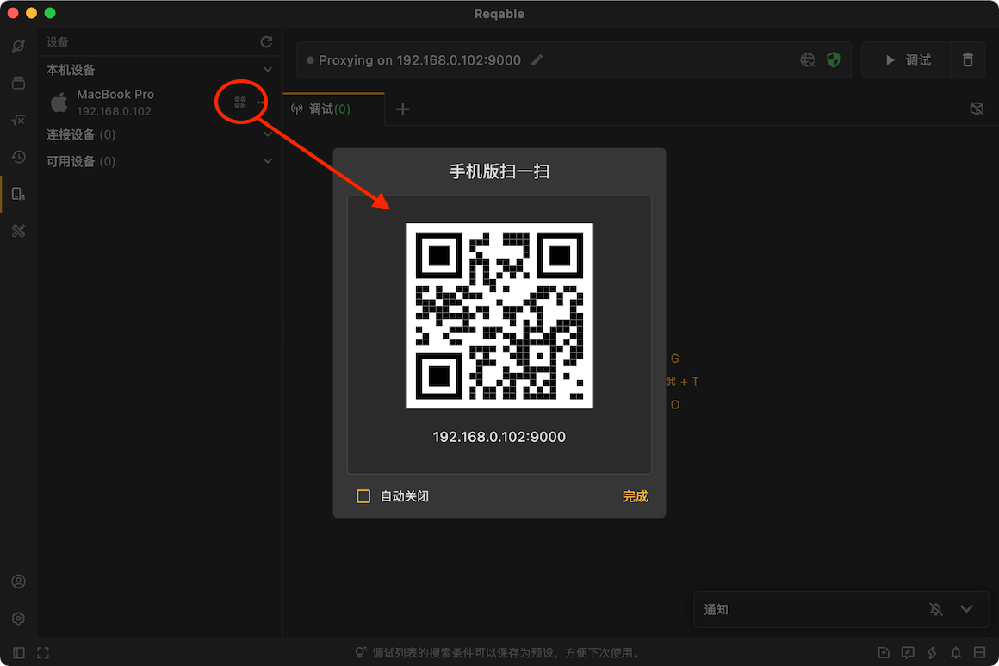
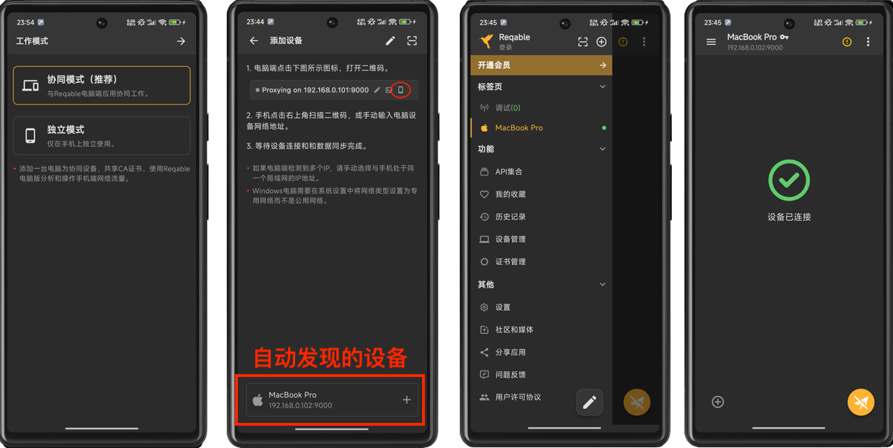
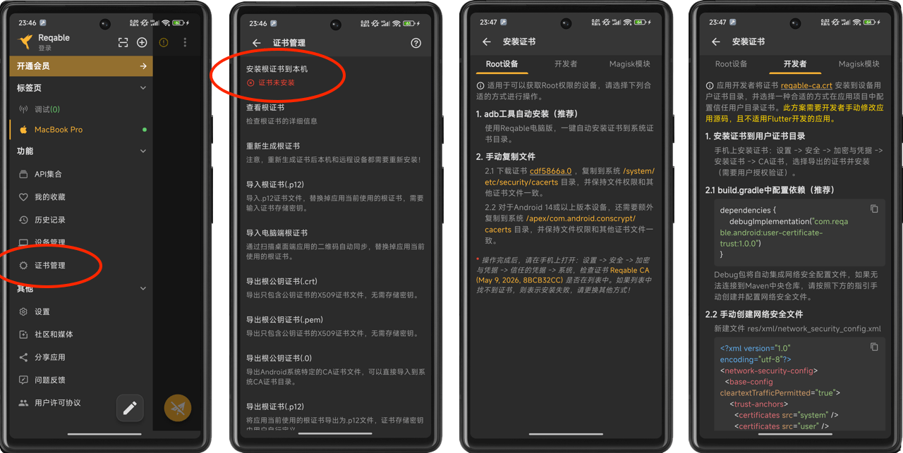
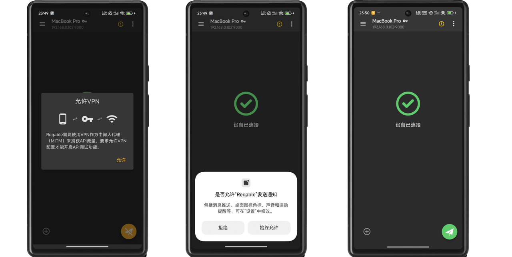
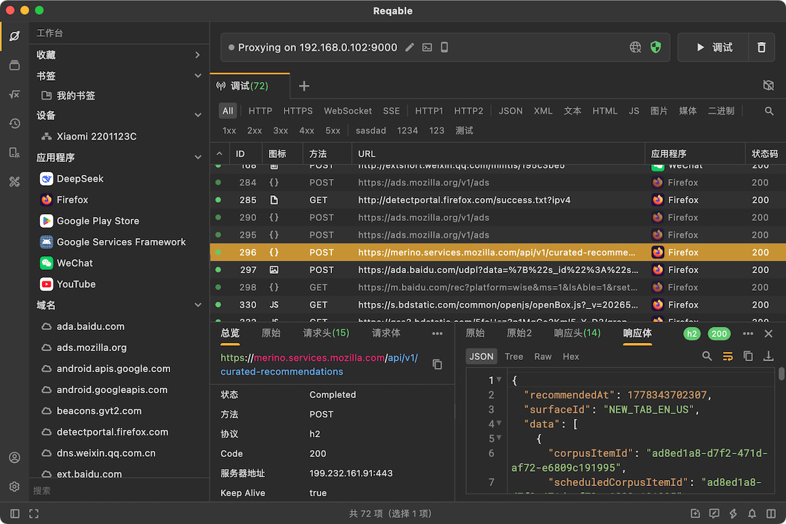

Reqable是全平台应用程序，包括独立的移动端Android App和iOS App，移动端App支持两种工作模式，分别是独立模式和协同模式。

- 独立模式：无需电脑客户端，直接在手机上分析应用程序流量以及进行API测试。
- 协同模式：手机端流量转发到电脑端Reqable进行分析和实施各种调试操作。

协同模式具有下面这些优点：

- 无需设置手机Wi-Fi代理，即可在电脑上拦截和操作手机流量。
- 基于VPN机制，支持更加全面的流量拦截。
- 自动同步电脑根证书到手机，方便后续安装证书。
- Android平台还支持获取到流量所属的应用信息。

## 如何配置

在电脑端Reqable打开二维码页面，如下：

安装Reqable移动端App并启动，初始化选择协作模式，并扫描上一步桌面端的二维码。

连接成功后，Reqable会自动将电脑端的根证书同步到手机端。Reqable移动端会记住远程设备（电脑）的IP地址和端口，下一次启动会自动进行连接。如果远程设备（电脑）的IP地址和端口发生变化，在侧边栏点击扫码图标重新扫描即可。

如果已经初始化了Reqable手机端App，你可以从侧边栏的`远程设备`中点击右上角的`+`按钮添加电脑端设备。

下一步，我们开始安装根证书，这可能是整个过程最复杂的一步。

由于Reqable桌面端的根证书已经被同步到了移动端，因此不需要打开浏览器输入xxx地址下载根证书了，直接在移动端保存根证书即可。打开侧边栏，点击证书管理页面，进行证书相关的操作。

Reqable移动的会自动检查证书的安装状态，如果未安装成功，页面上出现红色提示：证书未安装。上图是Android的根证书安装指引，iOS则简单很多，按照应用内的操作提示处理即可。更多资料请参考：[安装证书](../installation#mobile)。

:::caution
由于系统限制，Android的证书安装步骤相对复杂。Reqable提供了多个场景的证书安装指引，开发者可选择最合适的进行操作。
:::

最后，点击右下角的调试按钮，允许通知和VPN服务，进入调试模式。

当手机端进入调试模式后，Reqable桌面端也会自动进入调试模式。当在手机端发送网络请求时，在电脑端便可以看到访问的请求流量了。

可以看到，手机端的流量已经显示在Reqable桌面端了，后续我们可以在桌面端进行断点、重写、脚本等功能的处理。

:::note
Reqable可以获取到Android的应用信息，iOS因技术限制不支持。
:::

