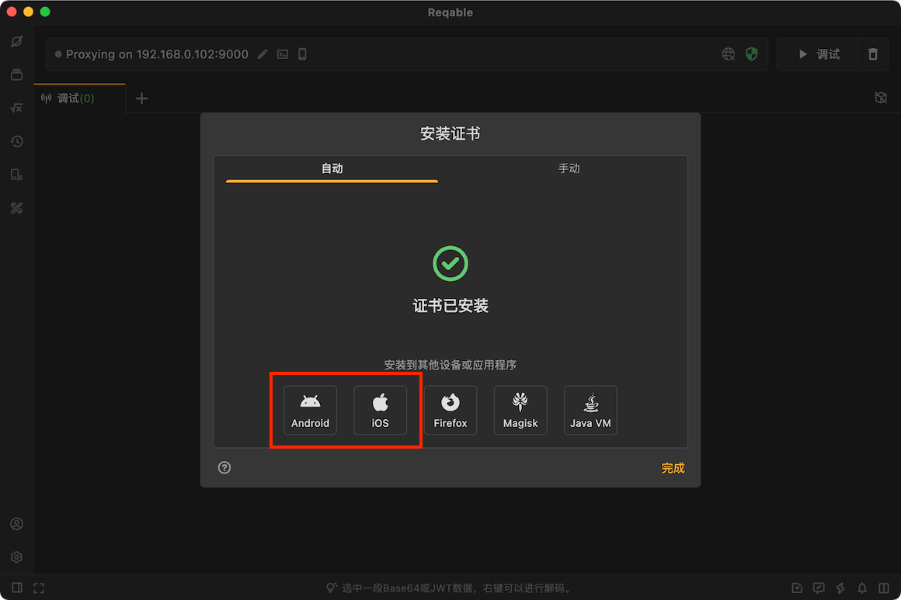
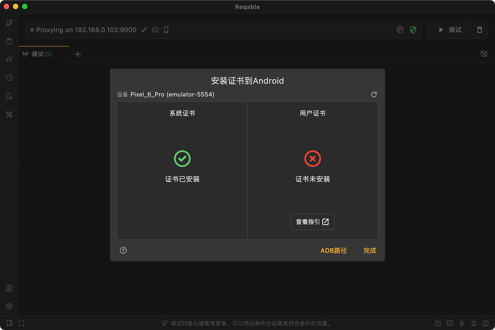
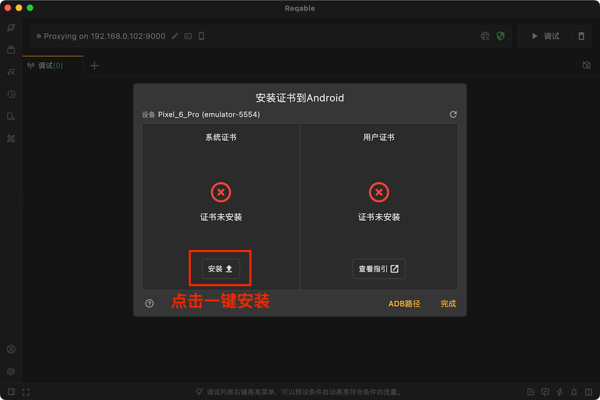

## 为什么要安装证书？

Reqable使用经典的中间人（MITM）技术分析HTTPS流量，当客户端与Reqable的代理服务器（下文简称`中间人`）进行通信时，中间人需要重签远程服务器的SSL证书。为了保证客户端与中间人成功进行SSL握手通信，需要将中间人的根证书（下文简称`CA根证书`）安装到客户端本地的证书管理中心。如果没有安装CA根证书，可能会出现`SSL握手失败`的错误。

如果目标客户端是电脑端应用程序，CA根证书需要安装到电脑的证书管理中心；如果目标客户端是移动端App，CA根证书则需要安装到手机的证书管理中心。如果您没有流量分析的需求，可以忽略这一步。

:::info 小提示
Reqable会为每台设备自动生成完全不同的CA根证书，并使用随机的证书密钥，所以您不必担心此证书会被第三方利用。
:::

## 桌面端安装  {#desktop}

不同的桌面端平台（这里主要是Windows/MacOS/Linux），证书安装方式有所不同，为了简化安装过程，Reqable提供了一键安装证书的功能。

证书的安装入口位于顶部操作栏，点击`盾牌`图标打开弹窗。


直接点击`现在安装`：


点击后系统会弹出确认弹窗或者输入账户密码进行授权，按照提示操作确认即可。不出意外的话，证书会自动安装成功；如果自动安装失败，可以切换到`手动安装`的Tab按照步骤手动安装。


注意，在Linux设备上Chrome和Firefox浏览器有内置的证书管理系统，您还需要将CA根证书安装到浏览器的证书管理系统中，请按照Reqable内的提示进行操作。

:::info 安装状态
CA根证书未安装或安装失败时，盾牌图标显示为黄色；安装成功后，盾牌图标显示为绿色。
:::

## 移动端安装 {#mobile}

如果您有分析移动端应用流量的需求，必须在移动端安装CA根证书，我们已经在Reqable中内置了Android和iOS证书安装的指引。如果您使用电脑端App，请切换到`Android`和`iOS`的Tab按照步骤进行安装；如果您使用移动端App，请进入`侧边栏` -> `证书管理` -> `安装根证书到本机`，然后选择合适的方案进行安装。

:::warning 重要须知
如果您使用电脑端App进行流量分析，请安装电脑端的CA根证书到移动端设备；如果您使用移动端App直接进行流量分析，请安装移动端的CA根证书到移动端设备。
:::

Reqable给每台设备生成的CA根证书均不相同。如果您希望所有设备共用同一个CA根证书，可以导出.p12格式证书后再在其他设备上导入。

:::info
小技巧：移动端App初始化选择协同模式并扫码连接电脑后，会自动同步电脑端的CA根证书到当前移动端设备，此时两台设备的CA根证书为同一个。
:::

### Android

Android证书分为两种：用户证书和系统证书。用户目录不需要权限即可添加和删除CA证书，系统目录需要Root权限才可以添加和删除CA证书。

Reqable的证书安装界面提供了Android证书的安装引导入口，如下图所示点击即可以进入。



Reqable要求用户事先已经在电脑上安装了ADB工具，Reqable会使用ADB工具检查连接到电脑的Android设备的证书安装状态，包括系统证书安装状态和用户证书安装状态。



:::info 关于ADB工具
Android Debug Bridge（简称ADB）是Google提供的Android设备连接工具，可以从Android开发者官网[下载](https://developer.android.com/tools/adb)，下载并安装完成后，配置好`ANDROID_HOME`和`PATH`环境变量，重启Reqable即可。
:::

#### 系统证书

无论设备是否Root，Reqable都可以检测系统证书的安装状态。但是，只有Root的设备Reqable才可以一键安装证书（支持Android 5.0 - 15系统）。



如果已经安装了系统证书，可以跳过下一步用户证书的安装。

#### 用户证书

用户证书需要用户手动进行安装，在手机端打开设置进行如下步骤的操作：

设置-> 安全 -> 加密与凭据 -> 安装证书 -> CA证书，选择导出的证书并安装（需要用户授权验证）。

注意，Reqable无法检测到非Root设备的用户证书安装状态，会一直显示`未知证书安装状态`。

在Android 7.0及以上版本的设备上，安装完用户证书后还需要开发者在项目中进行额外配置来信任用户证书。

::: caution
这种方式只对Android Native应用有效，基于Flutter的应用无效。
:::

方式一：build.gradle中配置依赖（推荐）

```gradle
dependencies {
  debugImplementation("com.reqable.android:user-certificate-trust:1.0.0")
}
```

按照以上配置，Debug包将自动集成网络安全配置文件，如果无法连接到Maven中央仓库，请按照方式二的指引手动创建并配置网络安全文件。

方式二：手动创建网络安全文件

新建文件 res/xml/network_security_config.xml

```xml
<?xml version="1.0" encoding="utf-8"?>
<network-security-config>
  <base-config cleartextTrafficPermitted="true">
    <trust-anchors>
      <certificates src="system" />
      <certificates src="user" />
    </trust-anchors>
  </base-config>
</network-security-config>
```

配置到 AndroidManifest.xml

```xml
<?xml version="1.0" encoding="utf-8"?>
<manifest>
  <application android:networkSecurityConfig="@xml/network_security_config">
    ...
  </application>
</manifest>
```

注意⚠️：请在发行版本中移除此配置，更多有关网络安全配置文件资料，请参考：[Android开发文档](https://developer.android.google.cn/training/articles/security-config)。

#### 浏览器

在Android设备上，安装完证书并不意味着可以被浏览器信任，即使是安装到系统证书目录。

##### Chrome浏览器

Chrome浏览器对证书的信任策略一直在变化，比如最新版本的Chrome浏览器会忽略安装到Android系统证书目录的自签CA证书，如果需要对Chrome浏览器进行抓包，请按照下面的方式进行处理：

- 如果是高版本Chrome浏览器，需要将CA证书安装到用户证书目录；
- 如果是低版本的Chrome浏览器，需要将CA证书安装到系统证书目录。

如果不确定选用那种方式，可以分别尝试下。

##### Firefox浏览器

Firefox浏览器使用内置的CA证书验证机制，无论Reqable的CA证书是安装到系统目录还是用户目录都不会被信任，需要用户进行额外的操作。

- Firefox设置 -> 关于Firefox -> 点击顶部Logo 5下启用调试菜单。
- Firefox设置 -> Secret Settings -> 启用 Use third party CA certificates。

按照上面步骤操作完成后，将CA证书安装到用户目录即可生效。

### iOS

在iOS设备上安装证书非常简单，按照下面的操作即可。

首先，下载并安装描述文件（证书）。描述文件可以手动保存，也可以通过浏览器下载。
- 手动保存：点击右上角导出CA证书，在文件应用的Reqable文档目录下找到导出的CA证书，并手动复制或移动到上一级目录，点击证书后出现提示`已下载描述文件`。
- 浏览器下载：点击证书自动打开浏览器下载，下载完成后自动出现提示`已下载描述文件`。

第二步：打开 设置 -> 下载的描述文件 -> 选择文件 -> 安装 刚刚下载的描述文件。

第三步：信任证书，设置 -> 通用 -> 关于 -> 证书信任设置 -> 打开开关。

## 特殊问题

在一些特殊情况下，即使已经安装了证书可能也无法正常解析HTTPS流量，常见的有下面这些情况。

- 网络请求启用了固定证书，要求服务器返回指定签发的证书。
- 网络请求启用了双向验证，要求客户端也要上传证书给服务器进行验证。
- 应用使用了内置的CA证书验证，而不是使用系统的CA证书。


