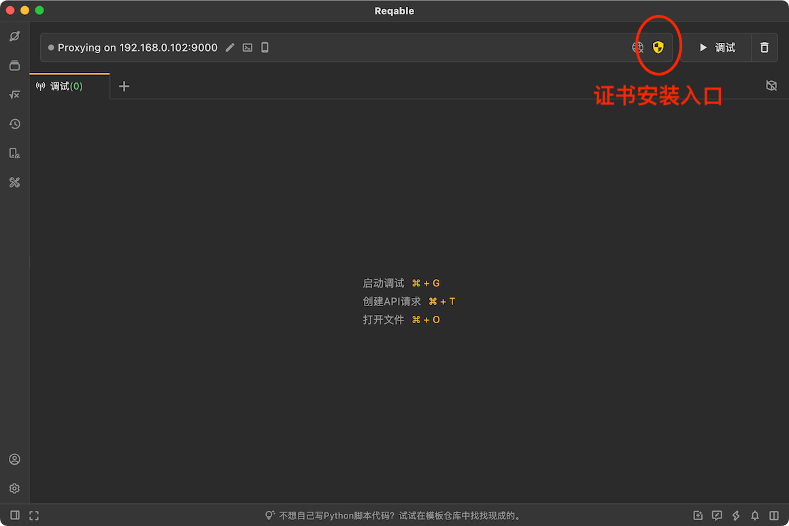
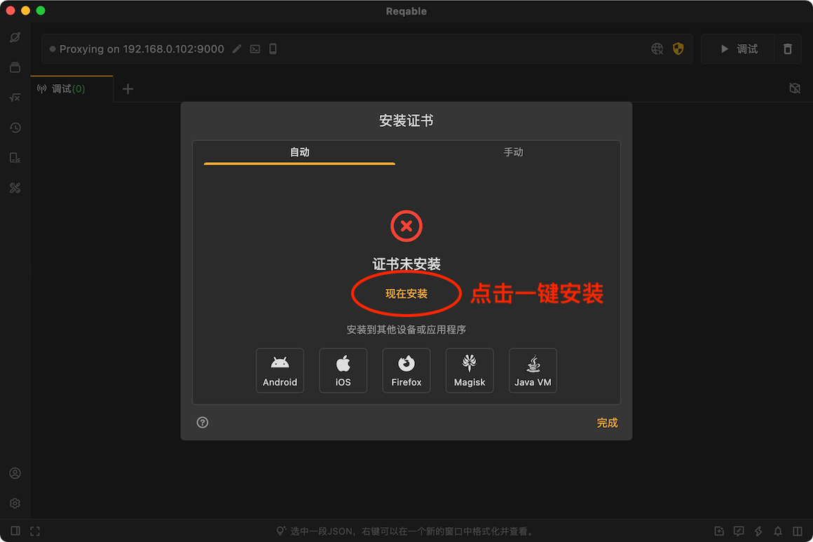
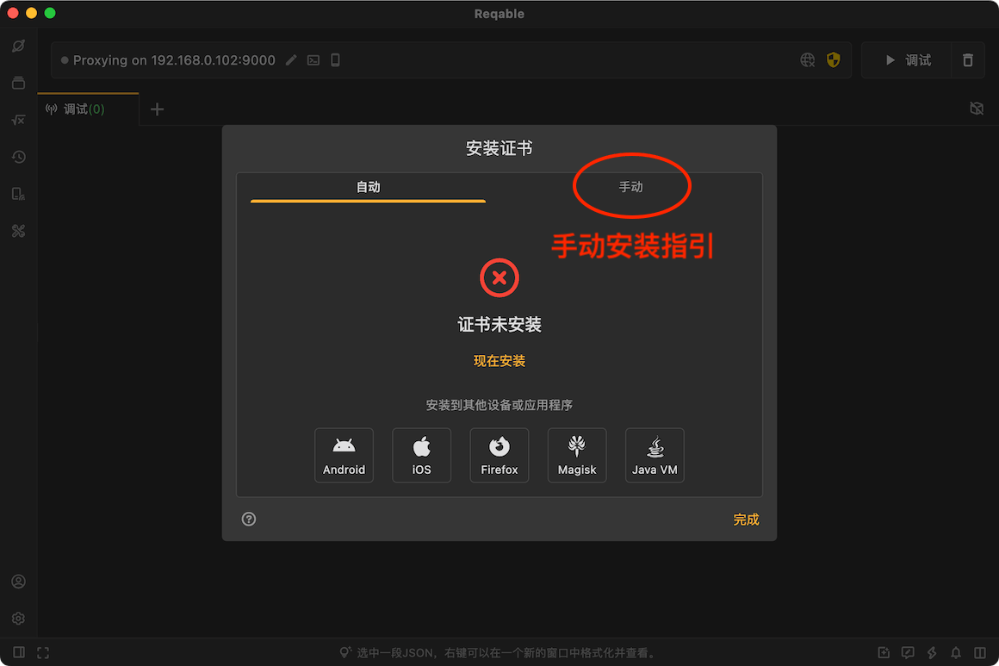

## 为什么要安装证书？

Reqable使用经典的中间人（MITM）技术分析HTTPS流量，当客户端与Reqable的代理服务器（下文简称`中间人`）进行通信时，中间人需要重签远程服务器的SSL证书。为了保证客户端与中间人成功进行SSL握手通信，需要将中间人的根证书（下文简称`CA根证书`）安装到客户端本地的证书管理中心。

如果目标客户端是电脑端应用程序，CA根证书需要安装到电脑的证书管理中心；如果目标客户端是移动端App，CA根证书则需要安装到手机的证书管理中心。如果您没有流量分析的需求，可以忽略这一步。

:::info 小提示
Reqable会为每台设备自动生成完全不同的CA根证书，并使用随机的证书密钥，所以您不必担心此证书会被第三方利用。
:::

## 桌面端安装  {#desktop}

不同的桌面端平台（这里主要是Windows/MacOS/Linux），证书安装方式有所不同，为了简化安装过程，Reqable提供了一键安装证书的功能。

证书的安装入口位于顶部操作栏，点击`盾牌`图标打开弹窗。



直接点击`现在安装`：



点击后系统会弹出确认弹窗或者输入账户密码进行授权，按照提示操作确认即可。不出意外的话，证书会自动安装成功；如果自动安装失败，可以切换到`手动安装`的Tab按照步骤手动安装。



注意，在Linux设备上Chrome和Firefox浏览器有内置的证书管理系统，您还需要将CA根证书安装到浏览器的证书管理系统中，请按照Reqable内的提示进行操作。

:::info 安装状态
CA根证书未安装或安装失败时，盾牌图标显示为黄色；安装成功后，盾牌图标显示为绿色。
:::

## 移动端安装 {#mobile}

如果您有分析移动端应用流量的需求，必须在移动端安装CA根证书，我们已经在Reqable中内置了Android和iOS证书安装的指引。如果您使用电脑端App，请切换到`Android`和`iOS`的Tab按照步骤进行安装；如果您使用移动端App，请进入`侧边栏` -> `证书管理` -> `安装根证书到本机`，然后选择合适的方案进行安装。

:::warning 重要须知
如果您使用电脑端App进行流量分析，请安装电脑端的CA根证书到移动端设备；如果您使用移动端App直接进行流量分析，请安装移动端的CA根证书到移动端设备。
:::

Reqable给每台设备生成的CA根证书均不相同。如果您希望所有设备共用同一个CA根证书，可以导出.p12格式证书后再在其他设备上导入。

:::note
小技巧：移动端App初始化选择协同模式并扫码连接电脑后，会自动同步电脑端的CA根证书到当前移动端设备，此时两台设备的CA根证书为同一个。
:::

### Android

Android证书分为两种：用户证书和系统证书。用户证书位于`/data/misc/user/0/cacerts`目录，系统证书位于`/system/etc/security/cacerts`。其中，用户目录不需要额外权限即可更改，系统目录需要权限解锁`system`分区才可修改。您可以按照下面的场景选择任意一个合适的证书安装方案。

#### 1. Android 7.0以下设备

Android 7.0以下设备默认信任用户证书，直接将证书安装到用户目录即可：设置-> 安全 -> 加密与凭据 -> 安装证书 -> CA证书，选择导出的证书并安装（需要用户授权验证）。

#### 2. Root设备并已解锁`system`分区

直接使用`adb`命令推送证书到系统证书目录。此证书为`hash.0`格式，具体hash值请参考App内的说明。

```shell
adb root
# restarting adbd as root
adb shell avbctl disable-verification
adb remount
adb push 364618e0.0 /system/etc/security/cacerts/364618e0.0
```

:::caution
由于Android 14证书迁移到`apex`模块，故此方案仅适合Android 13及以下版本。
:::

#### 3. Android项目配置信任路径

如果您是Android开发者并拥有项目的修改权限。您可以直接将证书安装到用户目录，然后在项目中配置信任用户目录证书即可。

第一步：手机上安装证书：设置-> 安全 -> 加密与凭据 -> 安装证书 -> CA证书，选择导出的证书并安装（需要用户授权验证）。

第二步：创建 res/xml/network_security_config.xml
```xml
<?xml version="1.0" encoding="utf-8"?>
<network-security-config>
  <base-config cleartextTrafficPermitted="true">
    <trust-anchors>
      <certificates src="system" />
      <certificates src="user" />
    </trust-anchors>
  </base-config>
</network-security-config>
```

第三步：配置 AndroidManifest.xml
```xml
<?xml version="1.0" encoding="utf-8"?>
<manifest>
  <application android:networkSecurityConfig="@xml/network_security_config">
    ...
  </application>
</manifest>
```

请在发行版本中移除此配置，更多有关网络安全配置文件资料，请参考：[Android开发文档](https://developer.android.google.cn/training/articles/security-config)。

#### 4. Android项目降低`targetSdkVersion`

如果您是Android开发者并拥有项目的修改权限。您可以直接将证书安装到用户目录，然后将项目的`targetSdkVersion`降低至23或以下。

第一步：手机上安装证书：设置-> 安全 -> 加密与凭据 -> 安装证书 -> CA证书，选择导出的证书并安装（需要用户授权验证）。

第二步：降低`targetSdkVersion`。
```gradle
android {
  defaultConfig {
    ...
    targetSdkVersion 23
    ...
  }
}
```

#### 5. Magisk模块安装到系统目录

Reqable应用内提供了Magisk模块安装包，可以一键安装证书到系统目录。支持Magisk和KernelSU，支持Android 5以上任何版本。

:::caution
KernelSU刷入模块后，可能需要需要授予Reqable Root权限，否则证书无法生效。
:::

#### 6. Chrome内核浏览器

最新版本Chrome内核浏览器对系统目录证书启用了CT日志验证，即使证书已经成功安装到系统目录，仍然会出现`NET:ERR_CERTIFICATE_TRANSPARENCY_REQUIRED`到问题。遇到这种问题，请将证书从系统目录中移除并安装到用户目录。Chrome内核浏览器默认会信任用户证书并不会进行CT日志验证。

#### 7. Flutter应用

Flutter框架开发的Android应用程序只信任系统目录证书，不会信任用户目录证书，这个是写死在框架里面的。无论是配置`network_security_config.xml`还是降低`targetSdkVersion`均不会生效。

### iOS

在iOS设备上安装证书非常简单，按照下面的操作即可。

首先，下载并安装描述文件（证书）。描述文件可以手动保存，也可以通过浏览器下载。
- 手动保存：点击右上角导出CA证书，在文件应用的Reqable文档目录下找到导出的CA证书，并手动复制或移动到上一级目录，点击证书后出现提示`已下载描述文件`。
- 浏览器下载：点击证书自动打开浏览器下载，下载完成后自动出现提示`已下载描述文件`。

第二步：打开 设置 -> 下载的描述文件 -> 选择文件 -> 安装 刚刚下载的描述文件。

第三步：信任证书，设置 -> 通用 -> 关于 -> 证书信任设置 -> 打开开关。

### 特殊情况

在一些特殊情况下，即使已经安装了证书可能也无法正常解析HTTPS流量，常见的有下面这些情况。

- 网络请求启用了固定证书，要求服务器返回指定签发的证书。

- 网络请求启用了双向验证，要求客户端也要上传证书给服务器进行验证。

- 应用使用了内置的CA证书验证，而不是使用系统的CA证书。