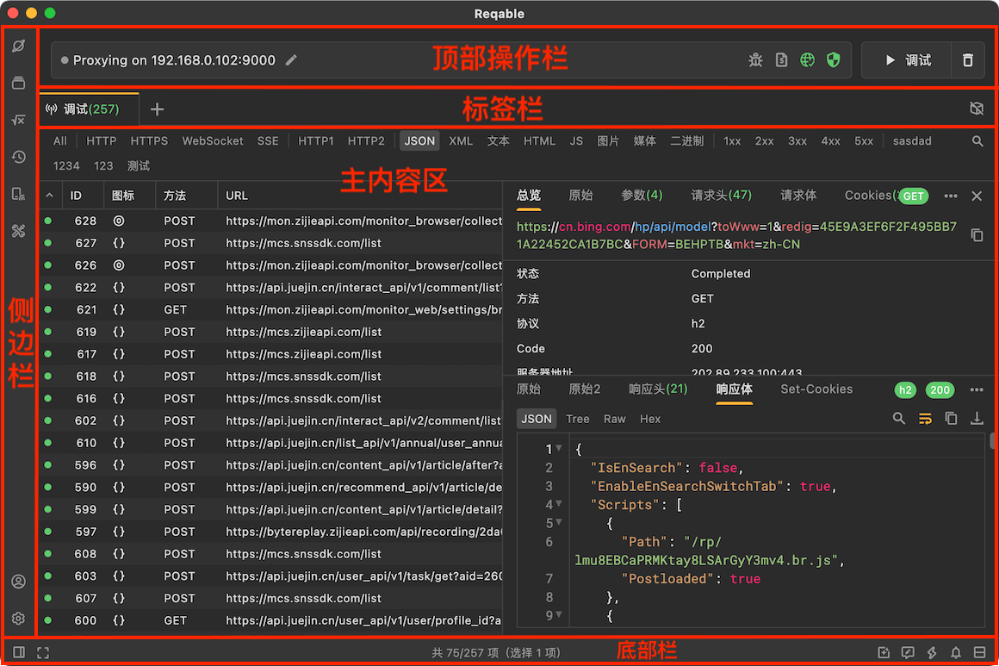
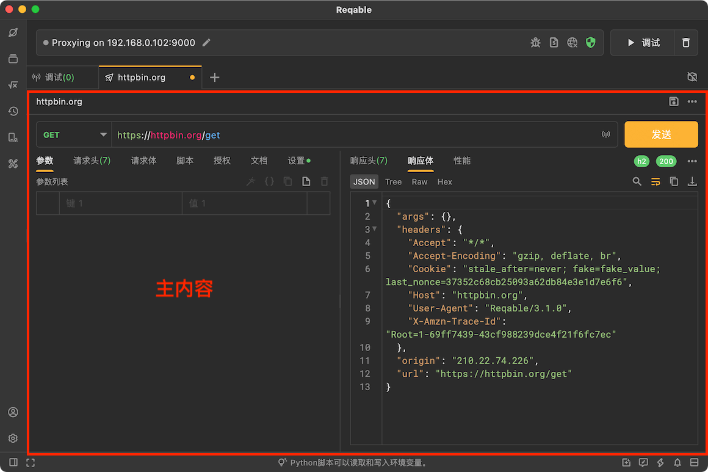
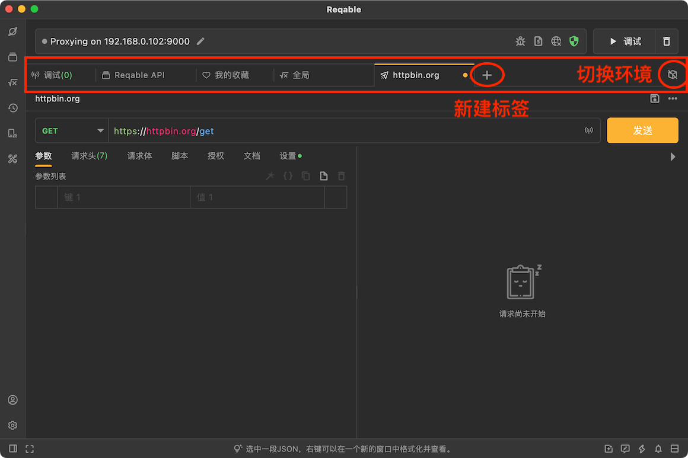
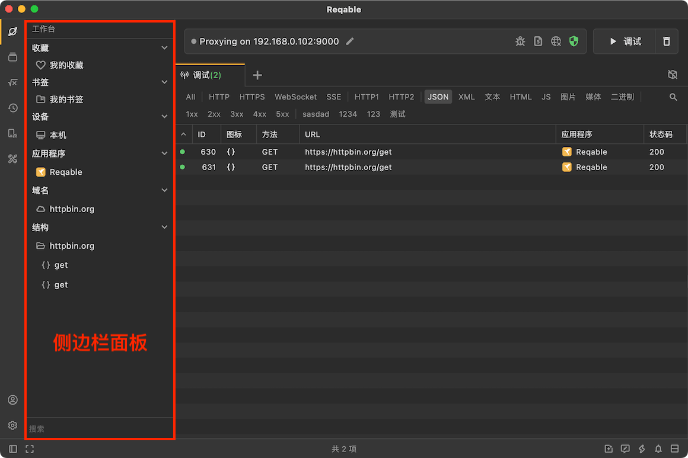

我们来了解下Reqable应用的整体布局，熟悉 `VS Code` 的小伙伴应该不会感到非常陌生。没错，Reqable就是就是使用的类似 `VS Code` 经典布局方式，但还是有一些差异，下面我们来看看吧。

Reqable的布局分为[主内容区](#main_board)、[侧边栏](#side_bar)、[顶部操作栏](#quick_bar)和[底部栏](#bottom_bar)，下面我们按照这四个部分分别进行介绍。

### 主内容区 {#main_board}

主内容区上方是标签栏，下方是内容区。Reqable支持多会话内容显示，包括调试列表、API编辑、调试历史记录以及HAR文件等。会话内容通过标签页Tab进行切换，当标签页Tab过多时，还支持左右滑动，右键点击标签页Tab可以进行新建、复制、关闭等功能操作。

### 侧边栏 {#side_bar}

侧边栏是指左侧边栏，分为上下两个部分。上部分包括工作台、历史记录、API集合、工具箱，下部分包括账户和设置。

点击图标可以直接展开侧边栏面板，再次点击图标可以关闭侧边栏面板。长按边界线左右拖动可调整侧边栏面板的大小，一直向左拖动还可以直接关闭侧边栏面板。

### 顶部操作栏 {#quick_bar}

顶部操作栏指的是标签页上面的区域，也被称作快捷操作栏（QuickBar）。

快捷操作栏用来控制调试功能的开启和关闭，图标按钮则作为SSL证书、代理、极速模式、无痕模式、脚本、断点、重写、镜像和网关功能的入口和状态显示。例如网络图标左键点击，可以自动配置系统代理或者关闭系统代理，右键点击可以进行代理协议切换、配置二级代理等。

快捷操作栏还显示了当前设备的IP地址，方便多端设备调试。

### 底部栏 {#bottom_bar}

底部栏放置了一些低频次使用的功能入口，例如布局方向切换，问题反馈、快捷键和版本升级等。在调试会话模式，还会显示调试列表的状态，例如总数、筛选数和选中数等。

