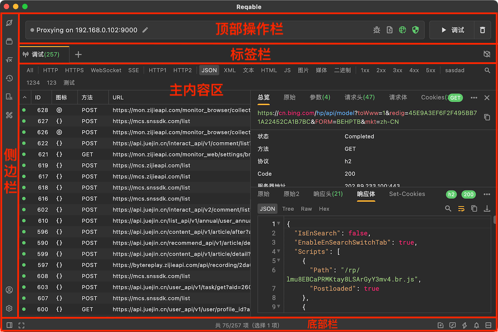
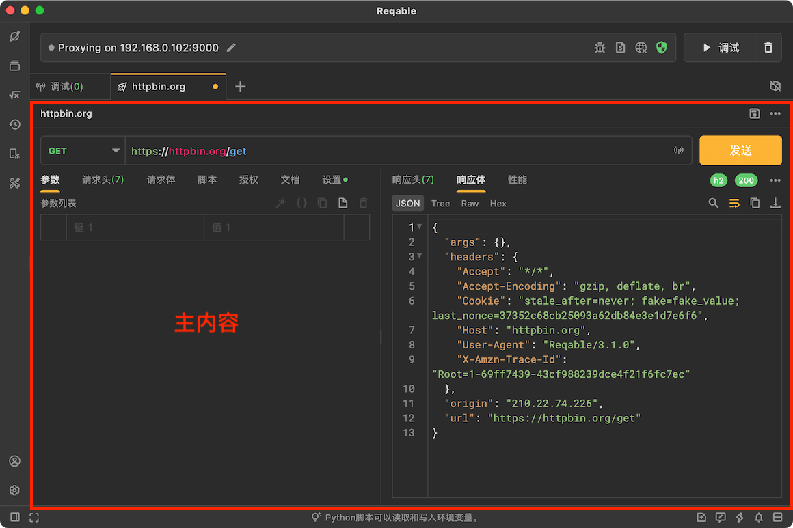
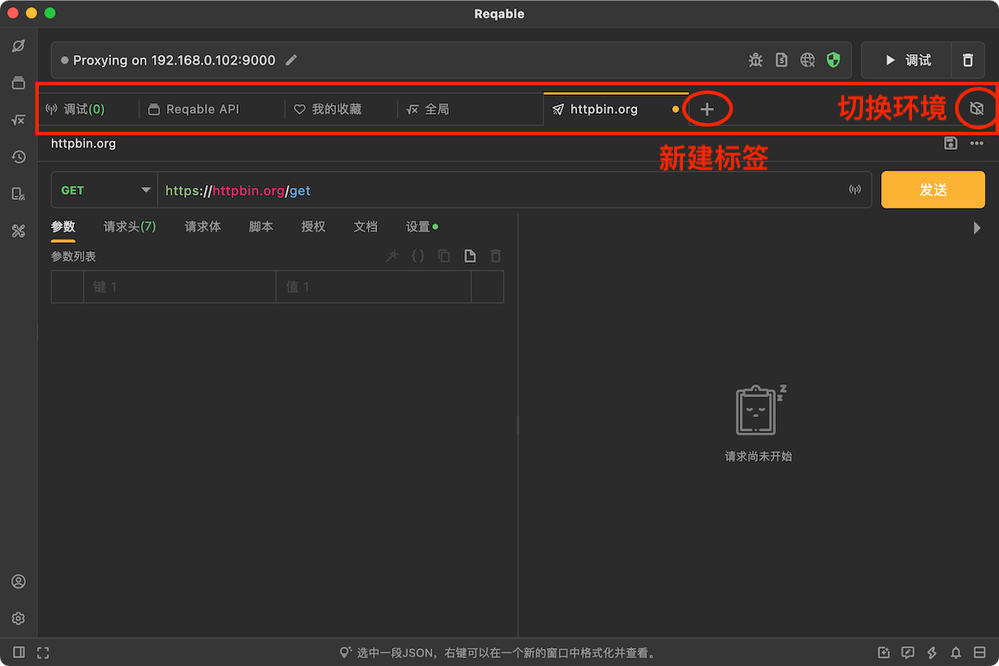
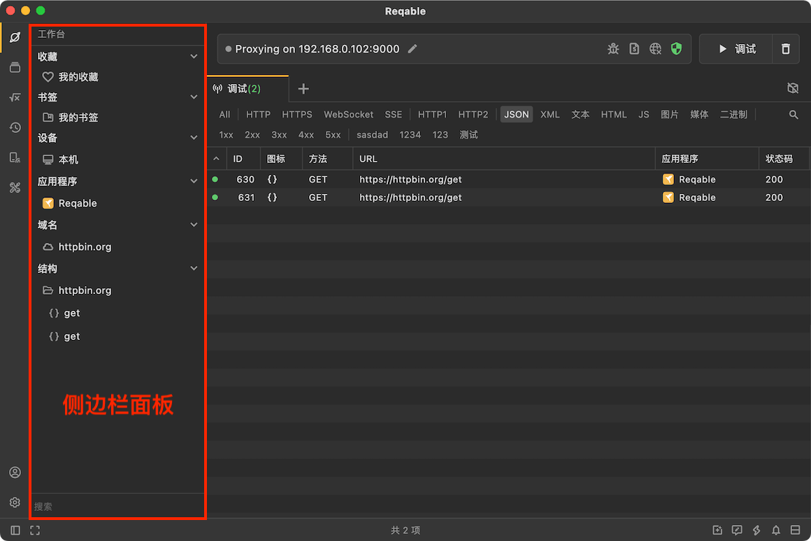
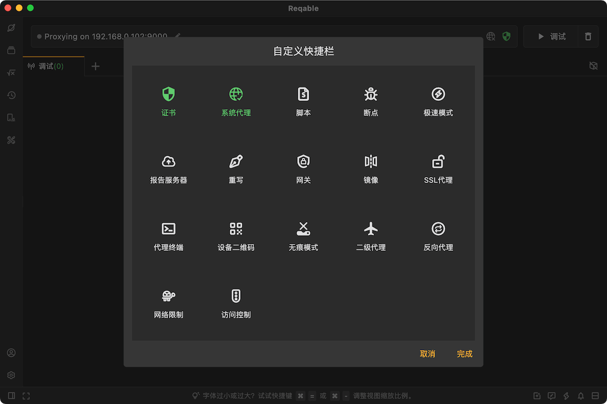
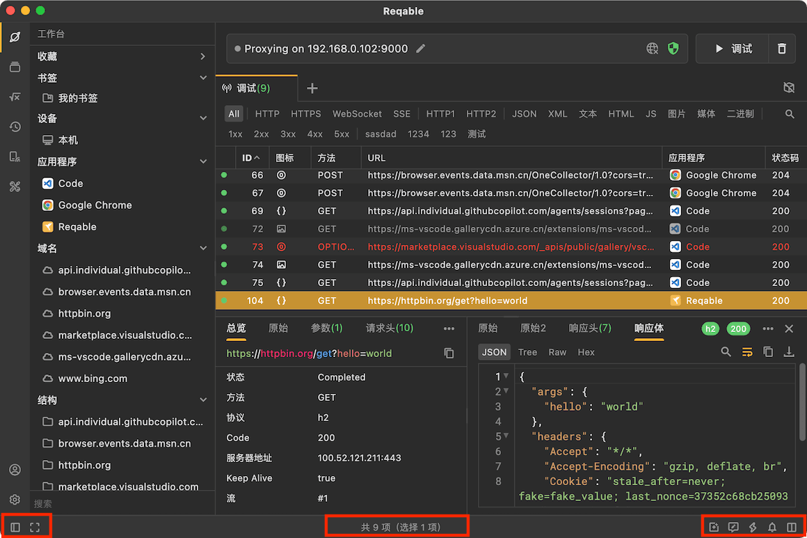

import Shortcut from '@site/src/components/Shortcut';

我们来了解下Reqable应用的整体布局，熟悉 `VS Code` 的小伙伴应该不会感到非常陌生。没错，Reqable就是就是使用的类似 `VS Code` 经典布局方式，但还是有一些差异，下面我们来看看吧。

Reqable的布局分为[主内容区](#main_board)、[标签栏](#tab_bar)、[侧边栏](#sidebar)、[顶部操作栏](#toolbar)和[底部栏](#bottom_bar)，下面我们按照这五个部分分别进行介绍。

### 主内容区 {#main_board}

主内容区用于展示核心内容，例如`调试列表`、`REST API`、`环境变量`和`API集合`等。主内容通过标签栏的标签进行管理，点击标签栏不同的标签可以显示不同的主内容，下图是REST API的主内容。

### 标签栏 {#tab_bar}

标签栏用来管理不同的内容，点击 `+` 按钮可以新建不同功能的标签。如果标签过多，还可以左右滚动。每个标签均支持右键菜单，不同功能的标签页的菜单选项不同。

标签页支持使用快捷键进行导航。

- <Shortcut>`Control` + `数字键`</Shortcut>：按索引选择标签页，第1个标签索引为1，索引0表示最后一个标签。
- <Shortcut>`Control` + `[` / `]`</Shortcut>：向左或者向右切换标签页。

标签栏最右侧显示当前环境，点击可以选择不同的环境。

### 侧边栏 {#sidebar}

侧边栏是指左侧边栏，分为上下两个部分。上部分包括`工作台（F1）`、`API集合（F2）`、`环境变量（F3）`、`历史记录（F4）`、`设备（F5）`、`工具箱（F6）`，下部分包括`账户`和`设置`。

上部侧边栏点击图标可以打开或者关闭侧边栏面板，左右拖动边界线可调整侧边栏面板的大小，一直向左拖动还可以直接关闭侧边栏面板。

### 顶部操作栏 {#toolbar}

顶部操作栏指的是标签页上面的区域，也被称作快捷操作栏。顶部操作栏上会显示当前设备的IP地址，以及常用功能快捷选项。一些已启用的功能也会显示相关的图标，例如`网络限制`等。

顶部操作栏右键菜单可以打开快捷栏编辑窗口，对常用功能进行固定和取消固定。

### 底部栏 {#bottom_bar}

底部栏放置了一些低频次使用的功能入口，例如`布局方向`、`禅模式`、`社区和媒体`、`问题反馈`、`快捷键`、`通知`和版本升级等。

底部栏中央会随机显示Reqable的使用小技巧。但是在不同的标签页中，中央文案会变化，例如标签页切换在调试的时候，会显示列表总数、筛选数和选中数等。

