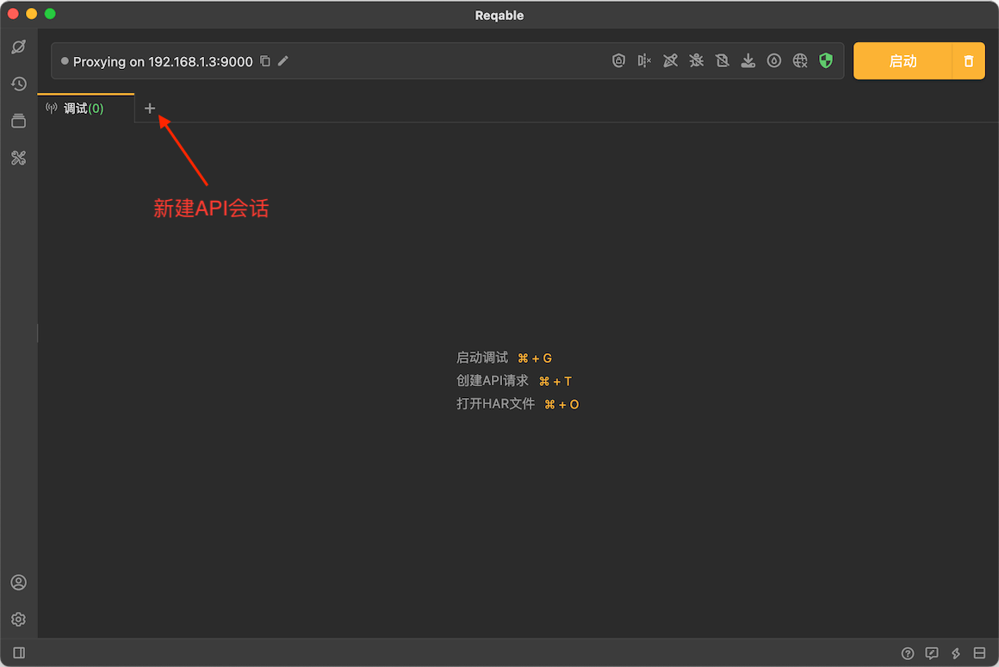
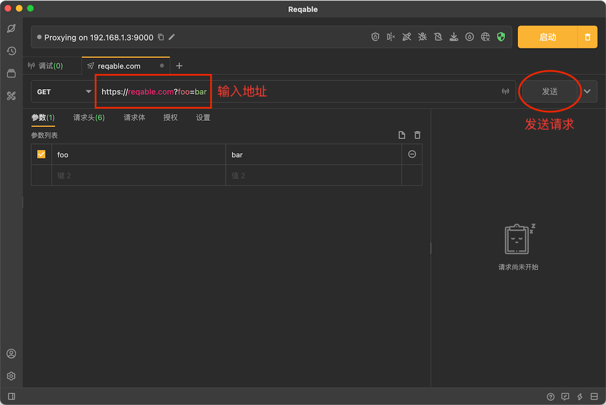
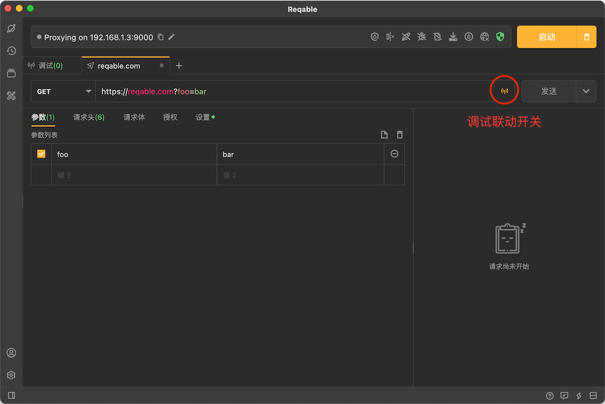
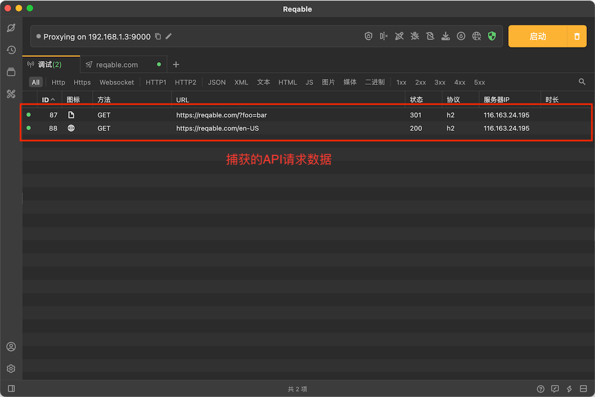
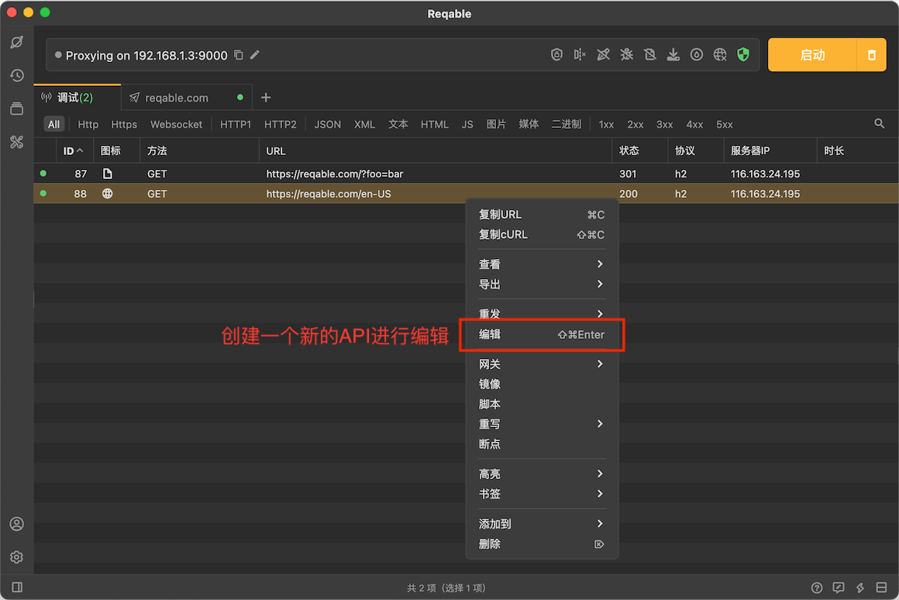

Reqable支持直接对API进行测试，支持HTTP1、HTTP2和HTTP3（QUIC）协议，下面讲解如何创建一个API并发送请求。

## 新建API

点击标签栏的 `+` 按钮，新建一个API会话。

在地址栏输入地址 `https://reqable.com?foo=bar` 并点击 `发送` 按钮。

静等几秒，便可以收到服务器的响应数据，一个简单的GET请求便发送完成了，我们可以查看这个请求的响应数据详情。

## 调试联动

API请求支持与调试功能进行联动，Reqable可以在API请求发送的同时进行流量捕获，点击地址栏末尾的信号按钮启用跟随调试功能。

再次点击 `发送` 按钮，便可以在调试列表中看到捕获的流量了。下图中调试列表中出现了两个请求，是因为出现了请求重定向，Reqable的API测试功能是支持重定向的。

在调试列表中选择一个请求双击可以打开详情面板，也可以右键打开功能菜单创建一个新的API会话。

