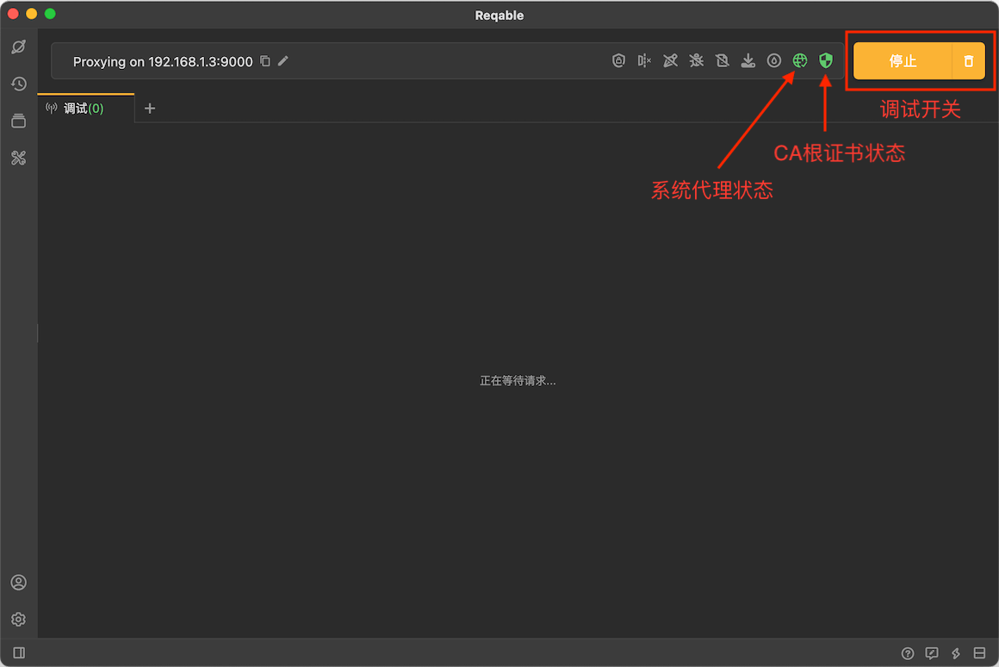
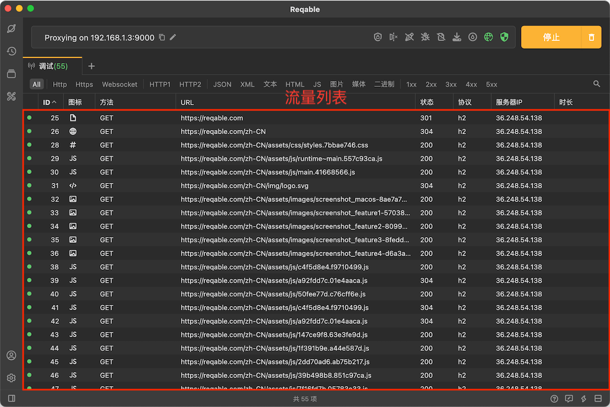
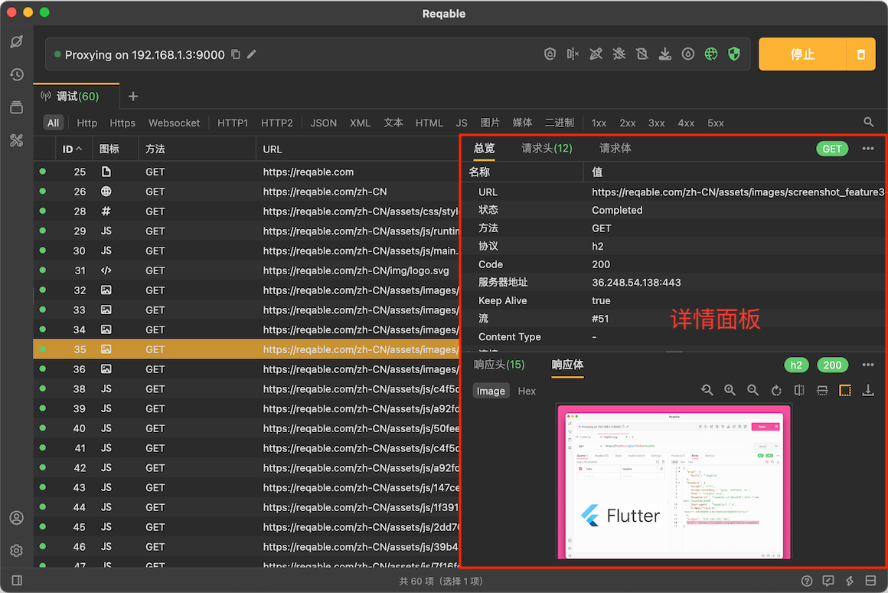
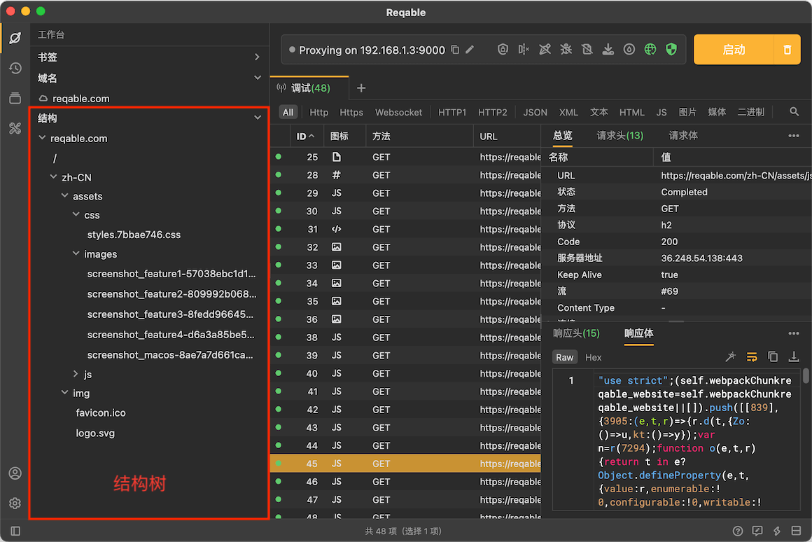

import Shortcut from '@site/src/components/Shortcut';

在API调试中，获取流量是第一步也是最基本的操作，这里讲解下如何使用Reqable获取流量，通俗地讲就是抓包。

## 开启调试

首先，需要启用Reqable的调试功能，点击最右上角的`启动`按钮进入调试状态。在调试状态下，任何HTTP请求经过Reqable的MITM代理服务器都会显示到界面上。

为了保证流量经过Reqable的MITM代理服务器并信任Reqable的CA根证书，请检查下面两项：

- 系统代理状态

如果系统代理已经设置，网络图标是绿色；如果系统代理未设置，网络图标是黄色，点击网络图标可以自动设置系统代理。

- CA根证书状态

如果CA根证书安装成功，盾牌图标是绿色；如果CA根证书未安装成功，网络图标是黄色，点击盾牌图标可以进入CA根证书安装界面，详细步骤请阅读[安装证书](../installation)。

一切就绪后，我们可以看到如下的界面：

:::caution

如果是调试手机等远程设备，请检查下面的checklist：
- [x] 手机与电脑都连接到同一个局域网。
- [x] 手机Wifi代理已设置Reqable的IP地址和端口号（见Reqable窗口顶部），或者使用SocksDroid进行转发。
- [x] 手机上已正确安装CA证书。
- [x] 电脑网络防火墙已开放Reqable的端口地址。

:::

## 浏览器测试

打开浏览器，输入地址 `https://reqable.com` 并回车，这里演示使用的是Chrome浏览器。回到Reqable，调试列表中已经捕获到了该网站的全部请求数据。

我们可以选择一个图片请求，双击打开详情面板，能够看到该请求的详细信息。注意，再次双击该请求，可以关闭详情面板。

点击侧边栏的`工作台`图标，打开调试列表的工作面板。然后展开`reqable.com`此域名的结构树，可以查看该域名下所有请求的目录结构，点击选择可以查看该请求的详情。

:::info
点击最右上角垃圾篓图标（快捷键 <Shortcut>Control + Shift + R</Shortcut> ）可以清空列表。
:::

这里，我们已经完成了获取流量最基本的操作了。