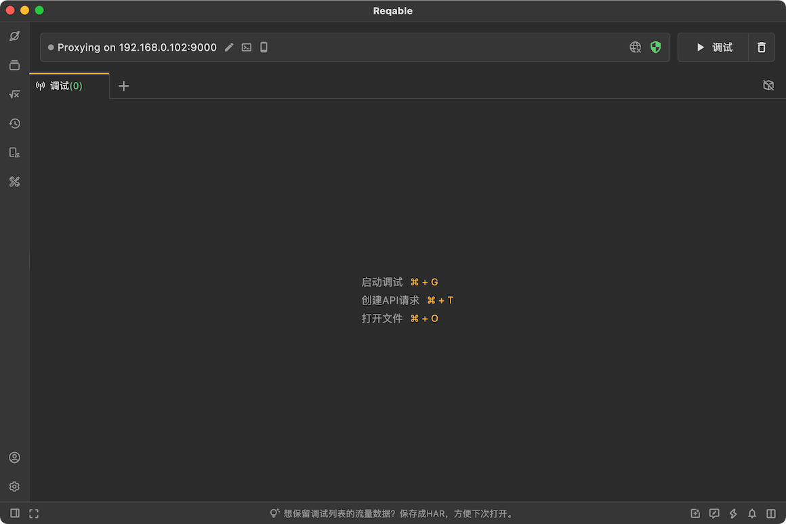
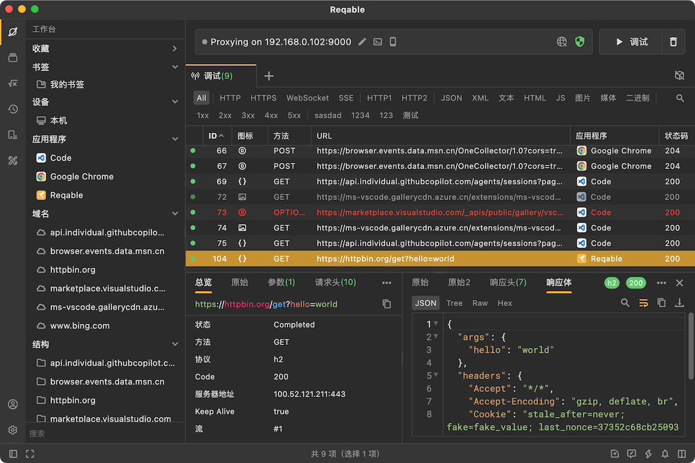
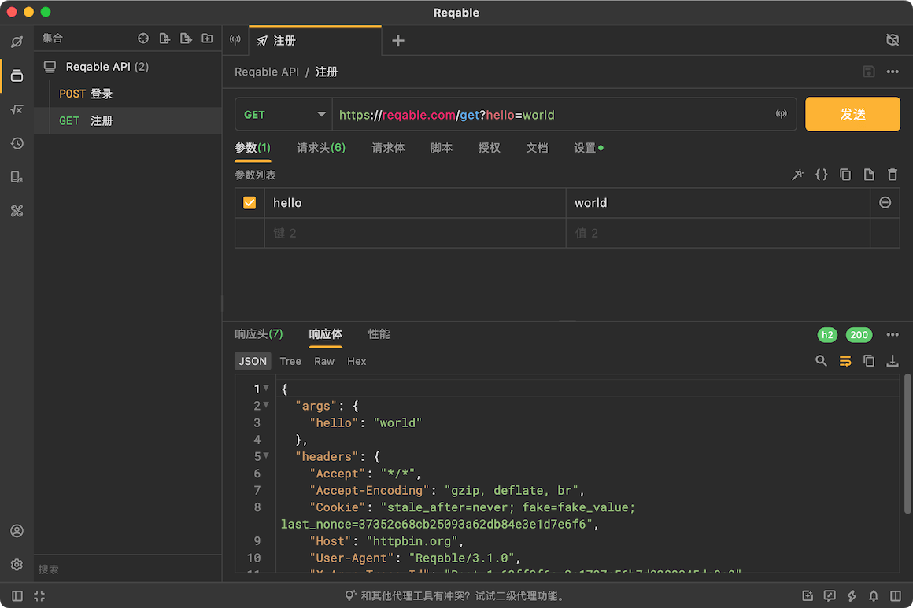

# 介绍

Reqable是一款跨平台的专业HTTP开发和调试工具，在全平台支持HTTP1、HTTP2和HTTP3(QUIC)协议，简单易用、功能强大、性能高效，助力程序开发和测试人员提高生产力！本产品需要一定的网络基础知识，适合开发、测试、网络、安全、爬虫等工程专业人员使用，或者在专业人员的指导下使用。

:::warning 许可声明
Reqable是一款用于企业接口生产的网络基础设施工具，某些特性可以修改网络传输数据，其设计和目的均是用于接口生产过程中的开发、调试和测试，请勿用于非许可用途！更多信息，请参阅[使用条款](https://reqable.com/policy)。
:::

## 特性

Reqable提供了两大基本功能：**[API调试](#capture)**和**[API测试](#rest)**，并打通了API调试和测试之间的壁垒，例如可以从抓包数据中创建API进行测试，也可以在API测试时进行抓包调试分析。同时，Reqable还提供了一些常用的技术[辅助工具](#toolbox)，尽可能一站式完成接口生产相关工作。

#### 1. API调试 {#capture}

Reqable采用经典的MITM代理方式进行流量分析，支持重写、脚本（Python）、断点和重放等功能。

- [x] 支持HTTP/1.x, HTTP2协议版本，HTTP3(QUIC)暂不支持。
- [x] 支持HTTP/HTTPS/Socks4/Socks4a/Socks5代理方式。
- [x] 支持HTTPS，TLSv1.1、TLSv1.2和TLSv1.3加密协议。
- [x] 支持基于IPv4和IPv6地址。
- [x] 支持基于HTTP1升级的WebSocket协议。
- [x] 支持HTTP/HTTPS二级代理（调试境外流量）。
- [x] 搜索筛选：提供书签、域名、快捷筛选栏和多条件等高级搜索方式。
- [x] 网关功能：对指定请求或响应进行屏蔽，挂起等操作。
- [x] 重写功能：预设规则对指定请求或响应进行重定向、替换或者修改。
- [x] 断点功能：对请求或响应进行实时断点操作，比如屏蔽，挂起或修改替换数据等。
- [x] 脚本功能：支持编写Python脚本处理实时请求或响应。
- [x] 镜像功能：对指定域名和端口配置镜像映射。
- [x] 测试联动：支持从调试列表创建API进行测试。
- [x] 历史记录：自动保存抓包的流量数据，方便回溯查看。
- [x] 重发回放：支持单个或多个请求进行回放测试。
- [x] 自动高亮：支持设定自定义规则对请求进行多种颜色高亮。
- [x] HAR支持：自动关联HAR格式文件，并支持HAR导出和导入。

#### 2. API测试 {#rest}

Reqable可以编辑和发送HTTP请求，用来测试API接口，同时还支持API集合存储和历史记录等功能。

- [x] 支持HTTP/1.1, HTTP2和HTTP3(QUIC)协议。
- [x] 多个会话：支持创建多个Tab进行API测试。
- [x] 集合导入：支持导入Postman、Hoppscotch、Apifox和ApiPost等API集合。
- [x] 批量编辑：支持批量编辑请求参数、请求头、表单等。
- [x] 授权设置：支持API KEY、Basic Auth和Bearer Token等授权方式。
- [x] 代理设置：支持自定义代理配置，系统代理和调试代理等。
- [x] 性能测试：可以查看请求在不同环节的耗时数据。
- [x] Cookie管理：自动保存Cookie或在请求头中自动加入关联的Cookie。
- [x] 历史记录：自动保存发送的请求和响应数据，方便回溯查看。
- [x] cURL支持：可以导入和导出cURL。

#### 3. 辅助工具 {#toolbox}

Reqable提供了一些常用的辅助工具。

- [x] Base64编解码。
- [x] URL编解码。
- [x] Md5计算。
- [x] 时间戳转换。
- [x] JSON查看器。
- [x] XML查看器。
- [x] HEX查看器。
- [x] 图片查看器。
- [x] 颜色选择器。
- [x] 二维码生成。
- [x] 数据Diff。
- [ ] 正则表达式测试。

## 历史

Reqable的前身是HttpCanary（一款Android平台应用程序），但是我们推翻了所有的技术栈，并用C++和Flutter重写，只保留了logo和主题色，所以两者并没有太多关联。当然，Reqable的使命之一，就是完全替代HttpCanary。
