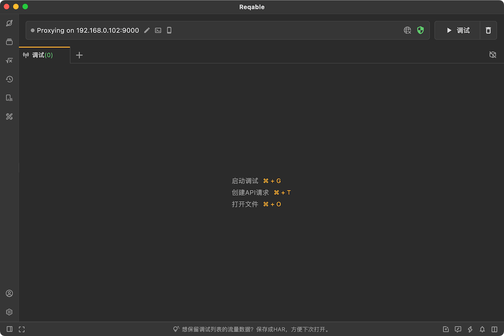
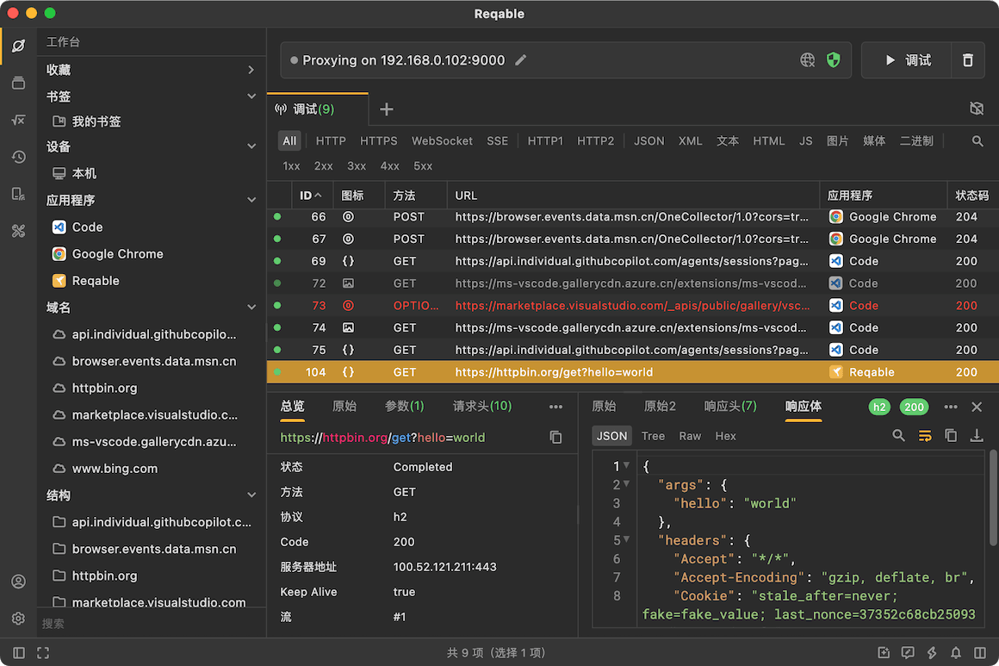
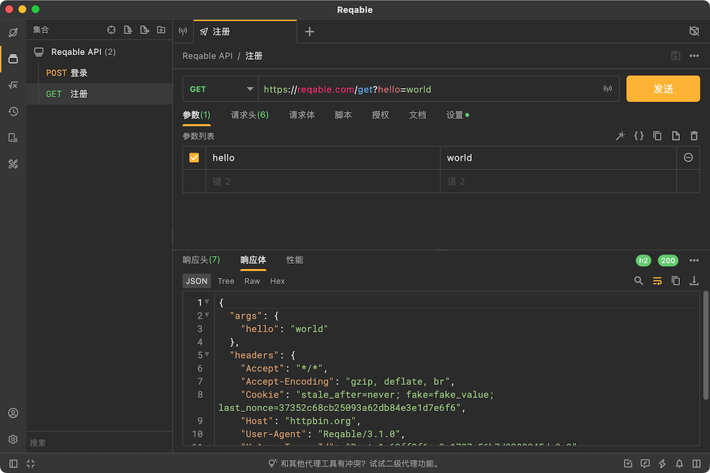

# 介绍

Reqable是一款跨平台的专业HTTP开发和调试工具，在全平台支持HTTP1、HTTP2和HTTP3(QUIC)协议，简单易用、功能强大、性能高效，助力程序开发和测试人员提高生产力！本产品需要一定的网络基础知识，适合开发、测试、网络、安全、爬虫等工程专业人员使用，或者在专业人员的指导下使用。

:::warning 许可声明
Reqable是一款用于企业接口生产的网络基础设施工具，某些特性可以修改网络传输数据，其设计和目的均是用于接口生产过程中的开发、调试和测试，请勿用于非许可用途！更多信息，请参阅[使用条款](https://reqable.com/zh-CN/policy)。
:::

# 特性

Reqable提供了两大基本功能：[API调试](#api-debugging)和[API测试](#api-testing)，并打通了API调试和测试之间的壁垒，例如可以从抓包数据中创建API进行测试，也可以在API测试时进行抓包调试分析。

## 1. API调试 {#api-debugging}

Reqable采用经典的MITM（中间人）方式对HTTP请求进行抓包，在桌面端使用系统代理的方式拦截流量，在移动端则使用VPN的方式拦截流量。Reqable支持对抓包数据进行调试操作，例如断点、重写请求和修改响应等。

:::caution 移动端限制
为防止滥用，Reqable移动端不提供调试相关功能，例如重写、断点和脚本等，如有调试需求请使用Reqable桌面端。
:::

### 1.1 协议支持

- 支持 `HTTP/1.x` 和 `HTTP2`，`HTTP3(QUIC)` 暂不支持。
- 支持 `TLSv1.1` 、`TLSv1.2` 和 `TLSv1.3`，国密暂不支持。
- 支持 `HTTP` 、`HTTPS` 、`Socks4` 、`Socks4a` 和 `Socks5` 代理协议。
- 支持 `WebSocket`（基于 `HTTP 1.1` 升级）协议。
- 支持 `Server-Sent Events(SSE)` 协议。
- 支持 `IPv4` 和 `IPv6` 地址。

#### 1.2 证书安装

API调试功能要求安装CA证书，请阅读文档[安装证书](../getting-started/installation)文档，了解如何安装。

#### 1.3 功能特性

有关API调试的各项功能，请阅读文档[API调试](../capture)。

## 2. API测试 {#api-testing}

Reqable可以编辑、发送和管理REST API请求，支持API集合、环境变量和云同步等功能。

#### 2.1 协议支持

- 支持 `HTTP/1.1` 、`HTTP2` 和 `HTTP3(QUIC)` 协议。
- 支持 `WebSocket`（基于 `HTTP 1.1` 升级）协议。
- 支持 `Server-Sent Events(SSE)` 协议。
- 支持 `IPv4` 和 `IPv6` 地址。

#### 2.2 API集合

Reqable支持导入 `Postman` 、`Swagger` 、`Insomnia` 、`Hoppscotch` 、`ApiFox` 、`ApiPost` 、`RapidApi(Paw)` 、`cURL` 和 `HAR`等文件格式。

未登录Reqable账号的情况下，API集合使用本地离线存储，仅在当前设备可以访问。如果需要将集合数据存储到云端和在多设备间同步，需要注册登录Reqable账号。

更多关于API集合的使用，请阅读文档[API调试](../rest/collection)。

#### 2.3 功能特性

有关API测试的各项功能，请阅读文档[API测试](../rest)。