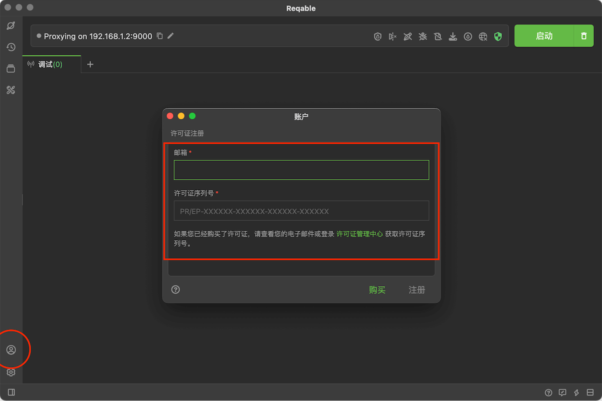
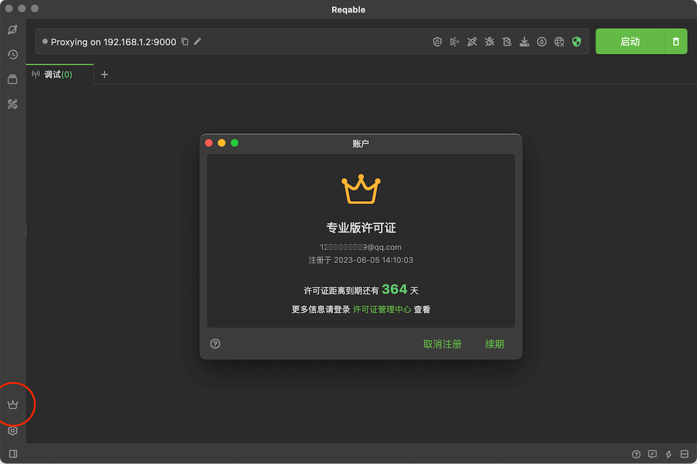
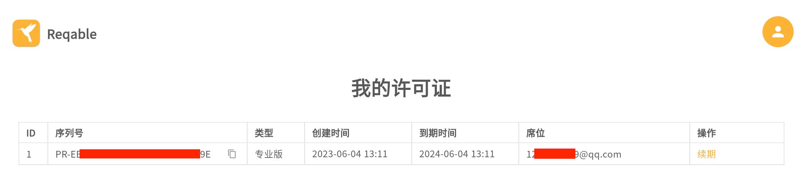

# 许可证

Reqable提供了完全免费的社区版，几乎所有的功能都是免费开放的，只是限制了使用数量，例如API集合数量，API标签页数量、规则数量等。但是好的产品需要资金支持，Reqable每年的研发成本超过百万，为了产品更长远和持续的发展，希望大家多多支持专业版和企业版订阅，帮助我们做出优秀的国产网络基础设施软件。

许可证分为两种类型：专业版和企业版。专业版适合个人团队或独立开发者使用；企业版适合多人或上规模的团队购买；专业版更贵，但是可同时使用的设备数量更多，详情请见[定价](https://reqable.com/pricing)。如果你有企业大量采购的需求，请联系market@reqable.com获取更优惠的价格。

许可证的订阅时长可以按年也可以按月，我们更加推荐年度订阅，可以享受技术顾问服务，同时价格也更加优惠。

### 许可证注册

如果您已购买许可证或已被企业管理员分配了席位，可以使用购买的许可证邮箱或者被分配的席位邮箱在Reqable中注册许可证。注册操作路径：点击Reqable程序左下角账户图标，输入邮箱和许可证序列号。

注册成功后，左下角图标变为会员皇冠标志，同时可以在账户窗口中看到许可证的有效剩余时间：

:::info
专业版许可证序列号为**PR-**开头，企业版许可证序列号为**EP-**开头。
:::

### 许可证管理

只要您购买了许可证，便可以登录Reqable的[许可证管理系统](https://license.reqable.com/)进行许可证的信息查看、续期和席位管理。对于企业版许可证账户，还可以进行席位的管理。

:::caution
注意：如果您是被分配的席位邮箱，无法登录许可证管理系统，必须使用购买下单的许可证的邮箱登录。管理系统初始登录密码可以在购买的邮件回执中查看。
:::

如果您有开发票的需求，请点击[这里](https://wj.qq.com/s2/12481788/98a9)提交开票信息。

### 许可证折扣

为感谢和回馈支持Reqable项目的小伙伴，我们会为其提供购买许可证优惠折扣甚至免费兑换活动，包括内测半价优惠、HttpCanary会员补偿活动、礼品卡兑换等方式，详情请[点击](https://reqable.com/discount)这里查看。

此外，我们在后面还会推出续期优惠活动（仅限年度订阅），敬请期待！