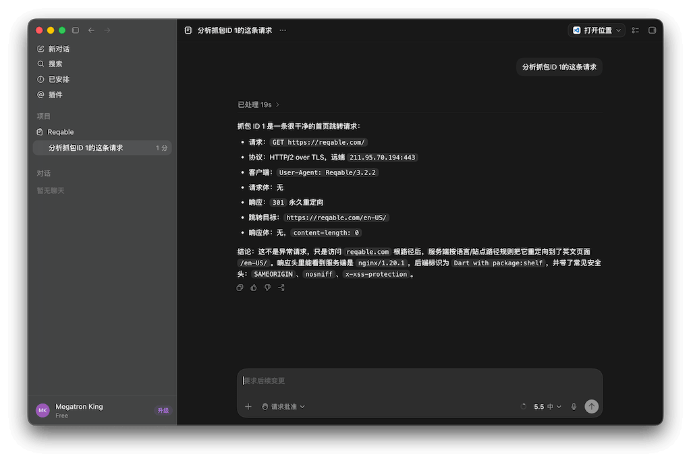
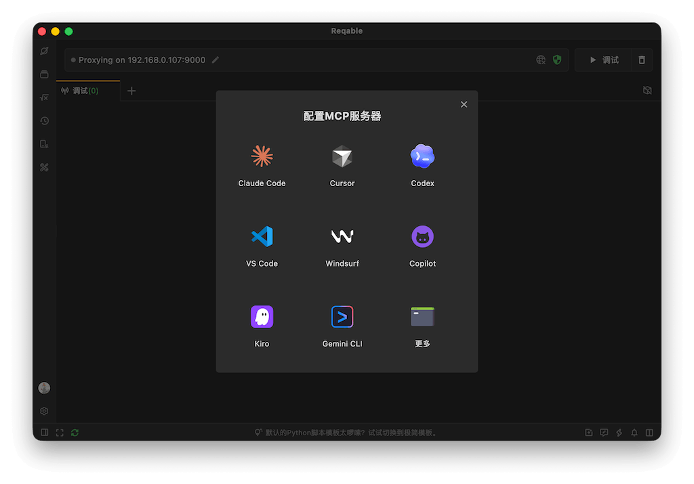

:::info
使用此功能需要更新Reqable到v3.2.0及以上版本。
:::

### 什么是MCP服务器

Reqable MCP（Model Context Protocol，模型上下文协议）是一项允许AI助手（如Claude、Cursor、Codex等其他兼容支持MCP的工具）直接与Reqable应用程序交互的功能。Reqable提供的MCP服务器直接内置在Reqable的安装包中，无需额外下载和安装，支持以`stdio`的方式配置到AI助手中。

在AI助手中配置好Reqable MCP服务器后，便可以让AI助手来操控Reqable，例如：

- 分析抓包ID 1的这条请求。
- 分析 `reqable.com` 相关的请求。
- 对全部的 `reqable.com` 域名的请求创建断点。
- 新建一个脚本规则，对抓包ID 2请求的响应进行AES解密，并输出解密后数据到控制台。
- 新建一个重写规则，将`https://reqable.com`的响应体中全部的 `123` 都改成 `456` 。
- 新建一个名称为`Development`的API集合，将本项目中调用到的全部的接口保存到其中，并添加说明文档。
- 预测明天哪只股票会涨停（🐶这个不支持）。

### 使用方式

从应用 `工具` 菜单中可以打开MCP服务器配置指引页面，我们提供了一些常用AI助手的配置说明和一键安装功能。

在AI助手中配置好后，便可以让AI操控本机的Reqable了，更多MCP使用教程可以参考：

https://juejin.cn/post/7660367762294226987

如果要让AI控制非本机（例如手机）的Reqable，在配置MCP时可以使用 `--host` 和 `--port`参数。

| 参数 | 缩写 | 说明 | 默认值 |
| --- | --- | --- | --- |
| `--host` | `-h` | 可选，Reqable API 服务地址。 | `127.0.0.1` |
| `--port` | `-p` | 可选，Reqable API 服务端口。 | 优先读取 Reqable 本地配置中的 `proxyPort`，读取失败时回退到 `9000` |
| `--scope` | `-s` | 可选，控制注册哪些工具， `minimal` 仅注册常用工具, `all` 注册全部工具。 | `minimal` |

### 支持功能

Reqable MCP 提供了上百个 MCP Tool，按功能分类如下。

#### HTTP请求测试

| Tool | 功能 | 包含在 `minimal` |
| --- | --- |--- |
| `rest_http_create_from_url` | 通过 URL 创建新的 HTTP API 标签页。 | ✅ |
| `rest_http_create_from_curl` | 通过 cURL 创建新的 HTTP API 标签页。 | ✅ |
| `rest_http_update` | 使用完整 JSON 载荷更新 HTTP API。 | ✅ |

#### WebSocket请求测试

| Tool | 功能 | 包含在 `minimal` |
| --- | --- |--- |
| `rest_websocket_create_from_url` | 通过 URL 创建新的 WebSocket API 标签页。 | ✅ |
| `rest_websocket_update` | 使用完整 JSON 载荷更新 WebSocket API。 | ✅ |

#### 环境变量

| Tool | 功能 | 包含在 `minimal` |
| --- | --- |--- |
| `environment_list` | 列出全部环境，并标记当前激活环境。 | ❌ |
| `environment_get_by_id` | 按 ID 获取环境详情。 | ❌ |
| `environment_get_active` | 获取当前激活环境。 | ❌ |
| `environment_create` | 创建新的环境。 | ❌ |
| `environment_update` | 更新环境内容。 | ❌ |
| `environment_delete` | 删除指定环境。 | ❌ |
| `environment_select` | 按 ID 选择激活环境。 | ❌ |
| `environment_builtin_variables` | 列出 Reqable 提供的内建环境变量。 | ❌ |

#### 集合

| Tool | 功能 | 包含在 `minimal` |
| --- | --- |--- |
| `collection_list` | 列出全部 Collection ID。 | ✅ |
| `collection_structure` | 获取全部 Collection 的树形结构。 | ✅ |
| `collection_get` | 按 Collection ID 获取集合属性。 | ✅ |
| `collection_create` | 创建新的 Collection。 | ✅ |
| `collection_update` | 更新 Collection 属性。 | ✅ |
| `collection_delete` | 删除指定 Collection。 | ✅ |
| `collection_folder_get` | 按 Collection ID 和 Folder ID 获取文件夹属性。 | ✅ |
| `collection_folder_create` | 在 Collection 中创建文件夹。 | ✅ |
| `collection_folder_update` | 更新 Collection 文件夹属性。 | ❌ |
| `collection_folder_delete` | 删除 Collection 文件夹。 | ❌ |
| `collection_api_get` | 获取 Collection 中指定 HTTP 或 WebSocket API 的详情。 | ✅ |
| `collection_api_create` | 通过 cURL 在 Collection 中创建新的 API。 | ✅ |
| `collection_api_add` | 将已创建的 HTTP 或 WebSocket API 加入 Collection。 | ✅ |
| `collection_api_update` | 更新 Collection 中已有的 API。 | ✅ |
| `collection_api_delete` | 从 Collection 中删除指定 API。 | ✅ |
| `collection_api_generate_curl` | 根据 Collection ID 和 API ID 生成 cURL。 | ✅ |

#### 脚本资源

| Tool | 功能 | 包含在 `minimal` |
| --- | --- |--- |
| `script_framework` | 获取 Reqable Python 脚本框架内容，创建或更新脚本前应先调用。 | ✅ |
| `script_template` | 获取 Reqable Python 脚本模板内容，创建或更新脚本前应先调用。 | ✅ |

#### 代理控制

| Tool | 功能 | 包含在 `minimal` |
| --- | --- |--- |
| `proxy_set` | 控制Reqable中的代理，例如是否覆盖系统代理等。 | ✅ |

#### 抓包列表

| Tool | 功能 | 包含在 `minimal` |
| --- | --- |--- |
| `capture_live_status` | 获取当前实时抓包状态。 | ❌ |
| `capture_live_set_enabled` | 启动或停止实时抓包。 | ✅ |
| `capture_live_filter` | 过滤当前抓包记录并返回匹配记录 ID。 | ✅ |
| `capture_live_get_by_id` | 按数字 ID 获取抓包记录详情。 | ✅ |
| `capture_live_clear` | 清空当前保存的实时抓包记录。 | ❌ |
| `capture_live_generate_curl` | 为指定抓包记录生成 cURL 命令。 | ✅ |
| `capture_live_compose` | 将抓包记录组装为新的 HTTP 或 WebSocket API 标签页。 | ✅ |
| `capture_live_collection_add` | 将抓包记录加入指定 Collection。 | ✅ |

#### SSL代理

| Tool | 功能 | 包含在 `minimal` |
| --- | --- |--- |
| `capture_ssl_proxying_get_config` | 获取 SSL Proxying 当前配置。 | ❌ |
| `capture_ssl_proxying_get_active` | 获取当前激活的 SSL Proxying 配置。 | ❌ |
| `capture_ssl_proxying_lookup` | 按 ID 获取 SSL Proxying 配置详情。 | ❌ |
| `capture_ssl_proxying_select` | 按 ID 选择激活的 SSL Proxying 配置。 | ❌ |
| `capture_ssl_proxying_create` | 创建新的 SSL Proxying 配置。 | ❌ |
| `capture_ssl_proxying_delete` | 删除一个或多个 SSL Proxying 配置。 | ❌ |
| `capture_ssl_proxying_update` | 更新 SSL Proxying 配置。 | ❌ |

#### 断点

| Tool | 功能 | 包含在 `minimal` |
| --- | --- |--- |
| `capture_breakpoint_get_config` | 获取断点功能的当前配置。 | ✅ |
| `capture_breakpoint_set_enabled` | 启用或禁用断点功能。 | ✅ |
| `capture_breakpoint_list` | 列出全部断点规则。 | ❌ |
| `capture_breakpoint_set_item_enabled` | 批量启用或禁用指定断点。 | ❌ |
| `capture_breakpoint_get_by_id` | 按 ID 获取断点详情。 | ✅ |
| `capture_breakpoint_create` | 创建新的断点规则。 | ✅ |
| `capture_breakpoint_create_folder` | 创建断点文件夹。 | ❌ |
| `capture_breakpoint_delete` | 删除一个或多个断点。 | ✅ |
| `capture_breakpoint_delete_folder` | 删除一个或多个断点文件夹。 | ❌ |
| `capture_breakpoint_update` | 更新断点规则。 | ✅ |
| `capture_breakpoint_update_folder_name` | 重命名断点文件夹。 | ❌ |

#### 网关

| Tool | 功能 | 包含在 `minimal` |
| --- | --- |--- |
| `capture_gateway_get_config` | 获取网关功能的当前配置。 | ✅ |
| `capture_gateway_set_enabled` | 启用或禁用网关功能。 | ✅ |
| `capture_gateway_list` | 列出全部网关规则。 | ❌ |
| `capture_gateway_set_item_enabled` | 批量启用或禁用指定网关规则。 | ❌ |
| `capture_gateway_get_by_id` | 按 ID 获取网关规则详情。 | ✅ |
| `capture_gateway_create` | 创建新的网关规则。 | ✅ |
| `capture_gateway_create_folder` | 创建网关文件夹。 | ❌ |
| `capture_gateway_delete` | 删除一个或多个网关规则。 | ✅ |
| `capture_gateway_delete_folder` | 删除一个或多个网关文件夹。 | ❌ |
| `capture_gateway_update` | 更新网关规则。 | ✅ |
| `capture_gateway_update_folder_name` | 重命名网关文件夹。 | ❌ |

#### 镜像

| Tool | 功能 | 包含在 `minimal` |
| --- | --- |--- |
| `capture_mirror_get_config` | 获取镜像功能的当前配置。 | ✅ |
| `capture_mirror_set_enabled` | 启用或禁用镜像功能。 | ✅ |
| `capture_mirror_list` | 列出全部镜像规则。 | ❌ |
| `capture_mirror_set_item_enabled` | 批量启用或禁用指定镜像规则。 | ❌ |
| `capture_mirror_get_by_id` | 按 ID 获取镜像规则详情。 | ✅ |
| `capture_mirror_create` | 创建新的镜像规则。 | ✅ |
| `capture_mirror_create_folder` | 创建镜像文件夹。 | ❌ |
| `capture_mirror_delete` | 删除一个或多个镜像规则。 | ✅ |
| `capture_mirror_delete_folder` | 删除一个或多个镜像文件夹。 | ❌ |
| `capture_mirror_update` | 更新镜像规则。 | ✅ |
| `capture_mirror_update_folder_name` | 重命名镜像文件夹。 | ❌ |

#### 重写

| Tool | 功能 | 包含在 `minimal` |
| --- | --- |--- |
| `capture_rewrite_get_config` | 获取重写功能的当前配置。 | ✅ |
| `capture_rewrite_set_enabled` | 启用或禁用重写功能。 | ✅ |
| `capture_rewrite_list` | 列出全部重写规则。 | ❌ |
| `capture_rewrite_set_item_enabled` | 批量启用或禁用指定重写规则。 | ❌ |
| `capture_rewrite_get_by_id` | 按 ID 获取重写规则详情。 | ✅ |
| `capture_rewrite_create` | 创建新的重写规则。 | ✅ |
| `capture_rewrite_create_folder` | 创建重写文件夹。 | ❌ |
| `capture_rewrite_delete` | 删除一个或多个重写规则。 | ✅ |
| `capture_rewrite_delete_folder` | 删除一个或多个重写文件夹。 | ❌ |
| `capture_rewrite_update` | 更新重写规则。 | ✅ |
| `capture_rewrite_update_folder_name` | 重命名重写文件夹。 | ❌ |

#### 抓包脚本

| Tool | 功能 | 包含在 `minimal` |
| --- | --- |--- |
| `capture_script_get_config` | 获取脚本功能的当前配置。 | ✅ |
| `capture_script_set_enabled` | 启用或禁用脚本功能。 | ✅ |
| `capture_script_list` | 列出全部脚本规则。 | ❌ |
| `capture_script_set_item_enabled` | 批量启用或禁用指定脚本规则。 | ❌ |
| `capture_script_get_by_id` | 按 ID 获取脚本规则详情。 | ✅ |
| `capture_script_create` | 创建新的 Python 脚本规则。 | ✅ |
| `capture_script_create_folder` | 创建脚本文件夹。 | ❌ |
| `capture_script_delete` | 删除一个或多个脚本规则。 | ✅ |
| `capture_script_delete_folder` | 删除一个或多个脚本文件夹。 | ❌ |
| `capture_script_update` | 更新脚本规则。 | ✅ |
| `capture_script_update_folder_name` | 重命名脚本文件夹。 | ❌ |

#### 网络模拟

| Tool | 功能 | 包含在 `minimal` |
| --- | --- |--- |
| `capture_network_throttling_get_config` | 获取网络限速功能的当前配置。 | ❌ |
| `capture_network_throttling_set_enabled` | 启用或禁用网络限速功能。 | ❌ |
| `capture_network_throttling_get_active` | 获取当前激活的网络限速配置。 | ❌ |
| `capture_network_throttling_lookup` | 按 ID 获取网络限速配置详情。 | ❌ |
| `capture_network_throttling_select` | 按 ID 选择激活的网络限速配置。 | ❌ |
| `capture_network_throttling_create` | 创建新的网络限速配置。 | ❌ |
| `capture_network_throttling_delete` | 删除一个或多个网络限速配置。 | ❌ |
| `capture_network_throttling_update` | 更新网络限速配置。 | ❌ |

#### 上报服务器

| Tool | 功能 | 包含在 `minimal` |
| --- | --- |--- |
| `capture_report_server_get_config` | 获取上报服务器功能的当前配置。 | ❌ |
| `capture_report_server_set_enabled` | 启用或禁用上报服务器功能。 | ❌ |
| `capture_report_server_lookup` | 按 ID 获取上报服务器配置详情。 | ❌ |
| `capture_report_server_set_item_enabled` | 批量启用或禁用指定上报服务器配置。 | ❌ |
| `capture_report_server_create` | 创建新的上报服务器配置。 | ❌ |
| `capture_report_server_delete` | 删除一个或多个上报服务器配置。 | ❌ |
| `capture_report_server_update` | 更新上报服务器配置。 | ❌ |

#### 反向代理

| Tool | 功能 | 包含在 `minimal` |
| --- | --- |--- |
| `capture_reverse_proxy_get_config` | 获取反向代理功能的当前配置。 | ❌ |
| `capture_reverse_proxy_set_enabled` | 启用或禁用反向代理功能。 | ❌ |
| `capture_reverse_proxy_list` | 列出全部反向代理规则。 | ❌ |
| `capture_reverse_proxy_set_item_enabled` | 批量启用或禁用指定反向代理规则。 | ❌ |
| `capture_reverse_proxy_lookup` | 按 ID 获取反向代理规则详情。 | ❌ |
| `capture_reverse_proxy_create` | 创建新的反向代理规则。 | ❌ |
| `capture_reverse_proxy_create_folder` | 创建反向代理文件夹。 | ❌ |
| `capture_reverse_proxy_delete` | 删除一个或多个反向代理规则。 | ❌ |
| `capture_reverse_proxy_delete_folder` | 删除一个或多个反向代理文件夹。 | ❌ |
| `capture_reverse_proxy_update` | 更新反向代理规则。 | ❌ |
| `capture_reverse_proxy_update_folder_name` | 重命名反向代理文件夹。 | ❌ |

#### 二级代理

| Tool | 功能 | 包含在 `minimal` |
| --- | --- |--- |
| `capture_secondary_proxy_get_config` | 获取二级代理功能的当前配置。 | ❌ |
| `capture_secondary_proxy_set_enabled` | 启用或禁用二级代理功能。 | ❌ |
| `capture_secondary_proxy_get_active` | 获取当前激活的二级代理配置。 | ❌ |
| `capture_secondary_proxy_lookup` | 按 ID 获取二级代理配置详情。 | ❌ |
| `capture_secondary_proxy_select` | 按 ID 选择激活的二级代理配置。 | ❌ |
| `capture_secondary_proxy_create` | 创建新的二级代理配置。 | ❌ |
| `capture_secondary_proxy_delete` | 删除一个或多个二级代理配置。 | ❌ |
| `capture_secondary_proxy_update` | 更新二级代理配置。 | ❌ |

#### 访问控制

| Tool | 功能 | 包含在 `minimal` |
| --- | --- |--- |
| `capture_access_control_get_config` | 获取访问控制功能的当前配置。 | ❌ |
| `capture_access_control_set_enabled` | 启用或禁用访问控制功能。 | ❌ |
| `capture_access_control_get_active` | 获取当前激活的访问控制配置。 | ❌ |
| `capture_access_control_lookup` | 按 ID 获取访问控制配置详情。 | ❌ |
| `capture_access_control_select` | 按 ID 选择激活的访问控制配置。 | ❌ |
| `capture_access_control_create` | 创建新的访问控制配置。 | ❌ |
| `capture_access_control_delete` | 删除一个或多个访问控制配置。 | ❌ |
| `capture_access_control_update` | 更新访问控制配置。 | ❌ |

### 自定义MCP服务器

Reqable MCP服务器项目是完全在Github上开源的，您可以修改和重新编译，也欢迎提交PR和Issue。

项目地址：https://github.com/reqable/reqable-mcp-server