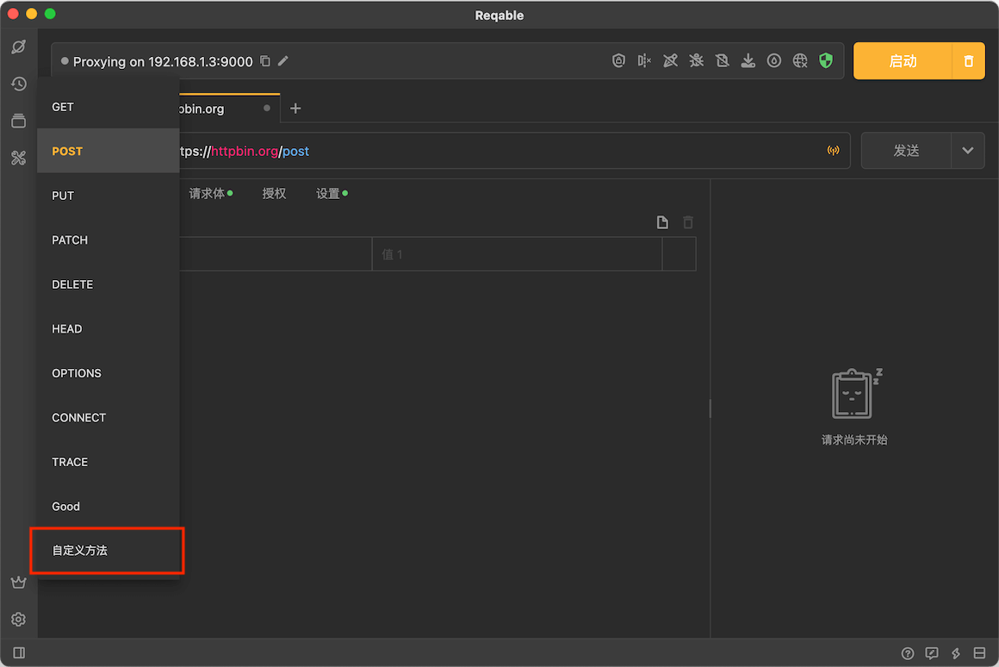
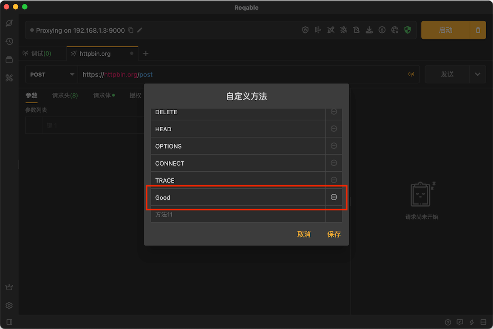
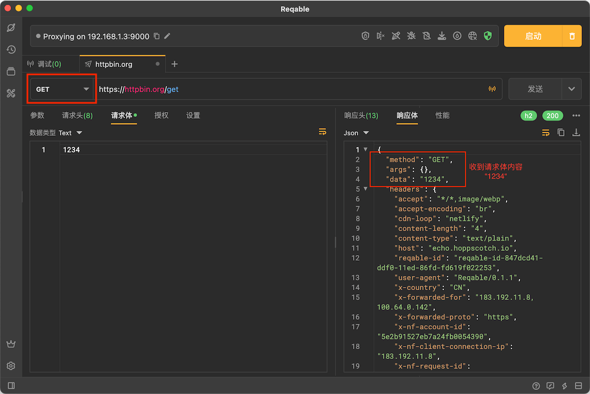

# 请求方法

Reqable支持使用内置请求方法和自定义请求方法，其中内置的9个请求方法如下：

- [GET](https://developer.mozilla.org/zh-CN/docs/Web/HTTP/Methods/GET)
- [POST](https://developer.mozilla.org/zh-CN/docs/Web/HTTP/Methods/POST)
- [PUT](https://developer.mozilla.org/zh-CN/docs/Web/HTTP/Methods/PUT)
- [PATCH](https://developer.mozilla.org/zh-CN/docs/Web/HTTP/Methods/PATCH)
- [DELETE](https://developer.mozilla.org/zh-CN/docs/Web/HTTP/Methods/DELETE)
- [HEAD](https://developer.mozilla.org/zh-CN/docs/Web/HTTP/Methods/HEAD)
- [OPTIONS](https://developer.mozilla.org/zh-CN/docs/Web/HTTP/Methods/OPTIONS)
- [CONNECT](https://developer.mozilla.org/zh-CN/docs/Web/HTTP/Methods/CONNECT)
- [TRACE](https://developer.mozilla.org/zh-CN/docs/Web/HTTP/Methods/TRACE)

除此之外，支持使用自定义请求方法：

展开下拉框后，点击**自定义方法**打开编辑界面：

:::info 关于GET方法

大部分网络框架对GET方法的实现都是无请求体，但是Reqable支持发送请求体！

:::

