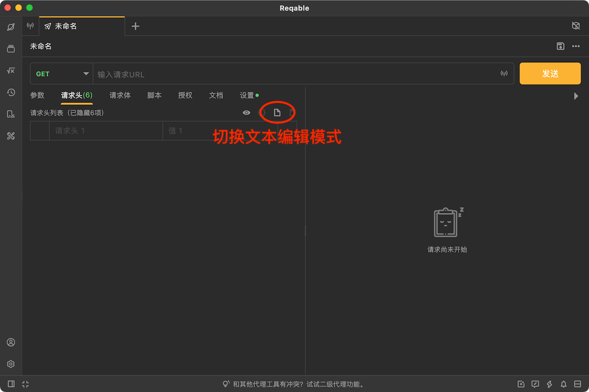
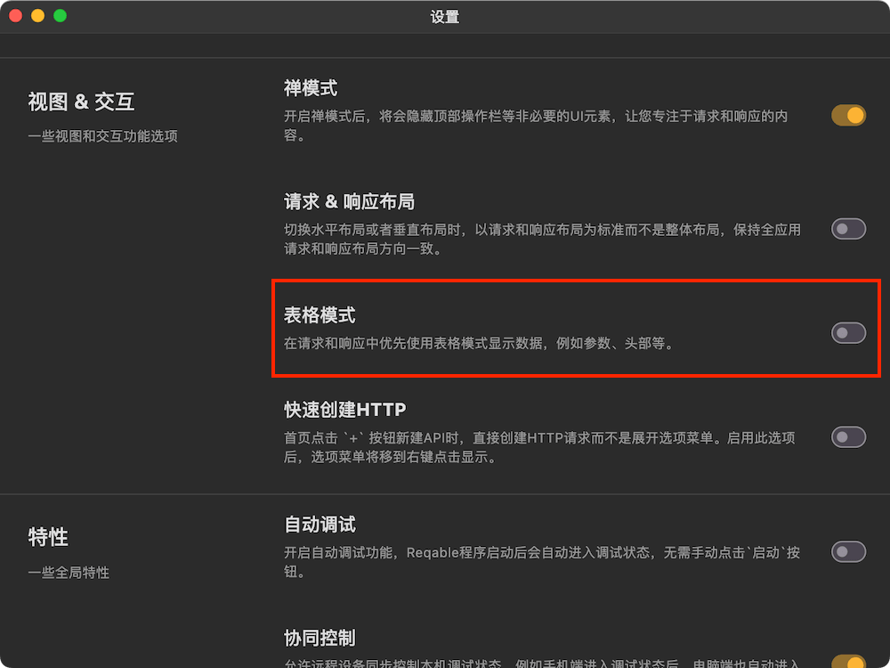
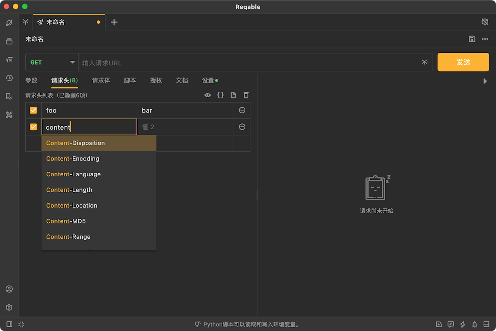
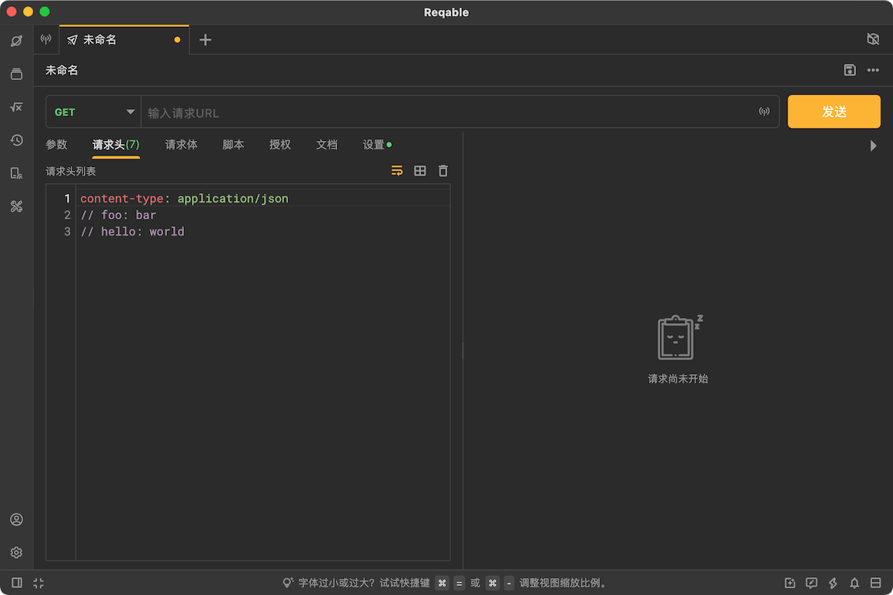
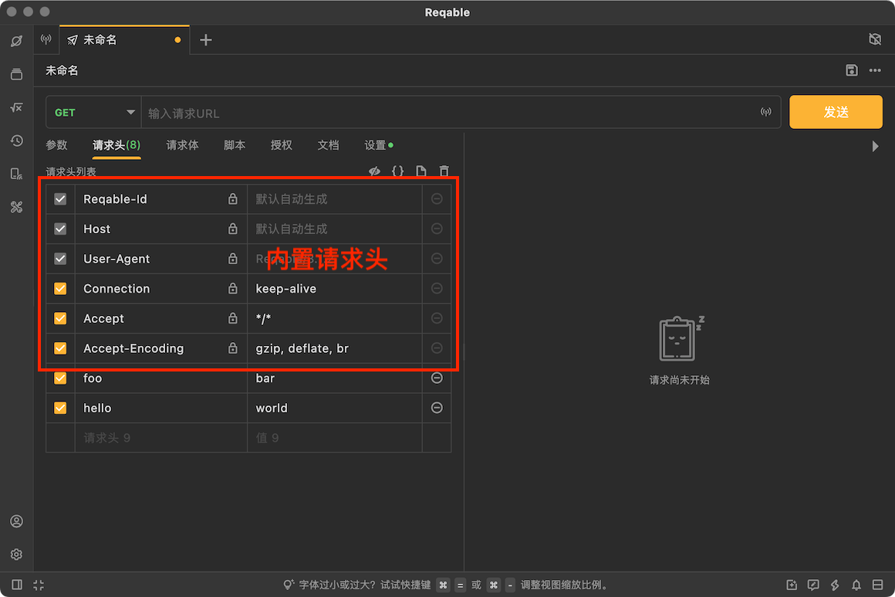

# 请求头部

import Shortcut from '@site/src/components/Shortcut';

Reqable可以编辑HTTP的请求头部，提供了表格编辑模式和文本编辑模式。

默认情况下使用表格编辑模式，在设置中可以关闭此选项来设置默认使用文本编辑模式。

:::info
请求头部支持使用[环境变量](../environment)。
:::

### 表格模式

表格编辑模式支持输入提示和自动填充。

### 文本模式

文本编辑模式支持对请求头进行批量编辑。

在请求头最前面使用 `//` 注释可以反勾选此请求头，可以使用快捷键 <Shortcut>Control + /</Shortcut> 。

### 内置请求头 {#builtin}

Reqable默认隐藏了部分必要的但无需开发者关心的请求头部，称之为内置请求头。在表格模式下点击眼睛图标，可以切换是否显示内置请求头部。

常见内置请求头说明：

- **[Reqable-Id](request_id)** 请求唯一ID标志符，可以在设置中禁用。
- **Host** 请求头中自动添加的域名信息，注意在HTTP2和HTTP3协议中使用 `:authority` 表示。
- **User-Agent** 默认使用Reqable的应用版本号。
- **Connection** 连接保持或关闭，注意在HTTP2和HTTP3协议中无效。
- **Content-Length** 如果使用请求体，发送请求时会自动计算此值。
- **Content-Type** 如果使用请求体，将会自动追加类型（MIME）到内置请求头部列表中。
- **[Cookie](cookie)** 启用Cookie时，将会在自动追加到内置请求头部列表中。
- **[Authorization](authorization)** 启用授权时，将会在自动追加到内置请求头部列表中。