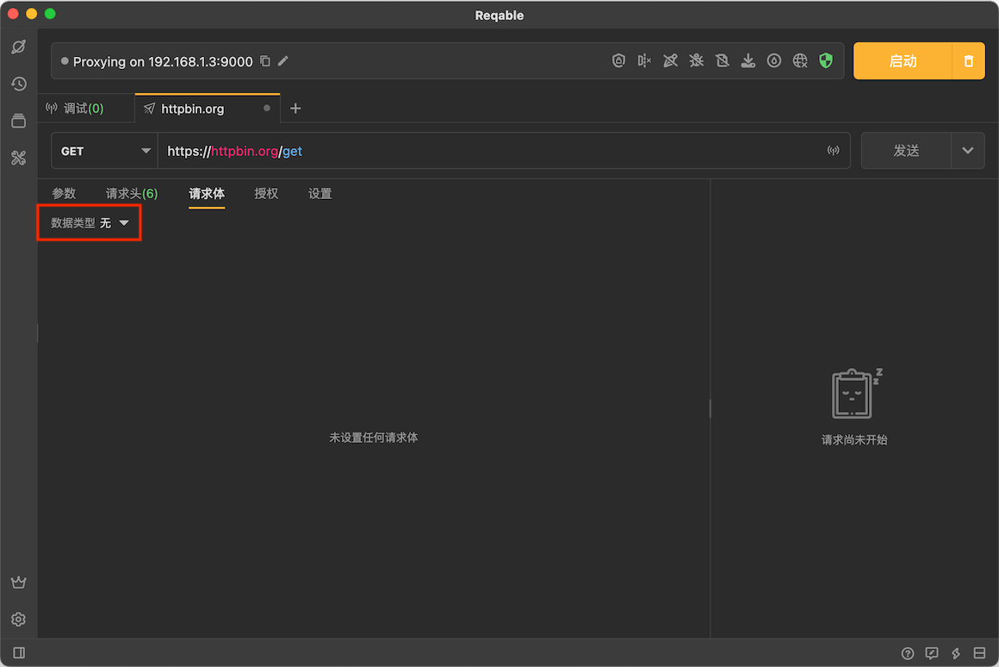
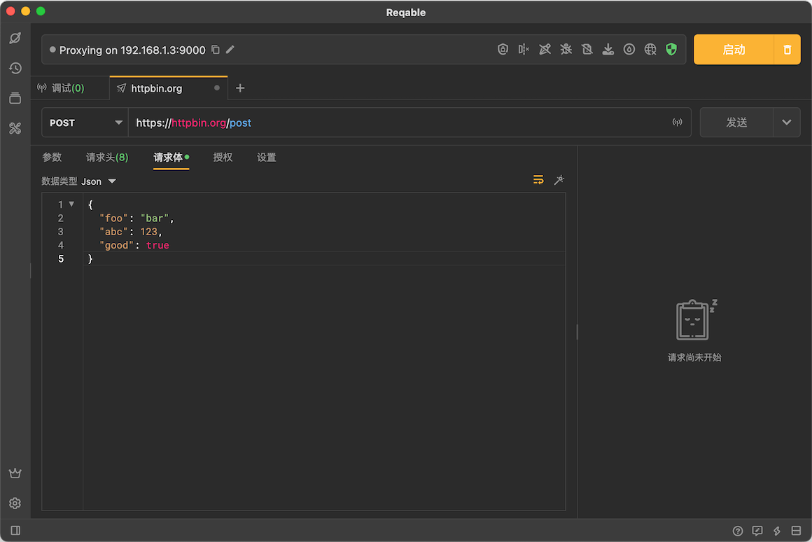
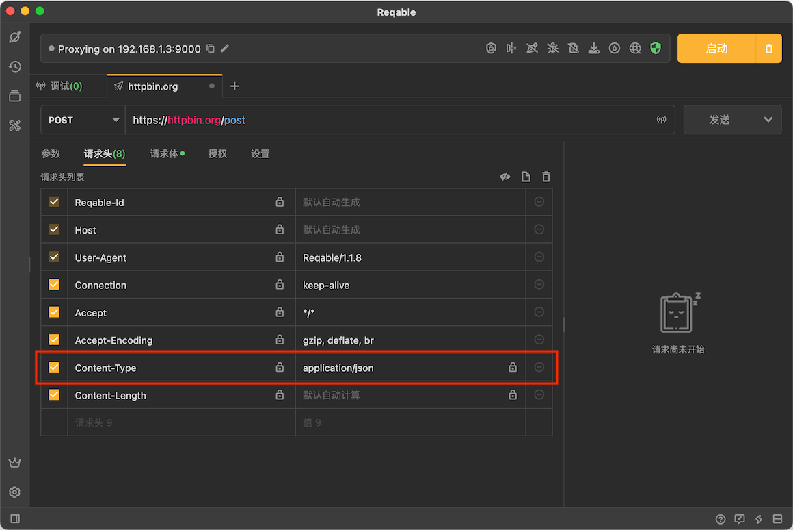
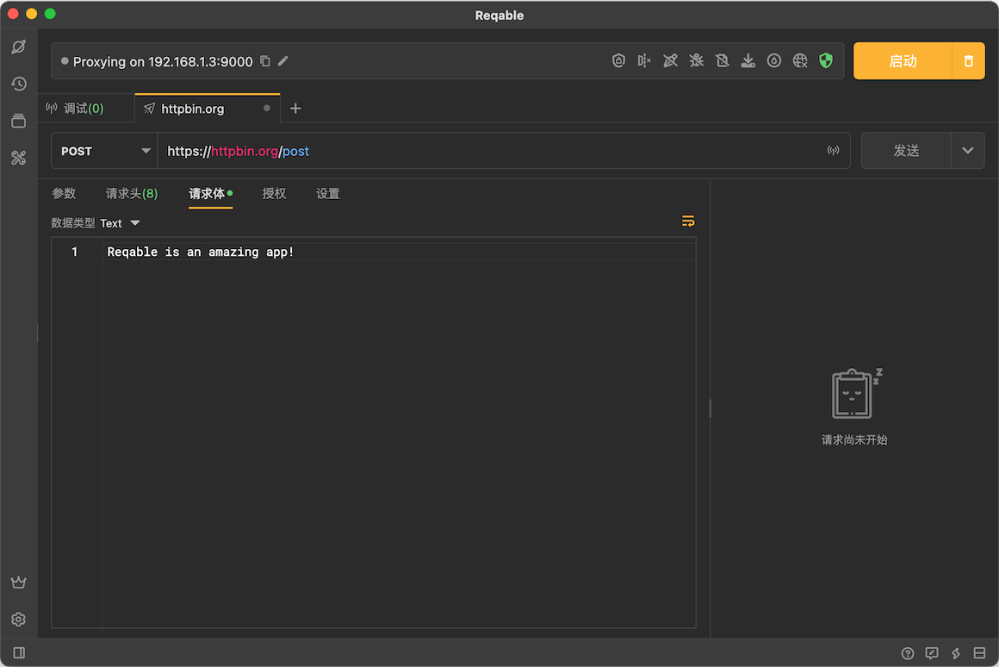
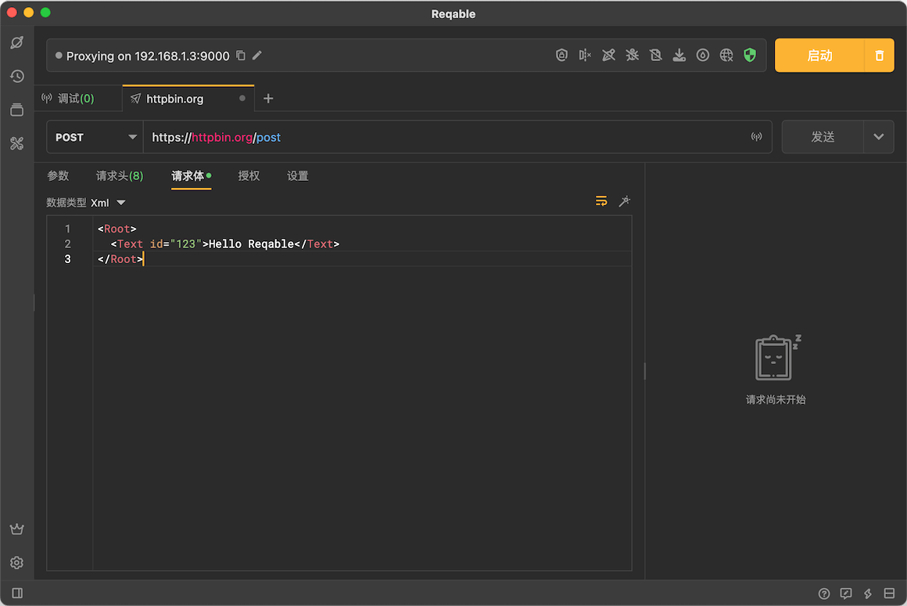
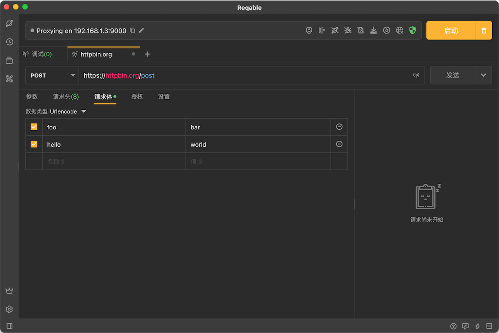
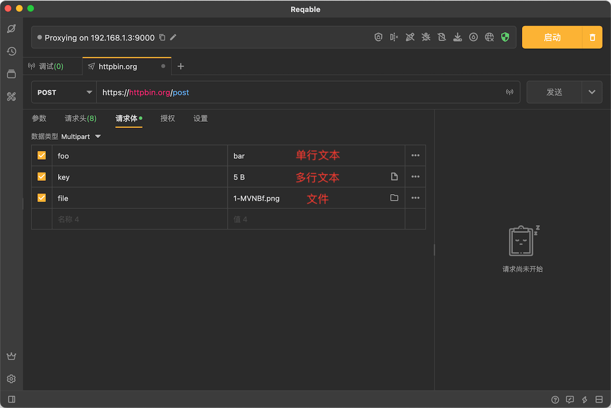
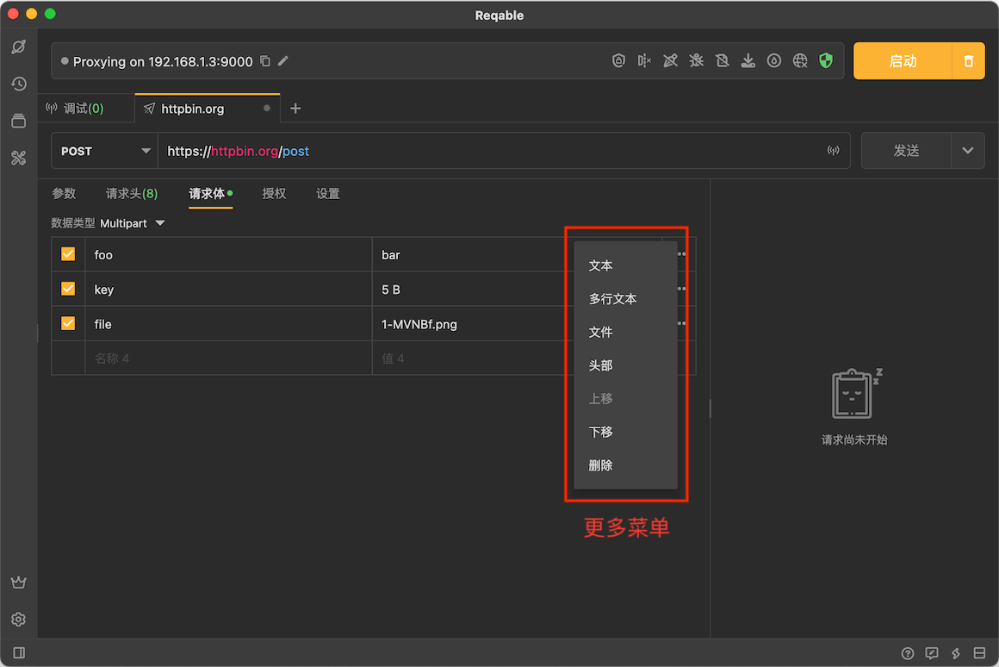
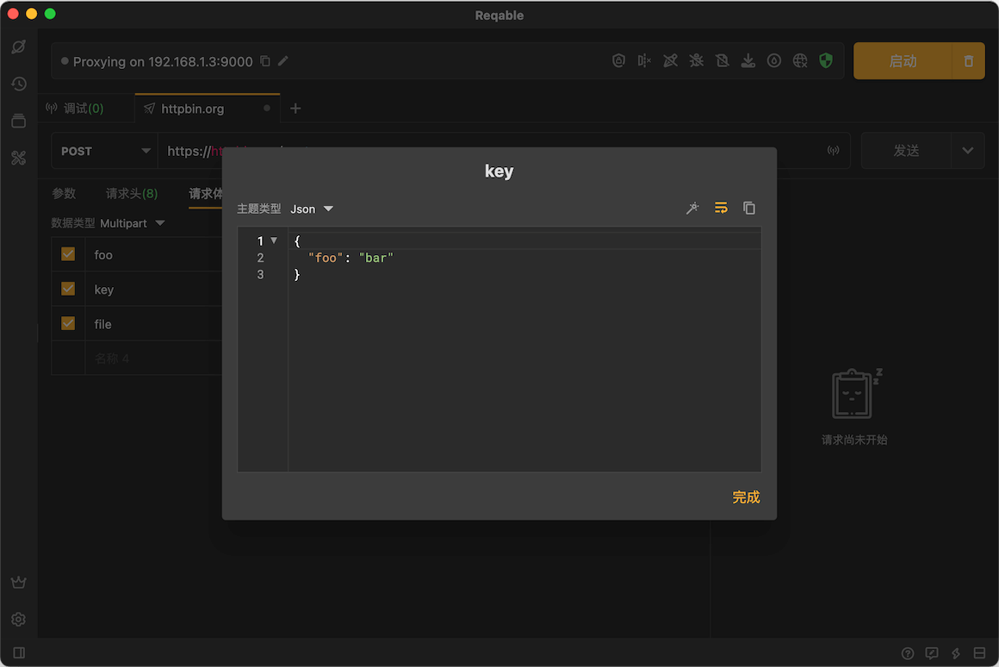
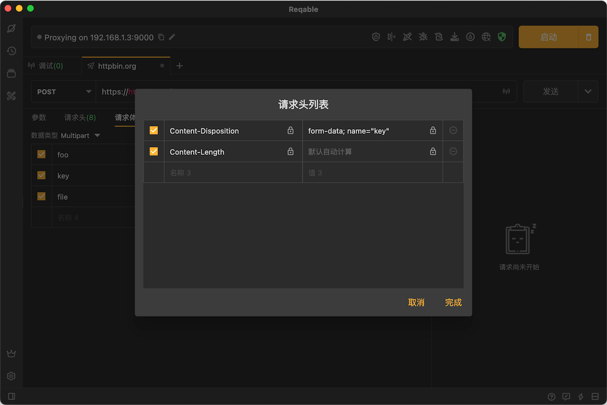

# 请求体

Reqable支持编辑多种类型的请求体，包括[JSON](#json)、[文本](#text)、[XML](#xml)、[表单](#urlencode)、[Multipart](#multipart)和[文件](#binary)。使用不同类型的请求体，会自动在[内置请求头](header#builtin)中自动追加相应的 `Content-Type` 请求头。

点击**数据类型**下拉菜单切换类型：



### JSON {#json}

JSON类型请求体自带语法高亮和格式化功能：



JSON类型会在[内置请求头](header#builtin)中自动追加 `Content-Type: application/json` :



:::info 自定义Content-Type

内置请求头Content-Type无法修改值，但是可以取消勾选和新建一个Content-Type实现自定义效果。

:::

### 文本 {#text}

最简单的请求体类型：



文本类型会在[内置请求头](header#builtin)中自动追加 `Content-Type: text/plain`。

:::info Raw类型

Reqable还提供了一个和文本相似的类型**Raw**，区别是Raw类型不会在[内置请求头](header#builtin)中自动追加任何Content-Type。

:::

### XML {#xml}

XML类型请求体自带语法高亮和格式化功能：



XML类型会在[内置请求头](header#builtin)中自动追加 `Content-Type: application/xml` 。

### 表单 {#urlencode}

表单类型（urlencode）是一组键值对拼接成如下格式：

```
foo=bar&hello=reqable
```

所以Reqable提供了类似请求参数的编辑方式：



表单类型会在[内置请求头](header#builtin)中自动追加 `Content-Type: application/x-www-form-urlencoded` 。

### Multipart {#multipart}

Multipart支持三种分部类型：**单行文本**、**多行文本**和**文件**：



点击右侧的更多按钮可以打开分部操作菜单，包括改变类型、移动位置、编辑头部和删除等等。



多行文本需要点击展开编辑弹窗进行修改：



Reqable还支持编辑每个分部的头部信息：



Multipart类型会在[内置请求头](header#builtin)中自动追加 `Content-Type: multipart/form-data` 。

:::info Boundary

无需手动添加Boundary，Reqable会在请求发送时自动创建并设置Boundary。

:::

### 文件 {#binary}

文件类型支持选择一个文件作为请求体，为了简化操作，Reqable提供了文件拖拽的功能，直接将文件拖入虚线框内即可。


:::info Content-Type推导

Reqable会根据选择的文件类型在[内置请求头](header#builtin)中自动追加相应Content-Type。

:::