# 请求体

Reqable支持多种类型的请求体，包括：

- [JSON](#json)
- [Text](#text)
- [XML](#xml)
- [Raw](#raw)
- [Form-data](#multipart)
- [Urlencode](#urlencode)
- [文件](#binary)

点击`数据类型`下拉菜单可以切换请求体类型：

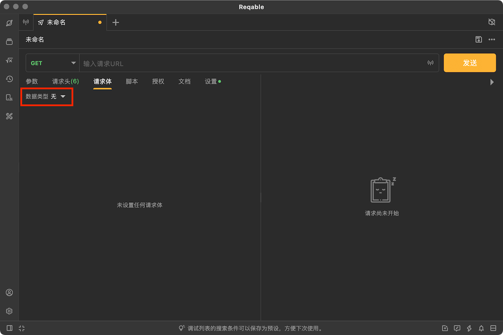

:::info
请求体支持使用[环境变量](../environment)。
:::

### JSON {#json}

JSON是最常见的请求类型，Reqable提供了一个支持语法高亮的编辑器。

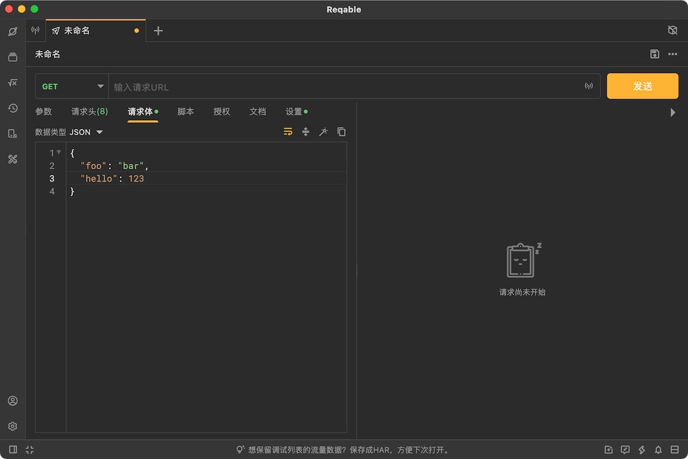

JSON类型会在[内置请求头](header#builtin)中自动追加 `Content-Type: application/json`和`Content-Length`（发送请求时自动计算其值）。

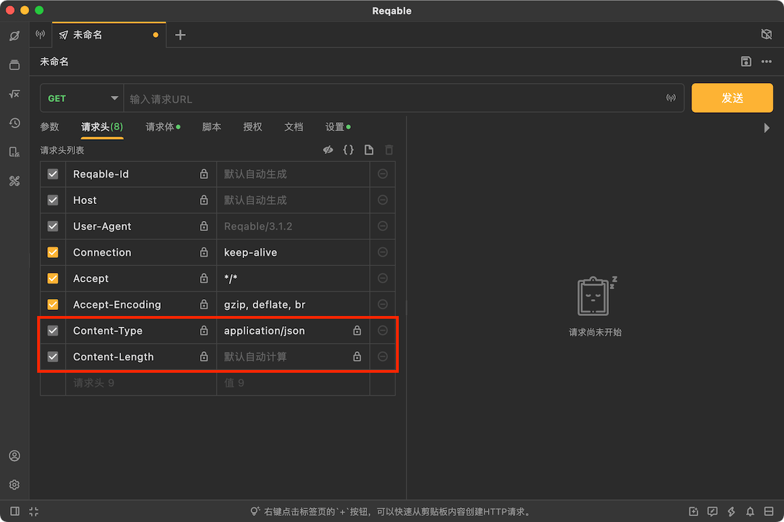

JSON数据支持使用注释，被注释的内容在请求时将不会被发送。

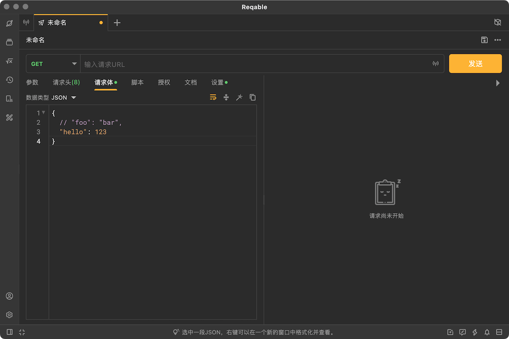

:::caution
包含注释的JSON内容暂不支持格式化、压缩和展开等操作。
:::

### Text {#text}

最简单的请求体类型：


Text类型会在[内置请求头](header#builtin)中自动追加 `Content-Type: text/plain`和`Content-Length`（发送请求时自动计算其值）。

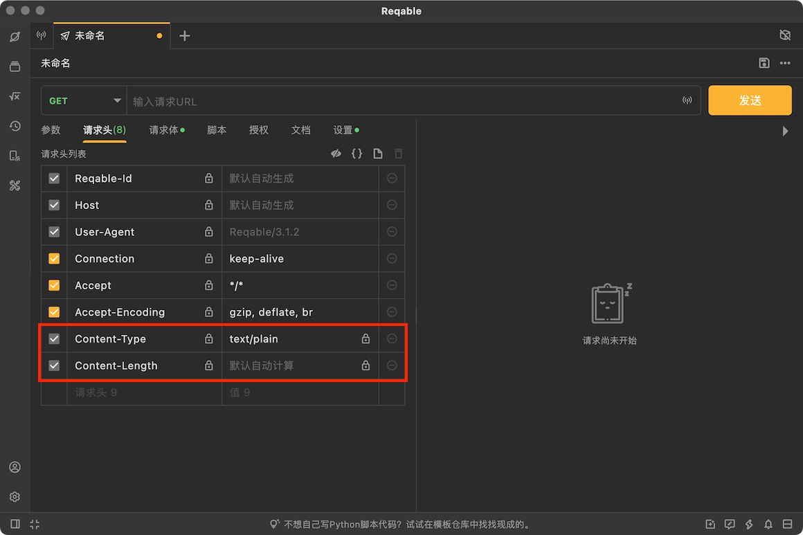

### XML {#xml}

XML类型请求体支持语法高亮：


XML类型会在[内置请求头](header#builtin)中自动追加 `Content-Type: application/xml`和`Content-Length`（发送请求时自动计算其值）。


### Raw {#raw}

Raw类型和[Text](#text)类似，区别在于不会在[内置请求头](header#builtin)中自动追加`Content-Type`，适合用户自定义的类型。

### Form-data {#multipart}

Form-data支持三种分部类型：`单行文本`、`多行文本`和`文件`：

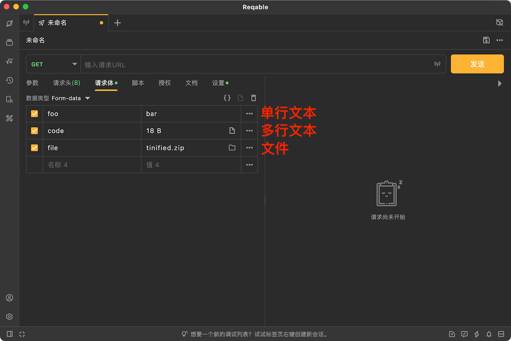

点击右侧的更多按钮可以打开分部操作菜单，包括改变类型、移动位置、编辑头部和删除等等。

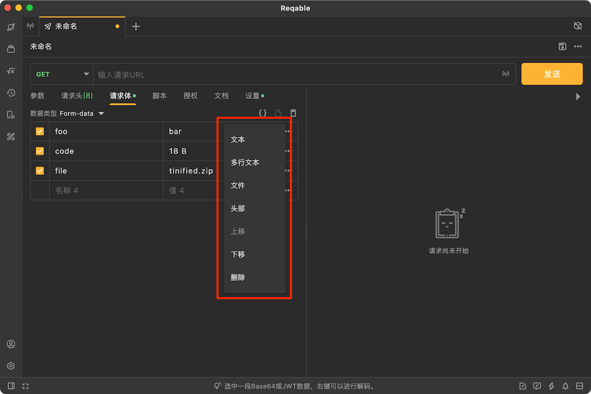

多行文本需要点击展开编辑弹窗进行修改：

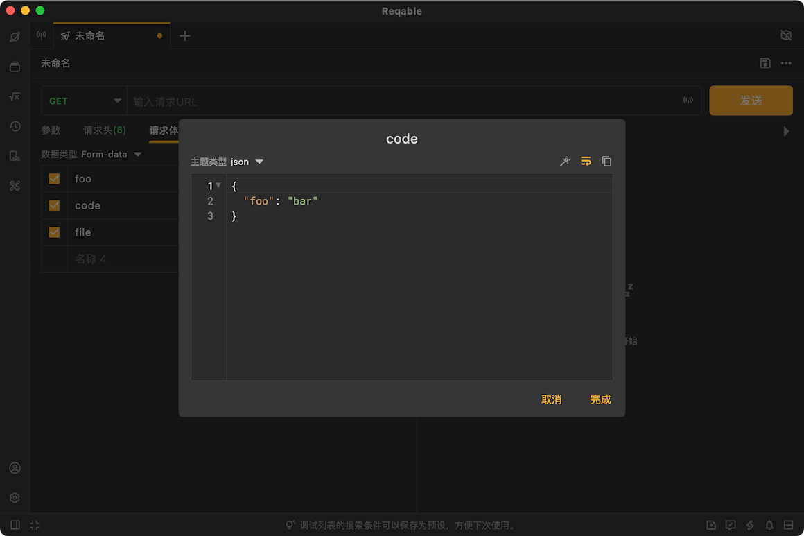

Reqable还支持编辑每个分部的头部信息：

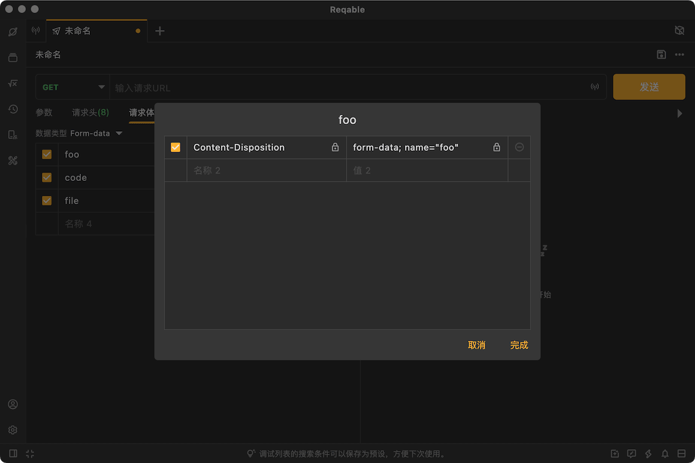

Multipart类型会在[内置请求头](header#builtin)中自动追加 `Content-Type: multipart/form-data`和`Content-Length`（发送请求时自动计算其值）。

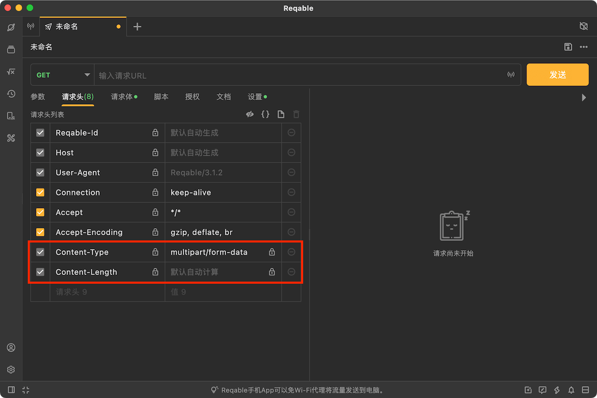

:::info 关于Boundary

无需手动添加Boundary，Reqable会在请求发送时自动生成Boundary。

:::

### Urlencode {#urlencode}

表单类型（Urlencode）是一组键值对拼接成如下格式：

```
foo=bar&hello=reqable
```

默认情况下，表单模式可以用表格模式进行编辑。

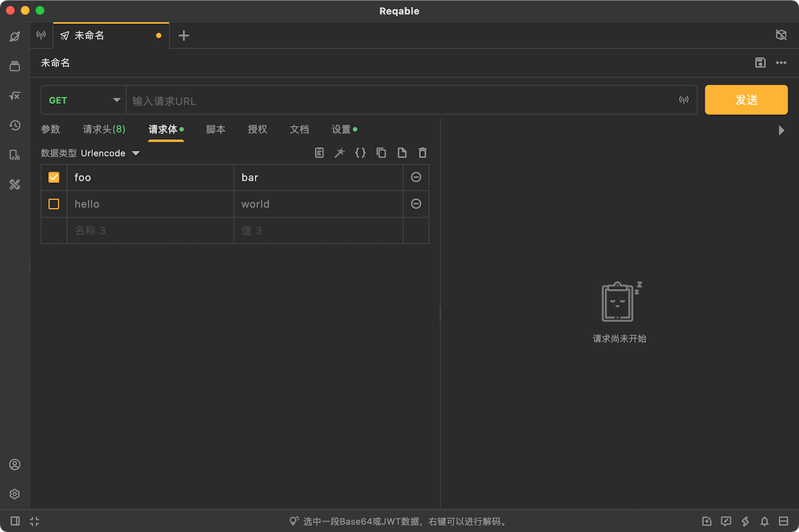

另外，也可以切换到文本模式进行编辑。文本模式下， 支持使用`//`注释来取消勾选。

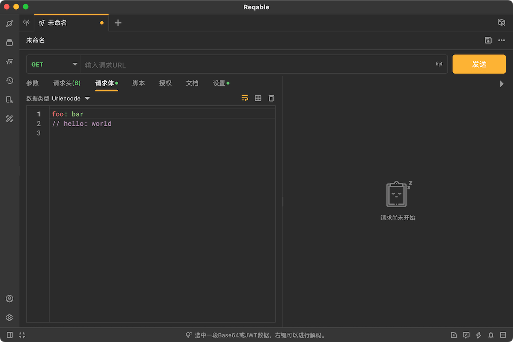

表单类型会在[内置请求头](header#builtin)中自动追加 `Content-Type: application/x-www-form-urlencoded`和`Content-Length`（发送请求时自动计算其值）。

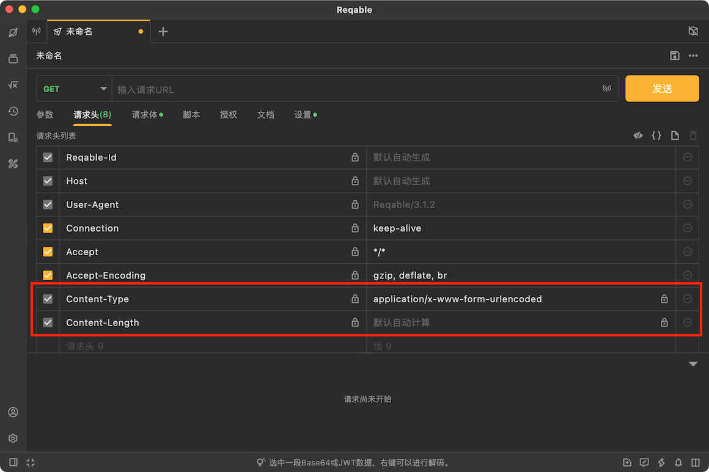

### 文件 {#binary}

文件类型支持选择一个文件作为请求体。可以通过系统文件管理器选择文件，页可以直接将文件拖入虚线框内。

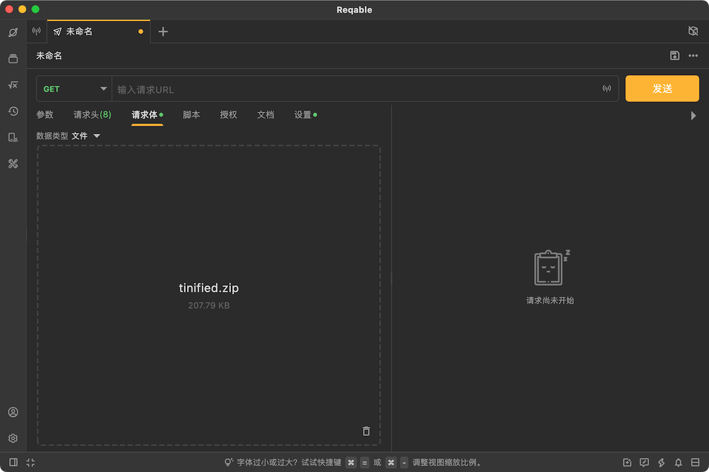

文件类型会在[内置请求头](header#builtin)中自动追加相应`Content-Type`（自动推导）和`Content-Length`（发送请求时自动计算其值）。

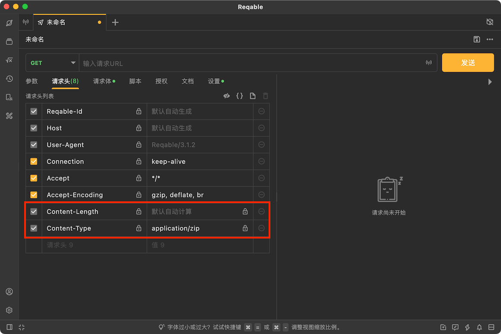