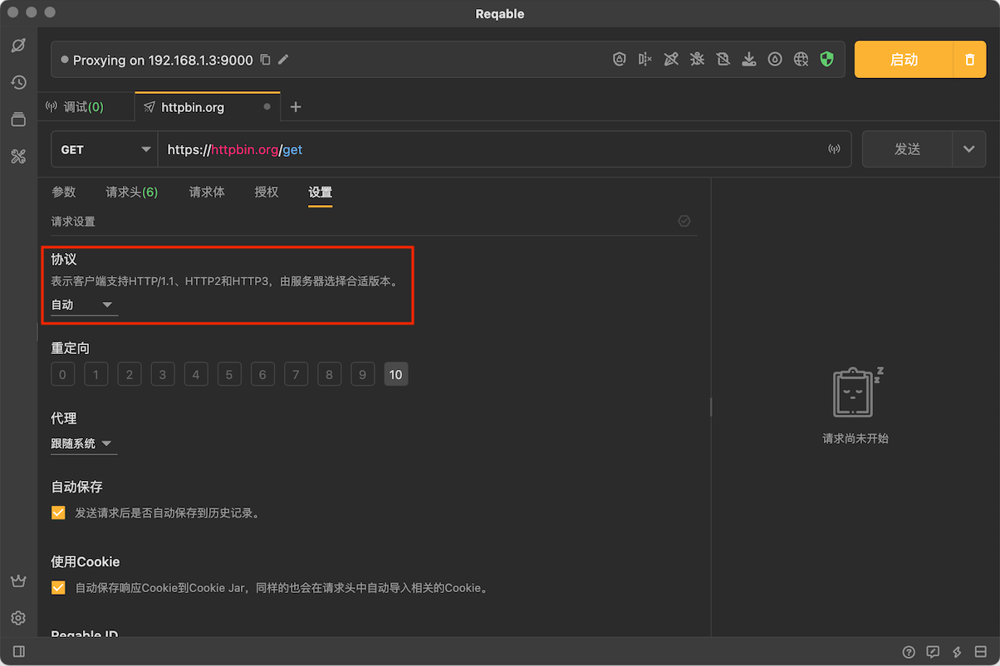
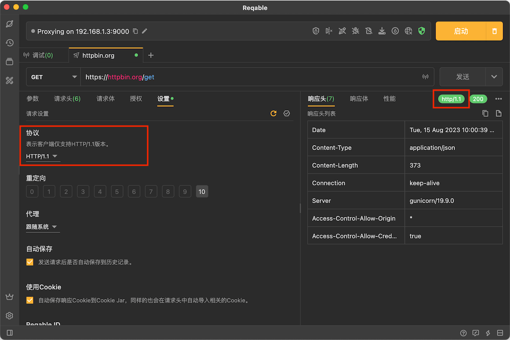
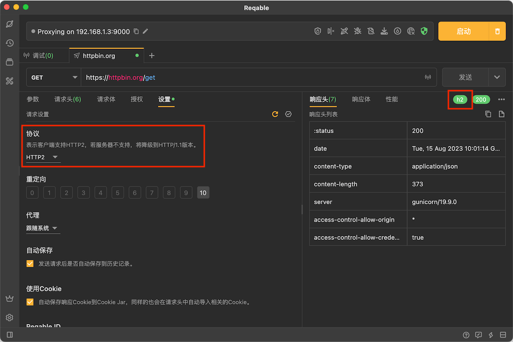
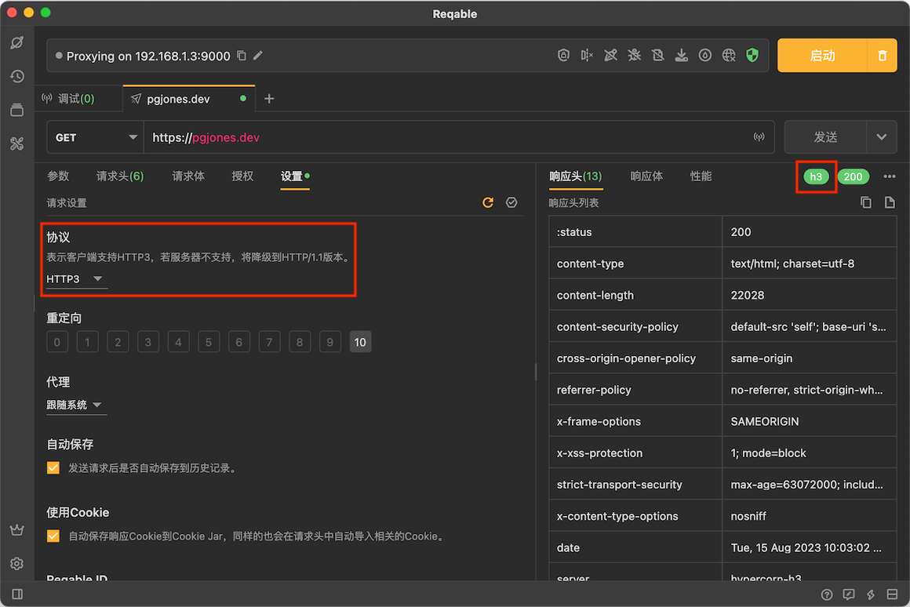

# 协议版本

Reqable支持三种HTTP协议：[HTTP1.1](https://www.ietf.org/rfc/rfc2616.txt)、[HTTP2](https://www.ietf.org/rfc/rfc7540.txt)和[HTTP3](https://www.ietf.org/rfc/rfc9114.txt)，我们可以在请求设置中指定协议版本。

:::info 服务端支持

一个巴掌拍不响，所有的协议版本都是需要服务端的支持，如果服务端不支持高版本，则会降级到HTTP1.1版本。

:::

### HTTTP1.1

HTTP1.1是目前最普及的HTTP协议版本，具有我们熟知的保持链接、chunk传输等特性，目前几乎所有的HTTP服务框架都支持此版本。我们可以在响应标签上查看具体使用的协议版本。

### HTTTP2

HTTP2是目前非常常用的HTTP协议版本，相比于HTTP1.1，其多路复用、头部压缩等特性具有非常明显的性能优势，但不一定是所有的HTTP服务框架都支持这个版本。如果服务端不支持HTTP2协议版本，则会被降级到HTTP1.1协议版本，我们可以在响应标签上查看具体使用的协议版本。

### HTTTP3

HTTP3是从[QUIC](https://www.ietf.org/rfc/rfc9000.txt)发展而来，相比于HTTP2，其性能和安全得到进一步的提升，但很遗憾，大多数的HTTP服务框架都不支持这个版本。作为未来的新协议，Reqable还是给予了足够的支持。如果服务端不支持HTTP3协议版本，则会被降级到HTTP1.1协议版本，我们可以在响应标签上查看具体使用的协议版本。

