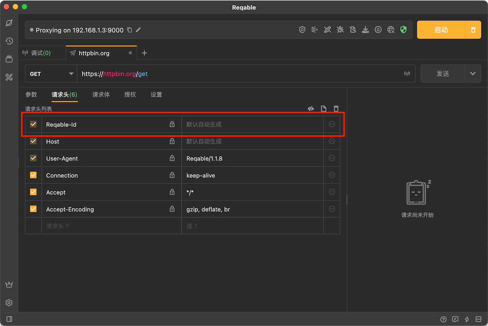
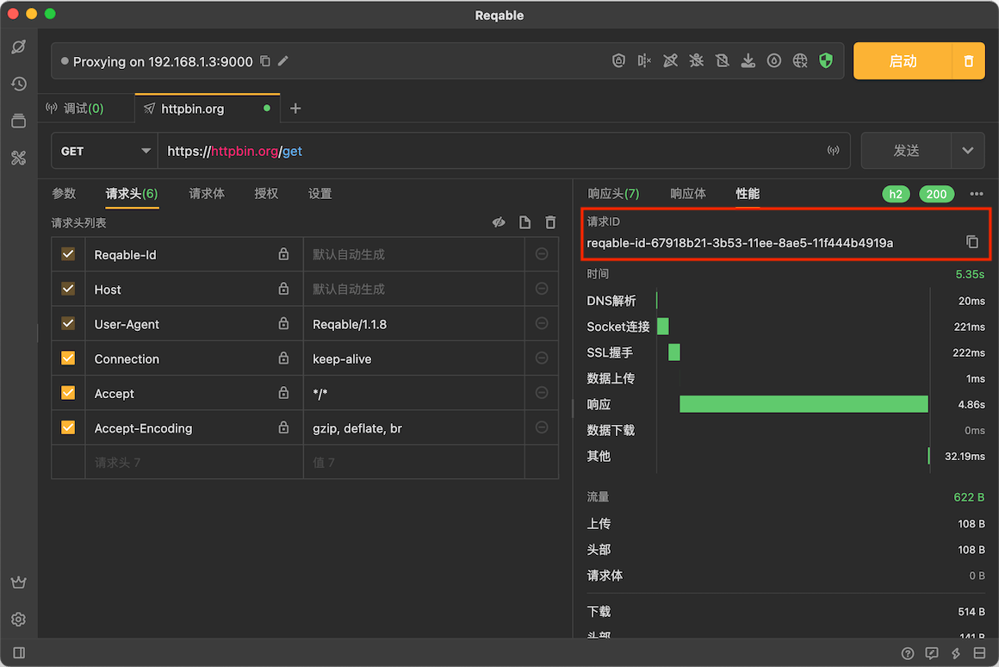
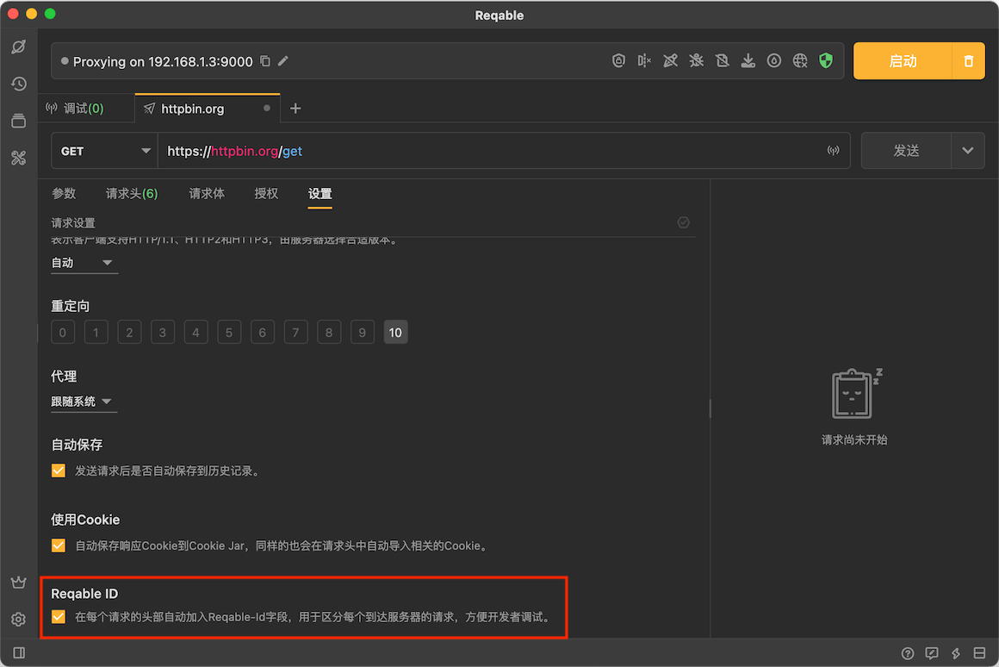

# 请求ID

Reqable支持在每次请求发送的时候自动创建唯一ID标志符，通过 `Reqable-Id` 可以方便开发者配合服务端协作对请求溯源。自动创建的ID格式如下：

```
reqable-id-{UUID}
``` 

例如：

```
reqable-id-aee9bdc1-ad01-11ed-ace8-ade55d424a3d
```



当然，开发者也可以自己填入一个固定的ID值。

### 获取ID值

请求成功时，可以在**性能**选项卡中获取或复制本次请求的ID值：



请求失败时，可以在响应右上角复制本次请求的ID值：


### 禁用请求ID

此功能默认开启，但是可以在**设置**中取消勾选以关闭：


