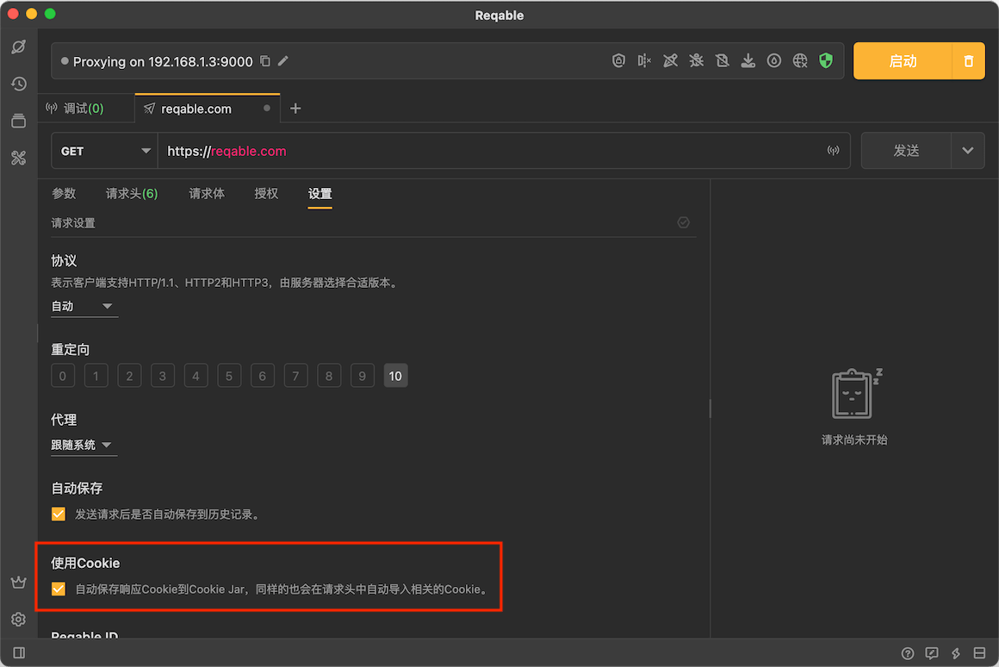
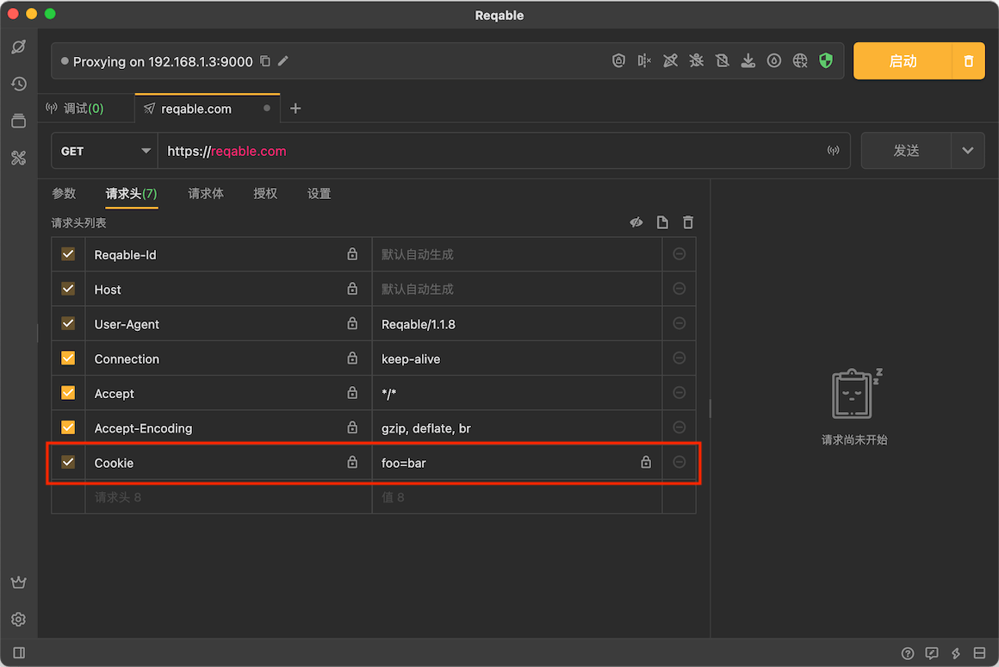
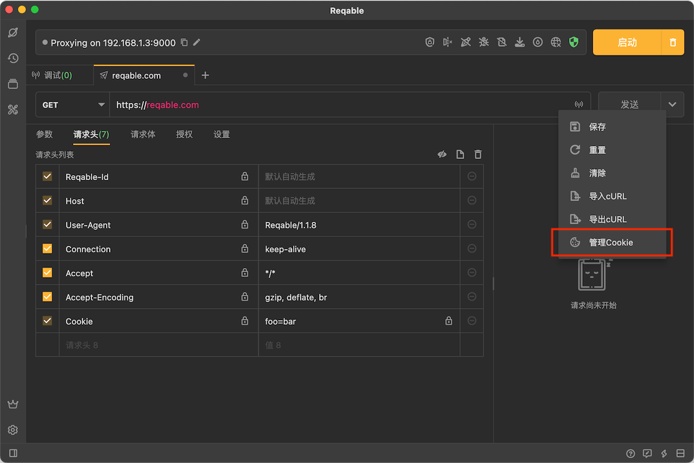
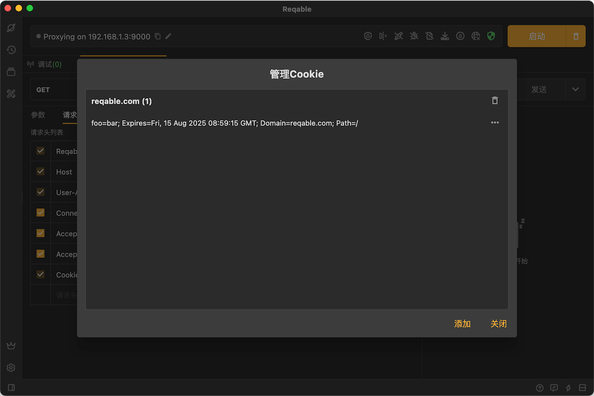

# Cookie

Reqable支持自动导入和保存Cookie功能，此功能默认开启，可以在设置中关闭。

开启此功能后，服务器返回的Cookie将会自动保存到`Cookie Jar`中，并且更新到请求头中。新创建的API也会从`Cookie Jar`中自动获取Cookie并填充到请求头里。

### 管理Cookie

点击右上角按钮展开下拉菜单，选择**管理Cookie**打开`Cookie Jar`：

### 修改Cookie

在Cookie管理器中，我们可以随时新建、删除和编辑Cookie。除了手动修改内容外，还可以从粘贴板中一键导入。

