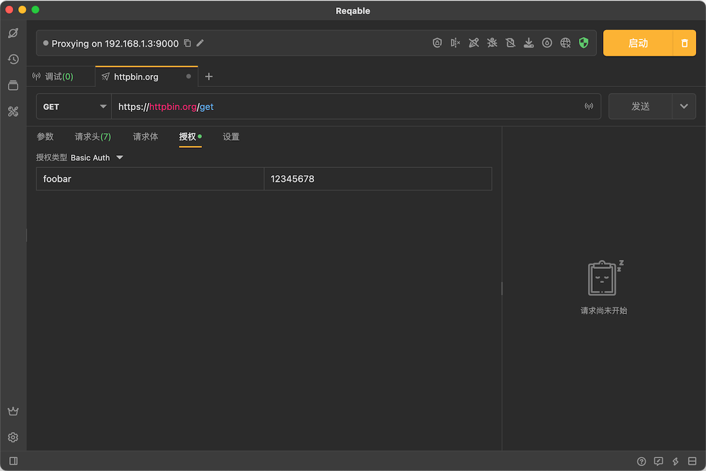
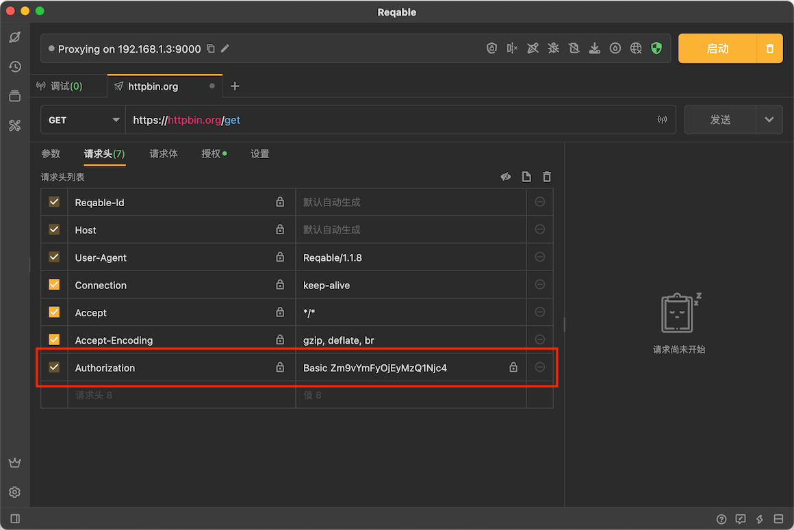
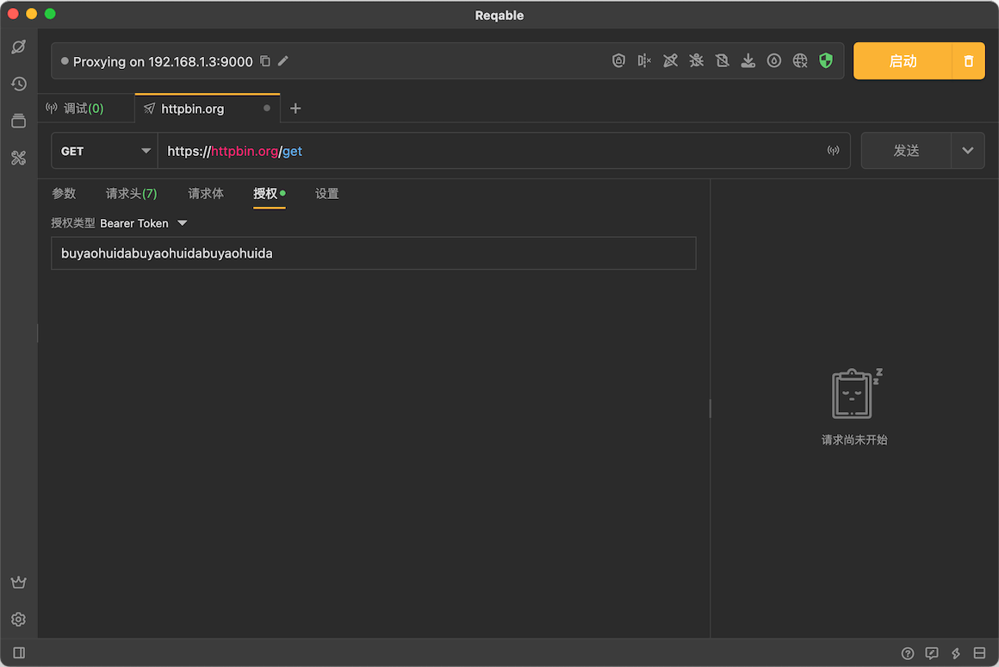
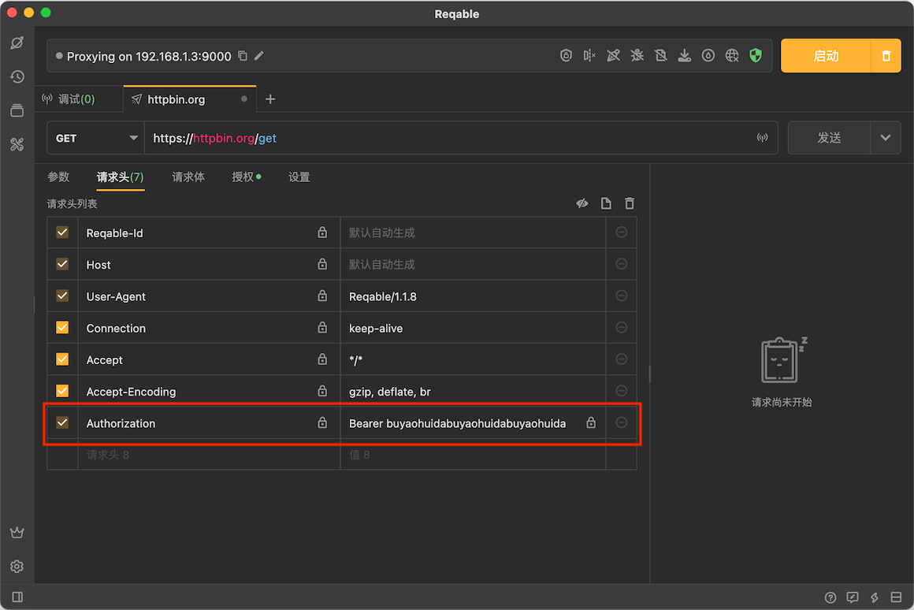
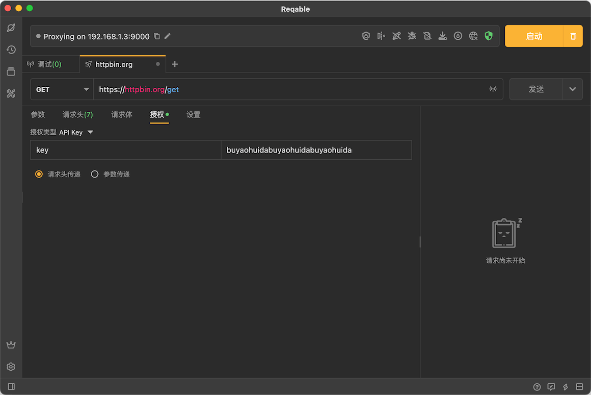
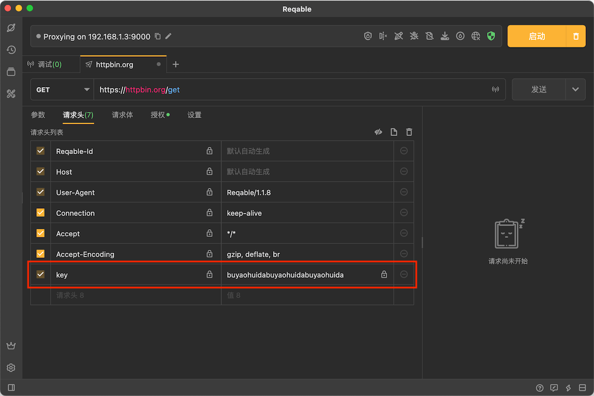
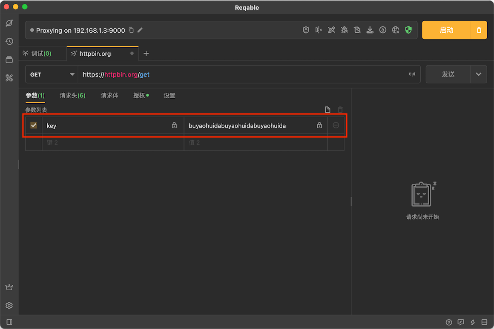

# 授权

Reqable提供了简单的授权功能，支持三种模式：[Basic Auth](#basic-auth)、[Bearer Token](#bearer-token)和[Api Key](#api-key)。

### Basic Auth {#basic-auth}

关于Basic Auth的细节和规范请查看[RFC文档](https://datatracker.ietf.org/doc/html/rfc7617)，不多解释。使用方式非常简单，只需要在授权中选择**Basic Auth**并填入用户名称和密码：

Reqable会自动在内置请求头中生成Authorization：

### Bearer Token {#bearer-token}

关于Bearer Token的细节和规范请查看[RFC文档](https://datatracker.ietf.org/doc/html/rfc6750)，不多解释。使用方式非常简单，只需要在授权中选择**Bearer Token**并填入token：

Reqable会自动在内置请求头中生成Authorization：

### Api Key {#api-key}

Api Key支持在请求头和请求参数中传递：

选择在请求头中传递：

选择在请求参数中传递：

