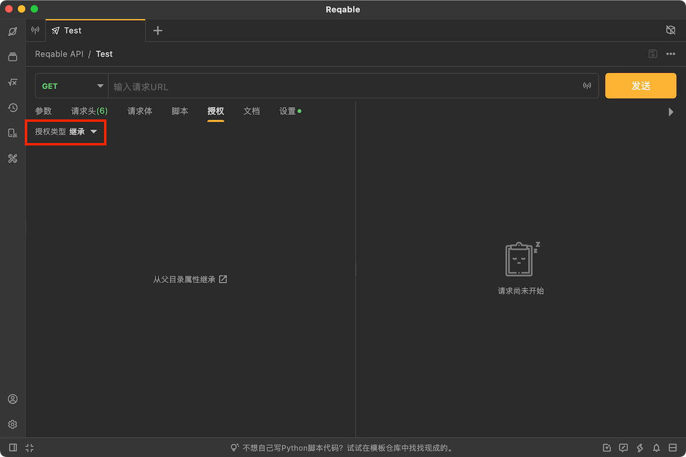
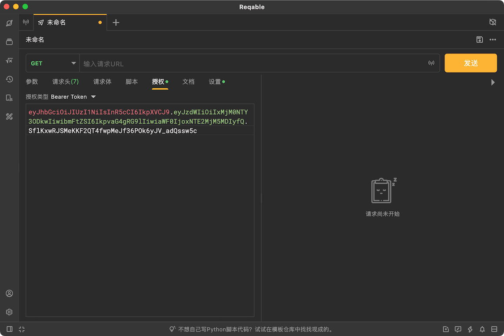
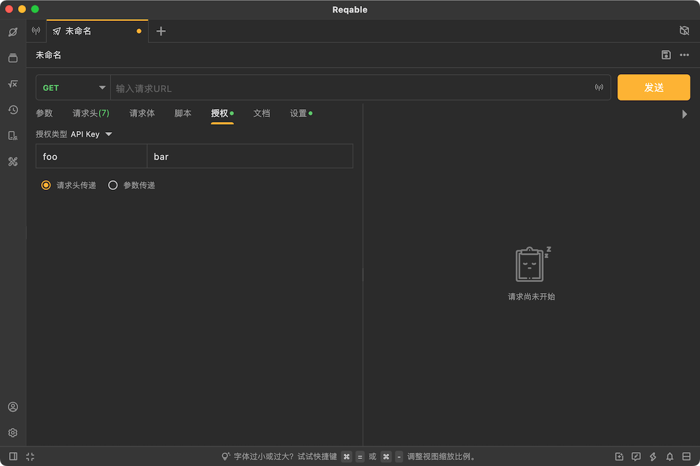
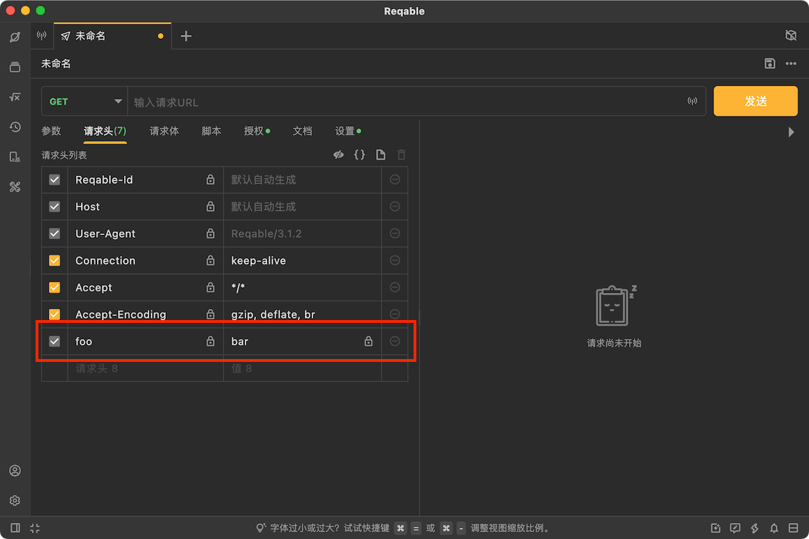
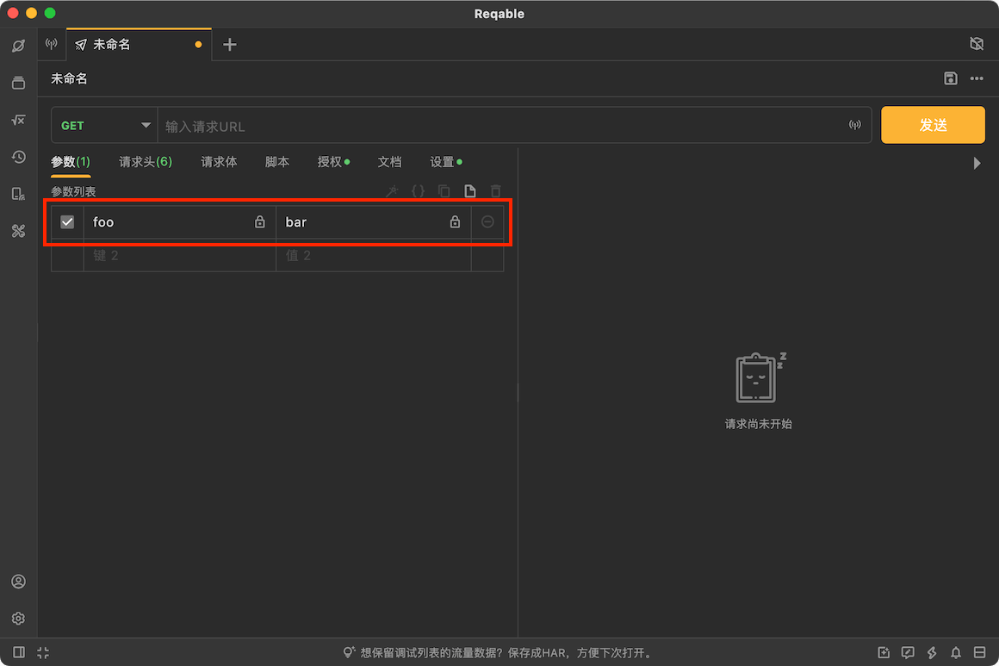
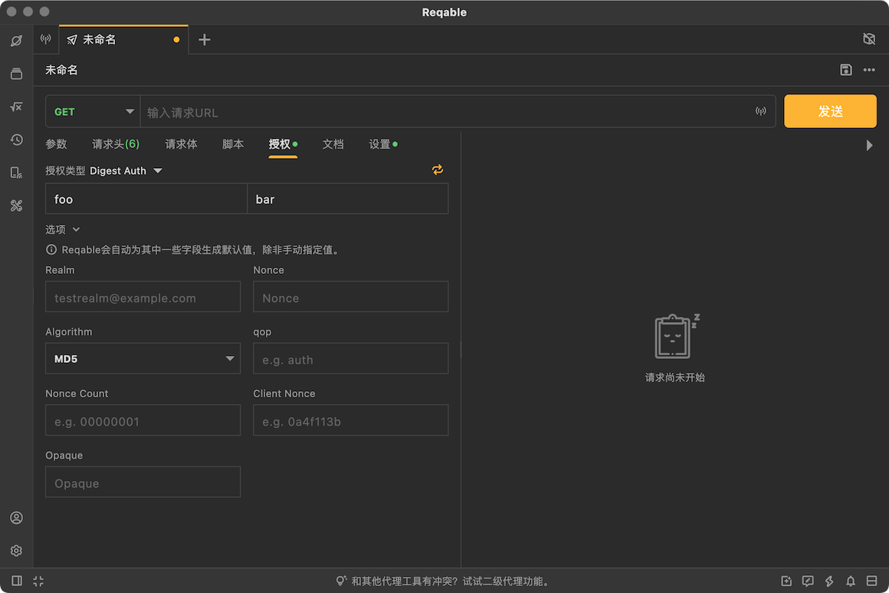

# 授权

Reqable提供了多种授权模式：

- [继承](#inherit)
- [Basic Auth](#basic-auth)
- [Bearer Token](#bearer-token)
- [Api Key](#api-key)
- [Digest Auth](#digest-auth)

:::info
授权支持使用[环境变量](../environment)。
:::

### 继承 {#inherit}

如果API已经保存到集合中，会自动从集合中继承统一定义的授权。如果未保存到集合，则为无授权。

### Basic Auth {#basic-auth}

关于Basic Auth的细节和规范请查看[RFC 7617](https://datatracker.ietf.org/doc/html/rfc7617)。使用方式非常简单，只需要在授权中选择**Basic Auth**并填入用户名称和密码：

### Bearer Token {#bearer-token}

关于Bearer Token的细节和规范请查看[RFC 6750](https://datatracker.ietf.org/doc/html/rfc6750)。使用方式非常简单，只需要在授权中选择**Bearer Token**并填入token：

### Api Key {#api-key}

Api Key支持在请求头和请求参数中传递：

选择在请求头中传递：

选择在请求参数中传递：

### Digest Auth {#digest-auth}

关于Digest Auth的细节和规范请查看[RFC 7616](https://datatracker.ietf.org/doc/html/rfc7616)。Digest Auth的参数比较多，但最基本的只需要填入用户名称和密码。

Reqable会自动根据响应的认证要求自动生成其他的参数，当然用户也可以展开选项自定义这些参数。

