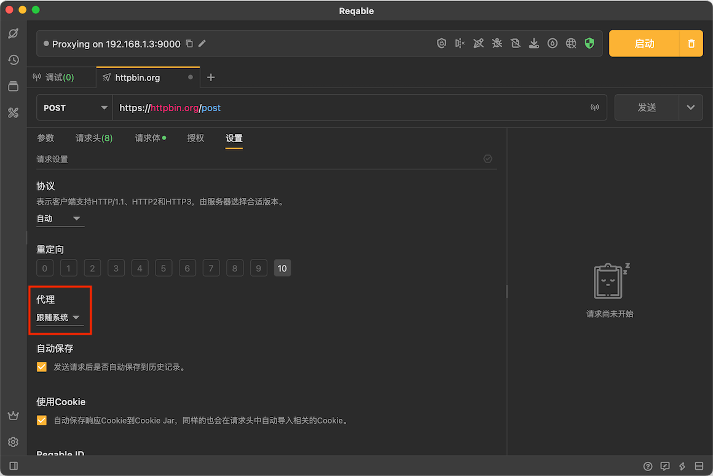
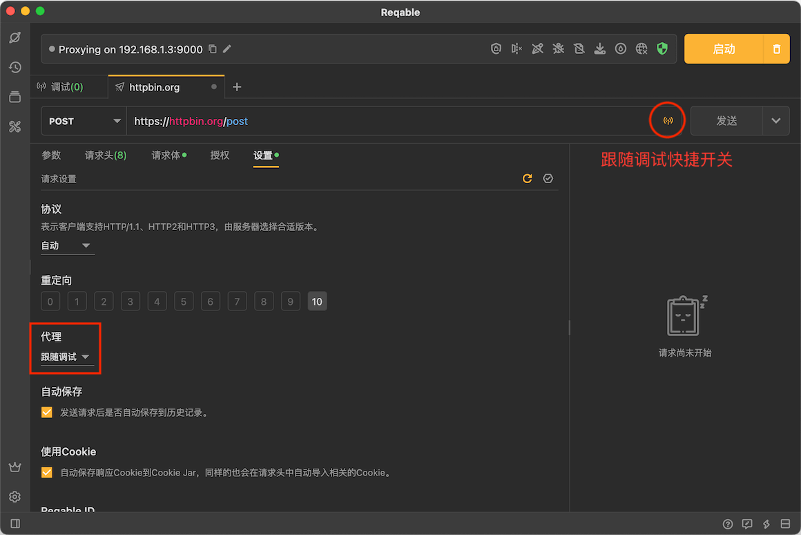
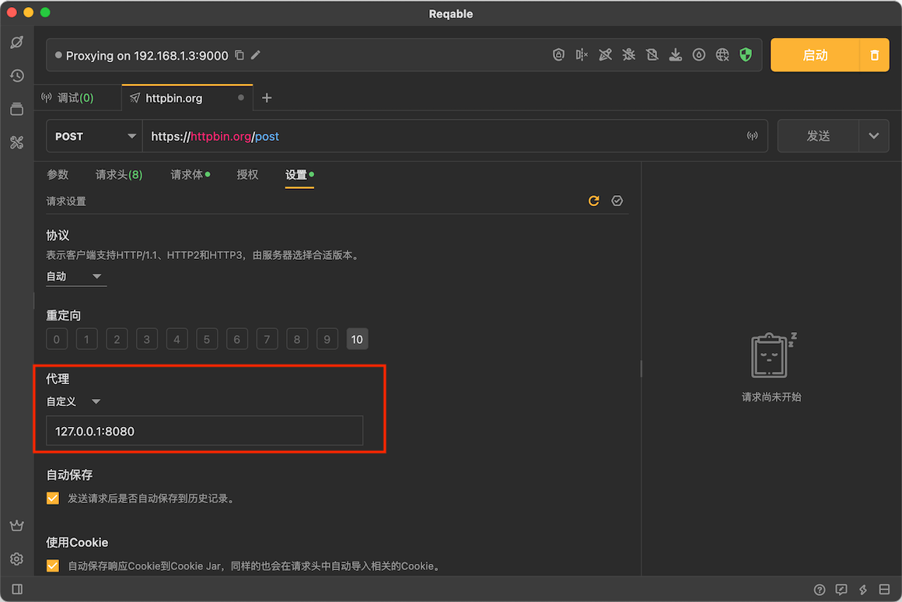

# 代理

代理是测试接口请求时必不可少的设置之一，我们可以在请求设置中配置代理选项。

Reqable支持四种代理设置：
- **跟随系统** 使用系统配置的代理，即系统用啥我用啥。
- **跟随调试** 使用[调试](../capture)代理，联合使用调试功能来更好地分析请求。
- **自定义** 使用自定义Web代理，指定代理IP和端口号即可。
- **不使用** 禁止使用代理功能。

### 跟随调试

**跟随调试**是Reqable的重要功能，通过这个可以和调试相关的各种功能进行联动，例如[脚本](../capture/script)功能。无需开启调试功能，跟随调试下的API请求也会在调试列表中显示。

### 自定义代理

Reqable目前仅支持设置自定义Web代理，需要指定代理IP和端口号，配置方式如下：

:::info 其他代理

如果有Socks等代理方式需求，可以将其配置到系统中并选择Reqable代理方式为**跟随系统**即可。

:::