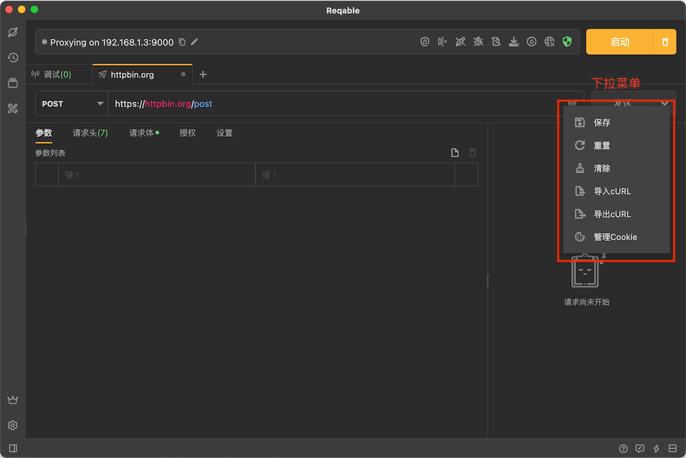
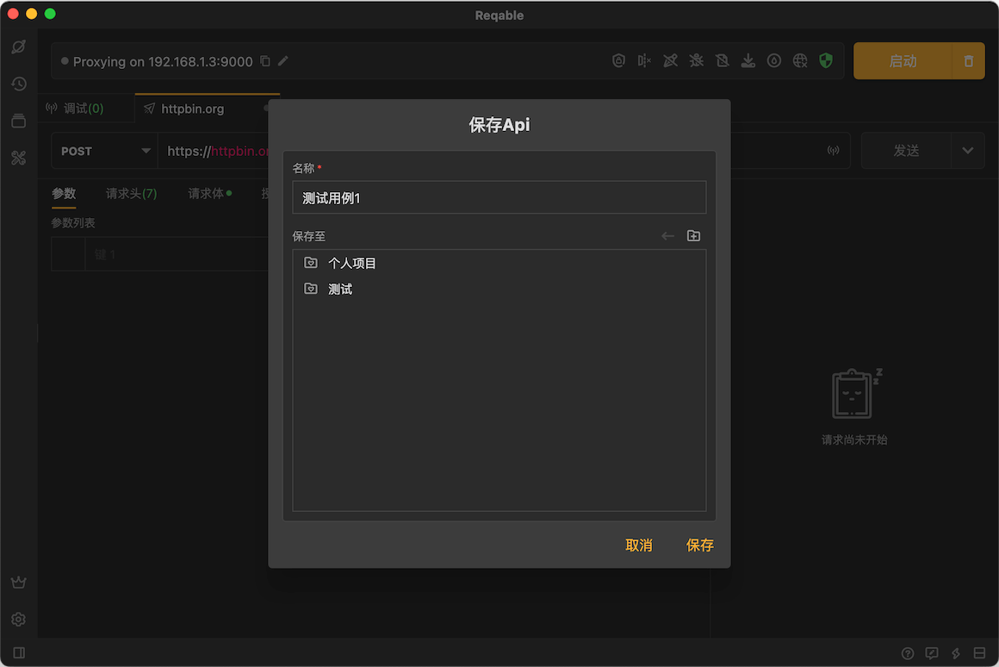
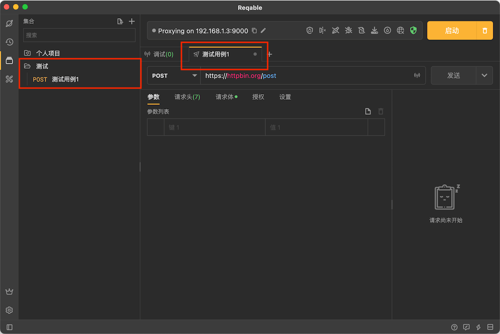
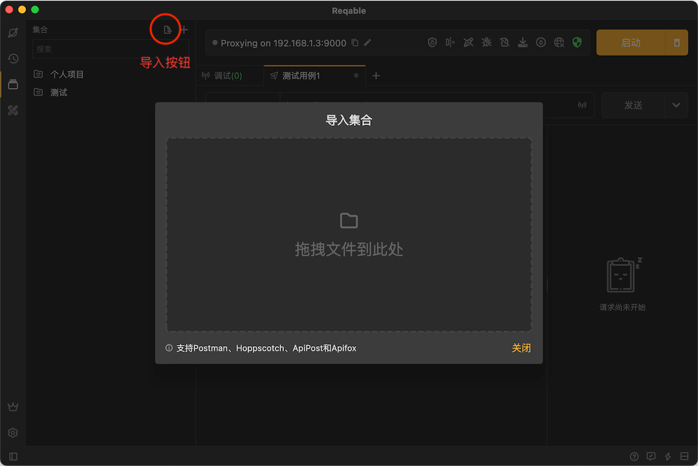
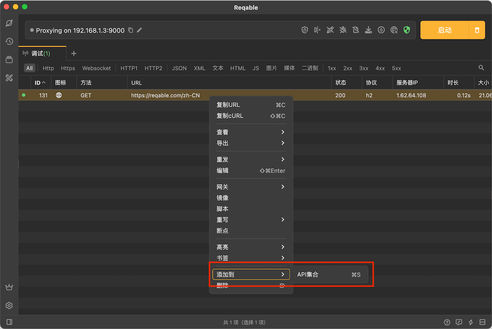
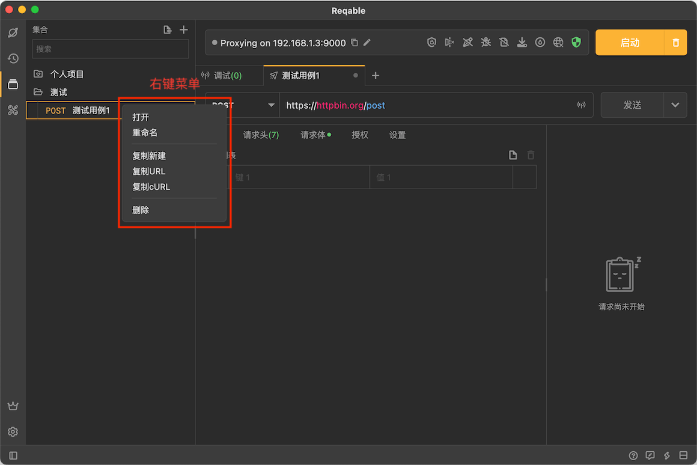
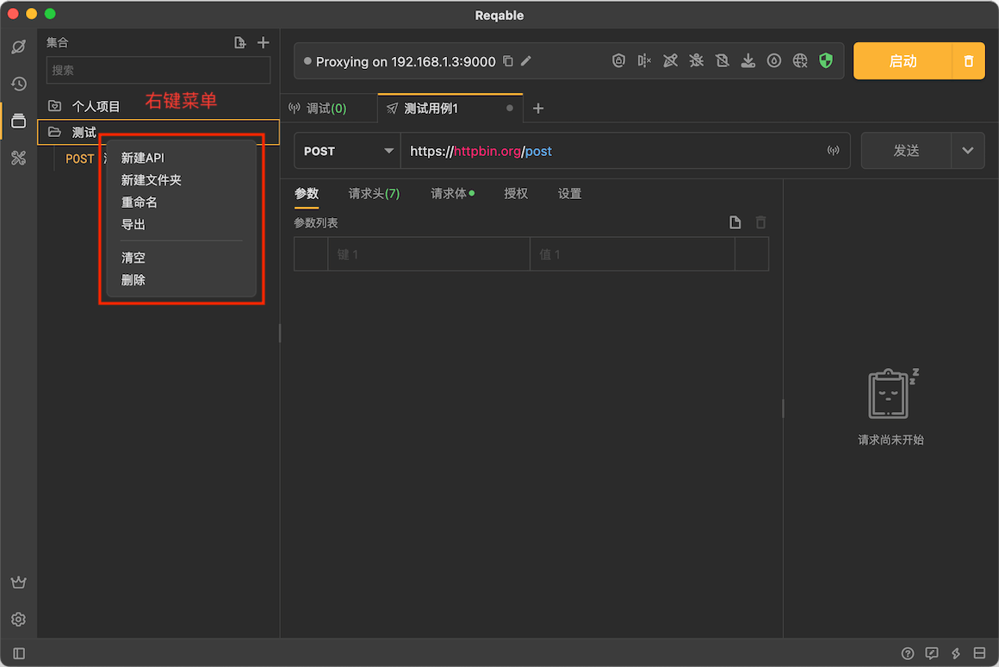

# 集合

import Shortcut from '@site/src/components/Shortcut';

Reqable支持将API请求收藏到集合中，并可以随时打开编辑。同时，Reqable还支持导入Postman等格式的API集合，并且可以将调试列表中的API保存到集合。

### 保存API会话

点击右上角打开更多操作菜单，选择保存（快捷键 <Shortcut>Control + S</Shortcut> ）：

在弹出的对话框中输入名称并选择存放的集合：

点击保存后，便可以在侧边栏的集合面板中看到保存的API了，同时还能看到选项卡的标题也变成了API的名称：

### 导入API集合

Reqable目前支持导入Postman、Hoppscotch、ApiPost和Apifox这四种格式的API集合文件，当然Reqable自身导出的格式肯定也是支持的。

### 保存调试流量

Reqable可以将调试列表中的API保存到集合，在右键菜单中选择 **添加到** -> **API集合**。

### 集合管理

需要回溯的时候，在侧边栏集合中直接点击打开，或者右键选择打开、复制新建、重命名或者删除。

当然，集合中还可以创建子文件夹，或者对集合进行导出、重命名，删除等操作：

:::caution 注意

为了更加直观地展示，Reqable限制集合中子文件夹的层级不超过4。

:::