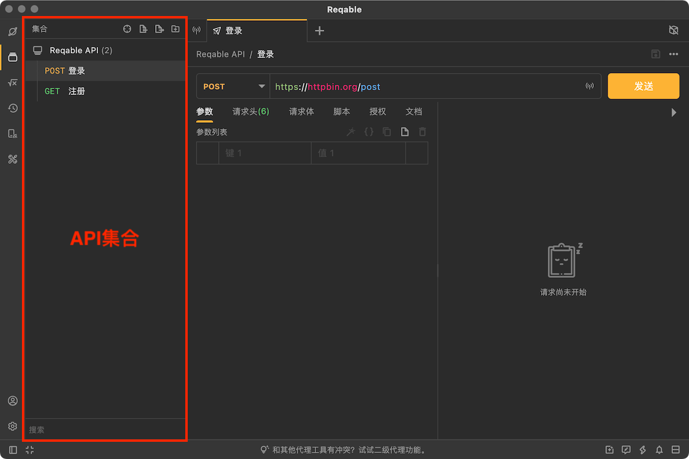
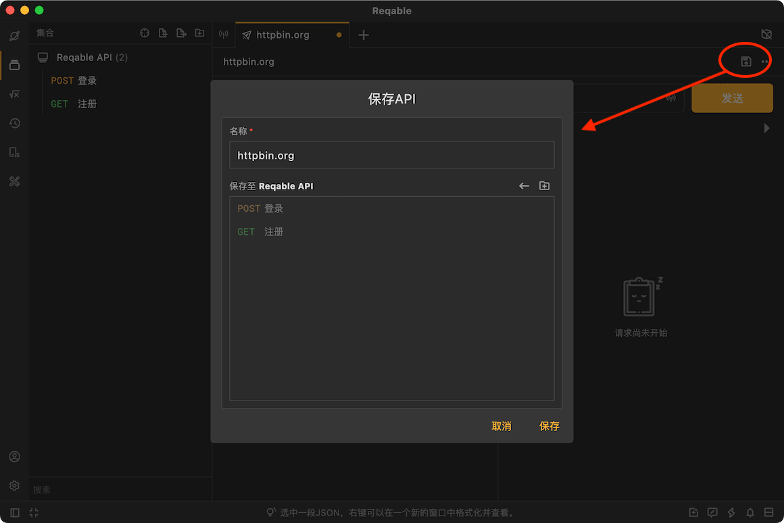
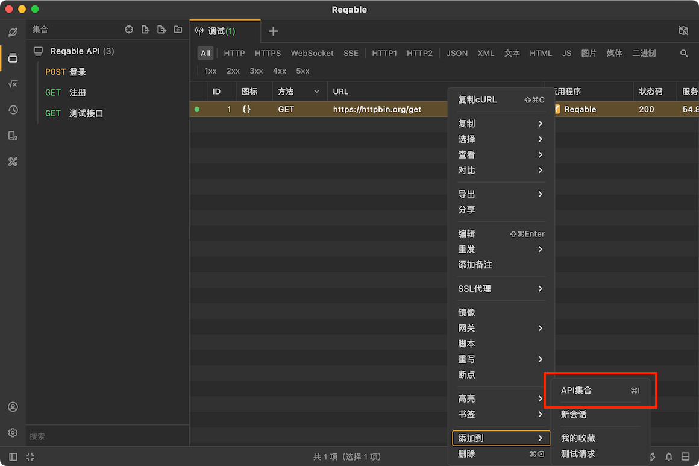
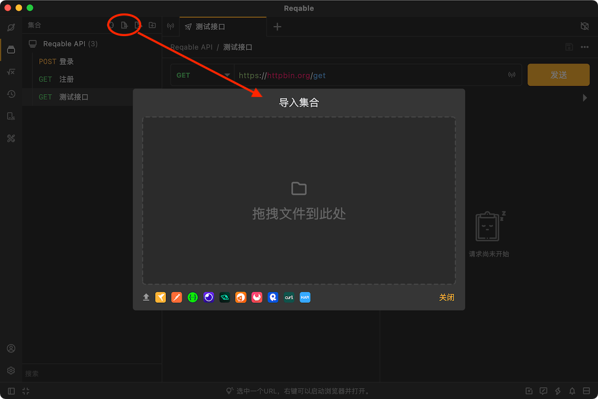
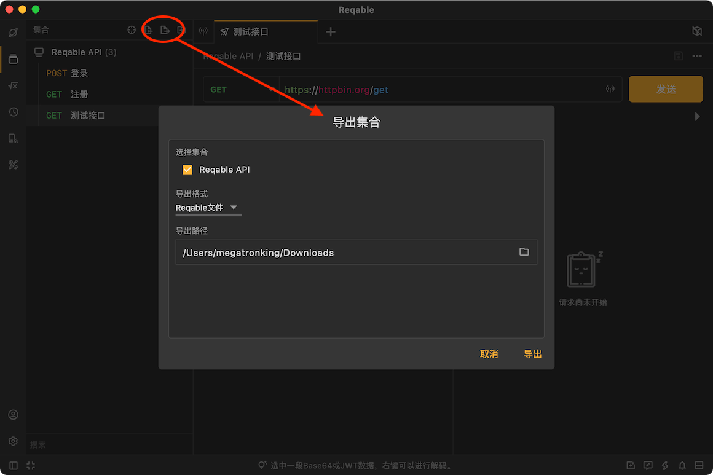
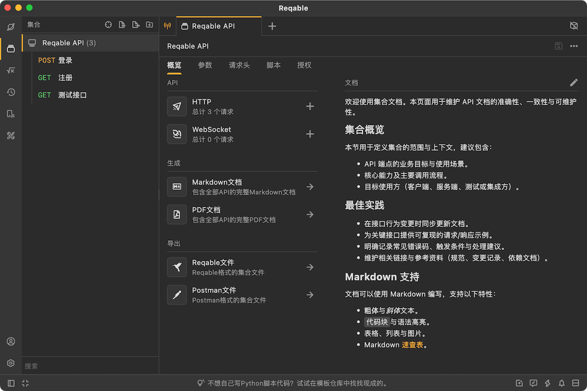

# 集合

import Shortcut from '@site/src/components/Shortcut';

Reqable支持将API请求保存到集合中进行统一管理。打开侧边栏`集合`(快捷键`F2`)，即可管理集合数据。

集合中可以存放HTTP接口、WebSocket接口以及文件夹，以树形结构（树深度限制为4）进行管理。

:::info 数据存储和同步
- 未登录账号的情况下，集合数据离线保存在设备本地。
- 登录账号后可以选择使用云端存储，集合数据支持在多设备间实时同步。
:::

### 保存API到集合

点击右上角`保存`图标按钮，即可保存当前API（快捷键 <Shortcut>Control + S</Shortcut> ）：

在弹出的对话框中输入API名称，选择存放的集合。保存成功后，便可以在侧边栏的集合面板中看到保存的API了。

### 保存调试到集合

Reqable可以将调试列表中的API保存到集合，在右键菜单中选择 `添加到` -> `API集合`（快捷键 <Shortcut>Control + I</Shortcut> ）。

### 导入集合文件

Reqable支持导入其他软件的集合文件，点击导入图标可以打开集合导入界面。

Reqable支持如下类型的集合文件。

- Postman (JSON)
- Swagger (JSON和Yaml)
- Insomnia (JSON)
- Hoppscotch (JSON)
- ApiPost (JSON)
- ApiFox (JSON)
- RapidAPI (JSON)
- cURL
- HAR

:::info 环境变量
如果集合文件中包含环境变量，环境变量也会一同导入，更多请阅读[环境变量](../environment)。
:::

### 导出集合文件

Reqable支持两种类型格式的集合文件导出。

- Reqable格式 (JSON)
- Postman格式 (JSON)

点击导出图标可以打开集合导出界面。

### 集合管理

双击集合可以打开集合管理页面。

集合管理页面可以进行如下操作：

- 定义公共参数、请求头、脚本、授权等，可以被集合中的API自动继承。
- 编写集合文档。
- 整体导出集合中所有API的文档。
- 导出集合文件。

:::info PDF文档
由于技术限制，导出PDF文档仅在Mac系统上可用。
:::