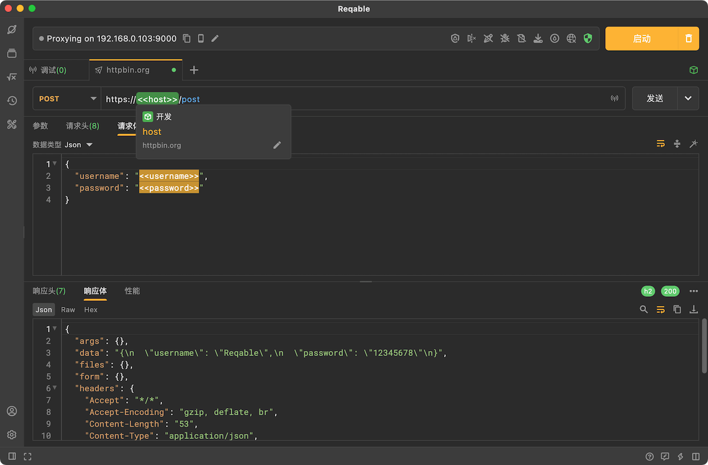

# 环境变量

在请求中可以使用尖双括号（例如 `<<variable_name>>`）来引用相应的环境变量，支持在请求URL、请求参数、请求头部、请求体以及请求授权中使用环境变量。

在输入框中输入尖括号`<`后会自动进行变量引用提示，用户可以查看当前匹配的环境变量。当鼠标指针悬浮在变量上时，会自动提示变量的信息。

Reqable会在发送请求时自动替换这些引用为实际的变量数值。

更多资料请阅读文档：[环境变量](../environment)