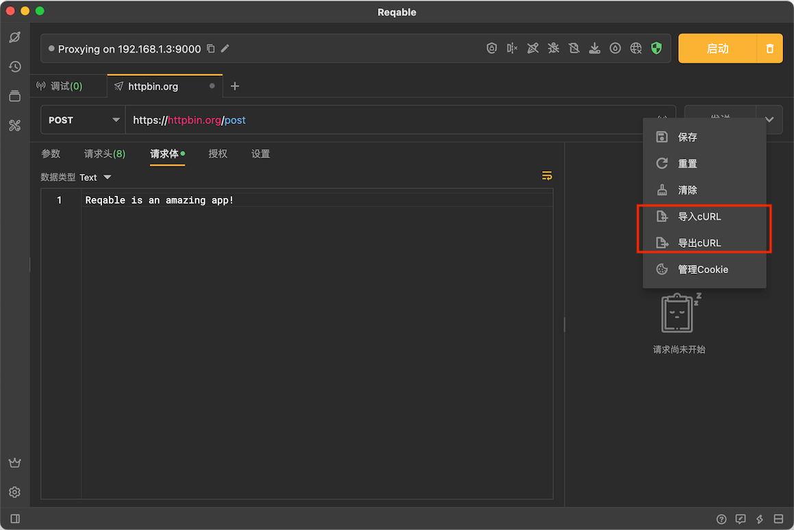
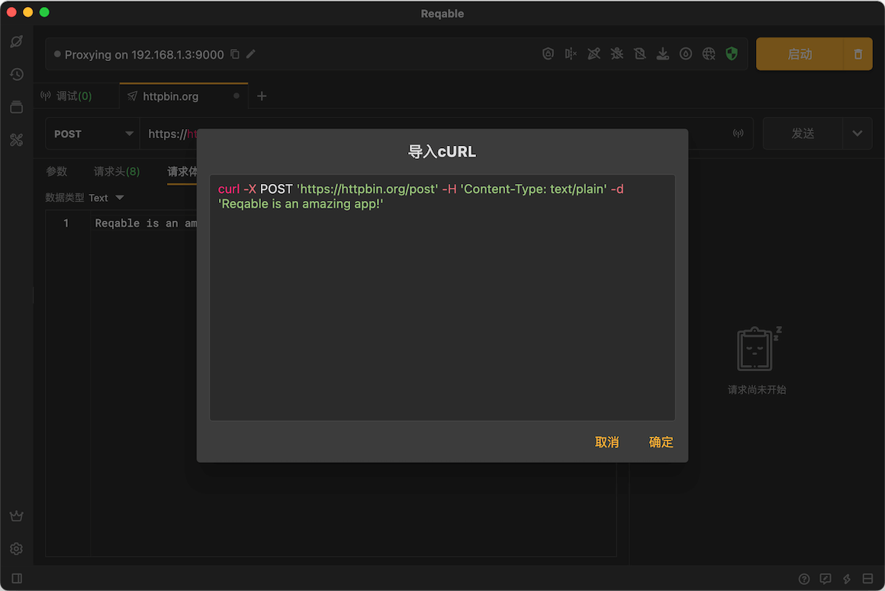
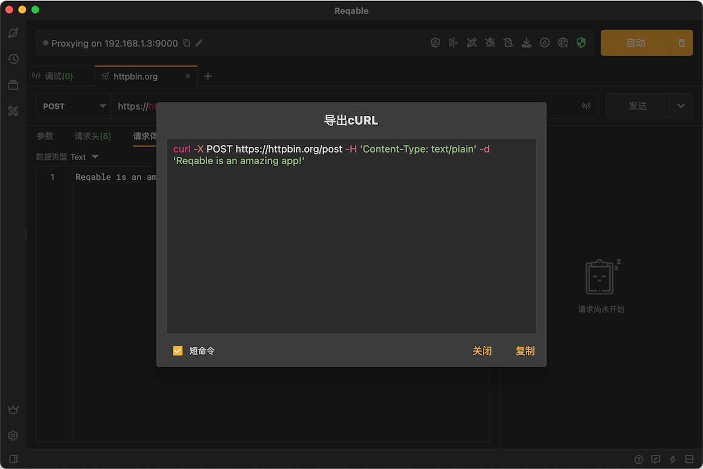

# cURL支持

Reqable提供了对cURL的支持：cURL转化成接口请求、接口请求转化成cURL。点击右上角打开更多操作菜单：

导入cURL：

导出cURL：

### cURL选项

Reqable支持以下的cURL参数选项：

[--basic](https://curl.se/docs/manpage.html#--basic)  
[--cookie, -b](https://curl.se/docs/manpage.html#-b)  
[--data-ascii](https://curl.se/docs/manpage.html#--data-ascii)  
[--data-binary](https://curl.se/docs/manpage.html#--data-binary)  
[--data-raw](https://curl.se/docs/manpage.html#--data-raw)  
[--data-urlencode](https://curl.se/docs/manpage.html#--data-urlencode)  
[--data, -d](https://curl.se/docs/manpage.html#-d)  
[--form, -F](https://curl.se/docs/manpage.html#-F)  
[--get, -G](https://curl.se/docs/manpage.html#-G)  
[--head, -I](https://curl.se/docs/manpage.html#-I)  
[--header, -H](https://curl.se/docs/manpage.html#-H)  
[--http1.1](https://curl.se/docs/manpage.html#--http11)  
[--http2](https://curl.se/docs/manpage.html#--http2)  
[--http3](https://curl.se/docs/manpage.html#--http3)  
[--json](https://curl.se/docs/manpage.html#--json)  
[--max-redirs](https://curl.se/docs/manpage.html#--max-redirs)  
[--no-keepalive](https://curl.se/docs/manpage.html#--no-keepalive)  
[--oauth2-bearer](https://curl.se/docs/manpage.html#--oauth2-bearer)  
[--proxy, -x](https://curl.se/docs/manpage.html#-x)  
[--request, -X](https://curl.se/docs/manpage.html#-X)  
[--upload-file, -T](https://curl.se/docs/manpage.html#-T)  
[--url](https://curl.se/docs/manpage.html#--url)  
[--user-agent, -A](https://curl.se/docs/manpage.html#-A)  
[--user,  -u](https://curl.se/docs/manpage.html#-u)  