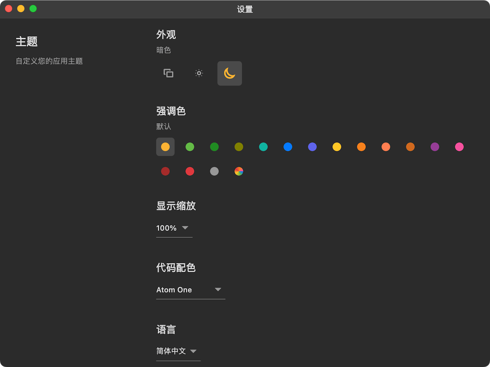
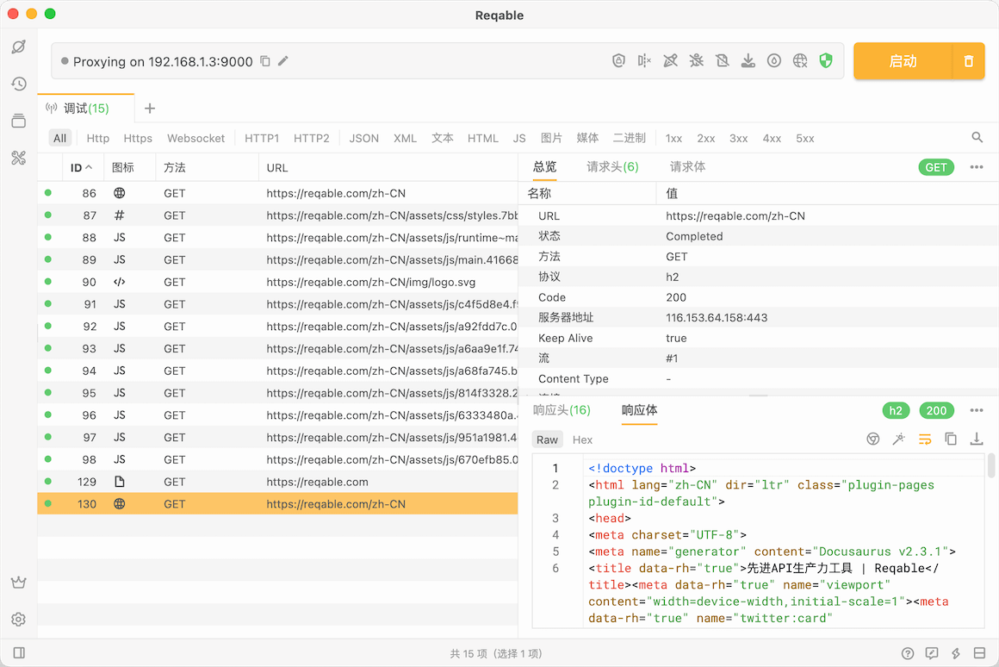
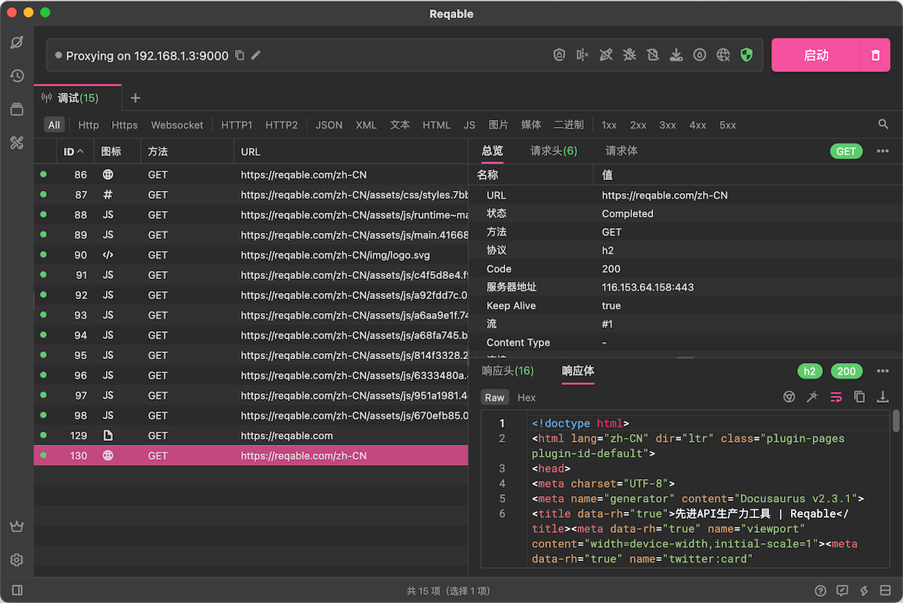
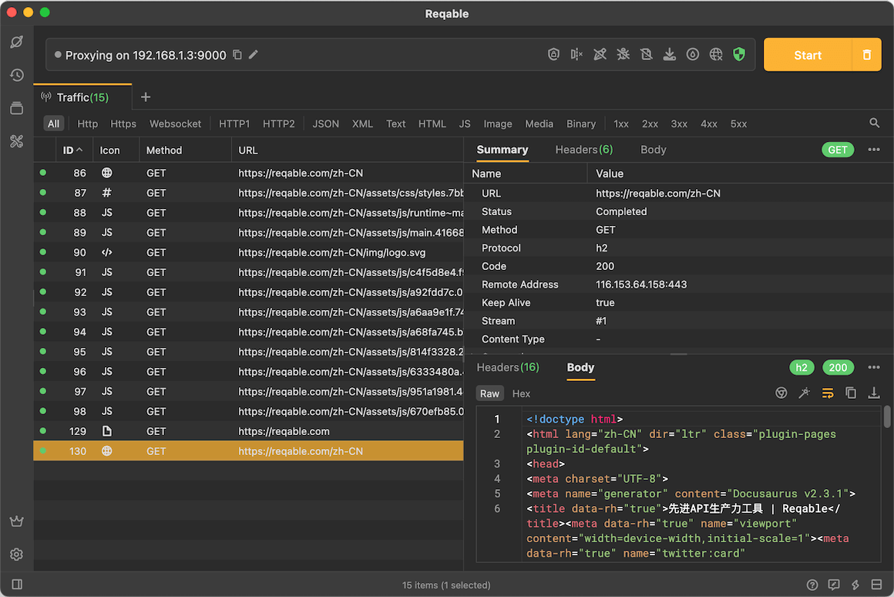

# 主题

Reqable支持丰富的主题设置，可以在 设置 -> 主题 中配置您喜欢的主题方案：

### 外观

Reqable支持三种模式：亮色、暗色和跟随系统（即使用系统当前的模式）。

### 强调色

Reqable支持十一种强调色：
- 默认色(#FCB334)
- 绿色(#63BA46)
- 青色(#16B2A0)
- 蓝色(#057AFF)
- 靛青色(#6064EB)
- 黄色(#FFC726)
- 橙色(#F7811C)
- 紫色(#963D96)
- 粉色(#F7509E)
- 红色(#E0383E)
- 石墨灰(#989898)

下面是粉色的效果图：

### 代码配色

Reqable当前使用的是Atom One配色，如果您有其他的配色需求，请在此[issue](https://github.com/reqable/reqable-app/issues/17)下留言。

### 语言

Reqable目前仅支持下面两种语言：
- 简体中文
- 英语

下面是英文的效果图：

